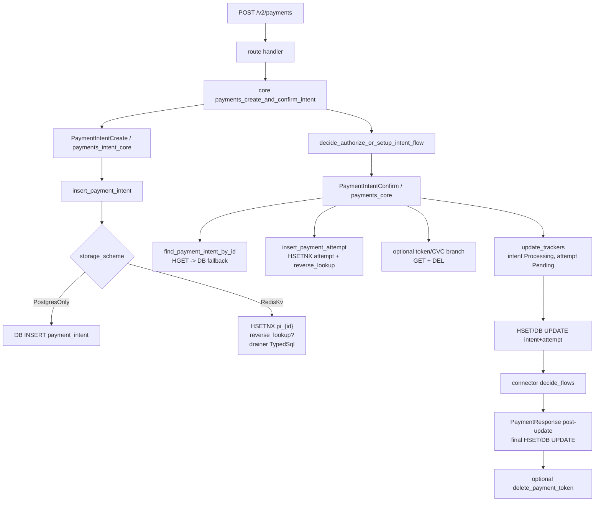

# Hyperswitch Dependency Cascades — Full Route Coverage (rust-brain enriched)

**Generated:** 2026-05-11  

**Local source:** `<repo-root>/vendor/hyperswitch-fresh`  

**rust-brain:** `http://127.0.0.1:8088/tools/pg_query`; Postgres index healthy with 219,675 extracted items. Snapshot metadata is not trusted for commit identity, so paths are mapped to and sample-verified against the local fresh checkout.

---

## What this file is

This is the route-complete dependency cascade matrix, enriched with rust-brain handler/callsite evidence. It supersedes the representative-only `03_DEPENDENCY_CASCADES.md` for coverage questions.

> **2026-05-15 MCP rerun note:** rust-brain MCP is available, but its indexed source metadata has `git_hash = NULL` and some stale paths/lines (for example, MCP locates `retrieve_and_delete_cvc_from_payment_token` in an older flattened `core/payment_methods.rs`, while the verified local checkout has it in `core/payment_methods/vault.rs`). Treat the class/count matrix here as useful, but use `08_MCP_RERUN_QUERY_GUIDE.md` and `raw/route-catalog-normalized.mcp-rerun.tsv` for refreshed local `file:line:column` links.

---

## rust-brain Evidence Counts

| Evidence set | rust-brain rows | Raw file |
|---|---:|---|
| Route rows parsed from route catalog | 509 | `raw/agent-routes.md` |
| Handler candidates | 497 | `raw/rust-brain-route-handler-candidates.jsonl` |
| redis_primitives | 233 | `raw/rust-brain-redis_primitives.jsonl` |
| kv_operations | 61 | `raw/rust-brain-kv_operations.jsonl` |
| sql_model_calls | 72 | `raw/rust-brain-sql_model_calls.jsonl` |
| route_registration_functions | 2 | `raw/rust-brain-route_registration_functions.jsonl` |
| Local path verification sample | 668 OK / 668 checked | mapped to `vendor/hyperswitch-fresh` |

### Routes by cascade class

| Cascade class | Route rows | Ambiguity |
|---|---:|---|
| `ADMIN_CONFIG_MUTATE` | 83 | `needs_db_snapshot_or_transaction_order` |
| `ACCOUNTS_MUTATE` | 51 | `needs_db_snapshot_or_transaction_order` |
| `ADMIN_CONFIG_READ` | 45 | `needs_resource_version_or_state` |
| `ACCOUNTS_READ` | 38 | `needs_db_snapshot_or_transaction_order` |
| `PAYMENTS_MUTATING_LIFECYCLE` | 28 | `needs_causal_scope_plus_ordinal + needs_stateful_redis_emulation` |
| `ACCOUNTS_AUTH_SESSION` | 27 | `needs_causal_scope_plus_ordinal` |
| `PM_MUTATE_TOKEN_VAULT` | 20 | `needs_stateful_redis_emulation` |
| `PAYMENTS_LIST_ANALYTICS` | 18 | `needs_db_snapshot_or_transaction_order` |
| `WEBHOOK_STATE_SYNC` | 18 | `needs_stateful_redis_emulation` |
| `GENERIC_DB_OR_CONFIG` | 16 | `needs_resource_version_or_state` |
| `PM_READ_CROSS_SESSION` | 14 | `needs_resource_version_or_state` |
| `PAYMENTS_CREATE_OR_TOKEN` | 12 | `needs_causal_scope_plus_ordinal` |
| `PAYOUT_MUTATE` | 11 | `needs_causal_scope_plus_ordinal` |
| `AUTHENTICATION_STATEFUL` | 10 | `needs_causal_scope_plus_ordinal` |
| `PAYMENTS_READ` | 9 | `needs_resource_version_or_state` |
| `PAYOUT_LIST` | 9 | `needs_resource_version_or_state` |
| `DISPUTE_READ_LIST` | 9 | `needs_db_snapshot_or_transaction_order` |
| `REFUND_LIST_SCAN` | 8 | `needs_resource_version_or_state` |
| `PAYOUT_READ` | 7 | `needs_resource_version_or_state` |
| `RECOVERY_PROCESS_TRACKER` | 7 | `needs_resource_version_or_state` |
| `CUSTOMER_MUTATE` | 6 | `needs_causal_scope_plus_ordinal` |
| `APIKEY_MUTATE_CACHE` | 6 | `needs_stateful_redis_emulation` |
| `CUSTOMER_READ` | 5 | `needs_resource_version_or_state` |
| `PM_LIST_SCAN` | 5 | `needs_resource_version_or_state` |
| `REFUND_MUTATE` | 5 | `needs_causal_scope_plus_ordinal` |
| `NO_DEP_HEALTH` | 4 | `signature_only_safe` |
| `CUSTOMER_LIST` | 4 | `needs_db_snapshot_or_transaction_order` |
| `REFUND_READ_SYNC` | 4 | `needs_resource_version_or_state` |
| `PM_DELETE_TOKEN_STATE` | 4 | `needs_stateful_redis_emulation` |
| `EPHEMERAL_KEY_REDIS_HASH` | 4 | `needs_stateful_redis_emulation` |
| `APIKEY_READ_CACHE` | 4 | `needs_stateful_redis_emulation` |
| `DISPUTE_MUTATE` | 4 | `needs_causal_scope_plus_ordinal` |
| `CARD_MUTATE` | 3 | `needs_resource_version_or_state` |
| `FILE_DB_STORAGE` | 3 | `needs_causal_scope_plus_ordinal` |
| `CHAT_OLAP` | 2 | `unsafe_without_driver_context` |
| `CACHE_INVALIDATE` | 1 | `needs_stateful_redis_emulation` |
| `MANDATE_LIST` | 1 | `needs_resource_version_or_state` |
| `MANDATE_READ` | 1 | `needs_resource_version_or_state` |
| `MANDATE_MUTATE` | 1 | `needs_causal_scope_plus_ordinal` |
| `CARD_BIN_READ` | 1 | `per_signature_fifo_maybe_ok` |
| `OLAP_ANALYTICS_READ` | 1 | `needs_db_snapshot_or_transaction_order` |

---

## Critical Flow Validation — Payments Create+Confirm

**Validated:** 2026-05-11 against local `vendor/hyperswitch-fresh` source and the saved rust-brain artifacts in `raw/rust-brain-*.jsonl`.

**Overall verdict:** the `PAYMENTS_MUTATING_LIFECYCLE` classification for `POST /v2/payments` create+confirm is **valid**, but the short pattern should be read as a two-phase cascade: **create-intent insert first, then confirm lifecycle mutation**. The replay requirement remains `needs_causal_scope_plus_ordinal + needs_stateful_redis_emulation`.

### Source-backed validation matrix

| Flow / branch | Existing class | Verdict | Source evidence | Replay consequence |
|---|---|---|---|---|
| `POST /v2/payments` create+confirm | `PAYMENTS_MUTATING_LIFECYCLE` | **Valid with refinement**: it is not only read/update; it first creates a payment intent, then immediately confirms it. | Route registration maps `/v2/payments` to `payments_create_and_confirm_intent` (`routes/app.rs:777-790`). Route handler delegates to core (`routes/payments.rs:431-483`). Core calls `payments_intent_core` with `PaymentIntentCreate`, then `decide_authorize_or_setup_intent_flow` with `PaymentIntentConfirm` (`core/payments.rs:3379-3481`). | Replay must preserve intra-request order: generated `GlobalPaymentId` insert must be visible to the confirm phase before matching later reads/writes. |
| `POST /v2/payments/create-intent` | `PAYMENTS_CREATE_OR_TOKEN` | **Valid**: create intent is an insert-only tracker path unless optional validation reads are triggered. | `PaymentIntentCreate::get_trackers` builds and inserts the intent (`core/payments/operations/payment_create_intent.rs:90-191`). Redis-KV storage uses `HSetNx` on `pi_{global_payment_id}` plus optional merchant-reference reverse lookup (`storage_impl/src/payments/payment_intent.rs:142-215`). | Needs causal ordinal for generated resources; no old value can be assumed for first insert. |
| `POST /v2/payments/{payment_id}/confirm-intent` and confirm phase of create+confirm | `PAYMENTS_MUTATING_LIFECYCLE` | **Valid**: confirm reads the intent, inserts an attempt, updates intent/attempt before connector execution, then post-updates from connector response. | `PaymentIntentConfirm::get_trackers` calls `find_payment_intent_by_id` and `insert_payment_attempt` (`core/payments/operations/payment_confirm_intent.rs:152-281`). `payments_core` obtains trackers and calls `payments_operation_core` (`core/payments.rs:3211-3292`). `complete_connector_service` calls `update_trackers` before `decide_flows` (`core/payments.rs:5306-5378`). `PaymentIntentConfirm::update_trackers` updates intent to `Processing` and attempt to `Pending` (`core/payments/operations/payment_confirm_intent.rs:749-873`). `PaymentResponse::update_tracker` performs final intent/attempt updates after connector response (`core/payments/operations/payment_response.rs:3197-3260`). | Same payment resource sees multiple indistinguishable `HGET/HSET` signatures in one scope; request id alone is insufficient without a local sequence/ordinal. |
| Redis-KV payment trackers | Storage branch for payment lifecycle | **Valid stateful Redis requirement**. | v2 intent insert/update/find uses `HSetNx`, `Hset`, `HGet` with DB fallback (`storage_impl/src/payments/payment_intent.rs:142-215`, `330-401`, `473-533`). v2 attempt insert/update uses `HSetNx`/`update_resource` (`storage_impl/src/payments/payment_attempt.rs:912-1005`, `1158-1204`; `storage_impl/src/kv_router_store.rs:440-504`). `kv_wrapper` pushes write-through SQL work to the drainer stream after Redis mutation (`storage_impl/src/redis/kv_store.rs:168-247`). | Replay must emulate Redis hash state, reverse lookup state, and DB fallback/write-through ordering; signature-only FIFO is unsafe. |
| Payment-token / CVC branch within confirm | Optional branch under lifecycle | **Valid stateful Redis requirement**. | `create_or_fetch_payment_method` may retrieve a payment token and call `retrieve_and_delete_cvc_from_payment_token` (`core/payments/operations/payment_confirm_intent.rs:551-636`). CVC retrieval reads `pm_token_*_hyperswitch_cvc` then deletes it (`core/payment_methods/vault.rs:2235-2268`). Final token deletion occurs unless status requires customer/merchant action (`core/payment_methods/vault.rs:2309-2326`; `core/payment_methods/utils.rs:925-947`). | Token/CVC keys have destructive reads/deletes and TTL-sensitive state; replay needs key-value state, not just dependency signatures. |
| `POST /v2/payments/{payment_id}/capture` and `/cancel` | `PAYMENTS_MUTATING_LIFECYCLE` | **Valid**: both read intent + active attempt, mutate attempt before connector, then rely on post-update. | Capture route delegates to `payments_core` (`routes/payments.rs:3959-4036`); `PaymentsCapture::get_trackers` reads intent and active attempt, and `update_trackers` updates attempt (`core/payments/operations/payment_capture_v2.rs:140-321`). Cancel route delegates similarly (`routes/payments.rs:1712-1778`); `PaymentsCancel::get_trackers` reads intent and attempt, and `update_trackers` sets `VoidInitiated` (`core/payments/operations/payment_cancel_v2.rs:128-240`). | Confirms the same lifecycle replay pattern applies beyond create+confirm. |

### Payment create+confirm graph

Graph file: `docs/hyperswitch-cascade/graphs/payments-create-confirm-v2.mmd`.



### Validation conclusion

The existing matrix pattern is **directionally correct and safe** for replay classification. The exact create+confirm path should be described as:

`create intent INSERT/HSETNX → confirm intent HGET/DB fallback → attempt INSERT/HSETNX → pre-connector intent+attempt UPDATE/HSET → connector call → post-connector intent+attempt UPDATE/HSET → optional token/CVC GET+DEL`.

Therefore, `POST /v2/payments` should stay in `PAYMENTS_MUTATING_LIFECYCLE`, and replay needs both:

1. a causal scope plus local operation ordinal for repeated payment-intent/payment-attempt signatures; and
2. stateful Redis emulation for hashes, reverse lookups, drainer-backed write-through, token TTLs, and destructive token/CVC deletes.

---

## rust-brain Dependency Evidence by Domain

### Payments

| Function | Verified local file:line:col | Lines |
|---|---|---:|
| `router::core::payments::helpers::insert_merchant_connector_creds_to_config` | `<repo-root>/vendor/hyperswitch-fresh/crates/router/src/core/payments/helpers.rs:4656:1` | 4656-4689 |
| `router::core::payments::helpers::get_merchant_connector_account` | `<repo-root>/vendor/hyperswitch-fresh/crates/router/src/core/payments/helpers.rs:4694:1` | 4694-4834 |
| `router::core::payments::types::SurchargeMetadata::get_individual_surcharge_detail_from_redis` | `<repo-root>/vendor/hyperswitch-fresh/crates/router/src/core/payments/types.rs:247:1` | 247-364 |
| `router::core::payments::types::get_individual_surcharge_detail_from_redis` | `<repo-root>/vendor/hyperswitch-fresh/crates/router/src/core/payments/types.rs:339:1` | 339-363 |
| `storage_impl::payments::payment_attempt::crate _ { diesel_error_to_data_error , errors , errors _ RedisErrorExt , kv_router_store _ KVRouterStore , lookup _ ReverseLookupInterface , redis _ kv_store _ { decide_storage_scheme , kv_wrapper , KvOperation , Op , PartitionKey } , utils _ { pg_connection_read , pg_connection_write , try_redis_get_else_try_database_get } , DataModelExt , DatabaseStore , RouterStore , }` | `<repo-root>/vendor/hyperswitch-fresh/crates/storage_impl/src/payments/payment_attempt.rs:35:1` | 35-43 |
| `storage_impl::payments::payment_attempt::KVRouterStore < T >::find_payment_attempt_by_processor_merchant_id_connector_txn_id` | `<repo-root>/vendor/hyperswitch-fresh/crates/storage_impl/src/payments/payment_attempt.rs:731:1` | 731-2045 |
| `storage_impl::payments::payment_attempt::KVRouterStore < T >::find_attempts_by_processor_merchant_id_payment_id` | `<repo-root>/vendor/hyperswitch-fresh/crates/storage_impl/src/payments/payment_attempt.rs:731:1` | 731-2045 |
| `storage_impl::payments::payment_attempt::KVRouterStore < T >::find_payment_attempt_by_preprocessing_id_processor_merchant_id` | `<repo-root>/vendor/hyperswitch-fresh/crates/storage_impl/src/payments/payment_attempt.rs:731:1` | 731-2045 |
| `storage_impl::payments::payment_attempt::KVRouterStore < T >::find_payment_attempt_by_attempt_id_processor_merchant_id` | `<repo-root>/vendor/hyperswitch-fresh/crates/storage_impl/src/payments/payment_attempt.rs:731:1` | 731-2045 |
| `storage_impl::payments::payment_attempt::KVRouterStore < T >::find_payment_attempt_by_payment_id_processor_merchant_id_attempt_id` | `<repo-root>/vendor/hyperswitch-fresh/crates/storage_impl/src/payments/payment_attempt.rs:731:1` | 731-2045 |

### PaymentMethods

| Function | Verified local file:line:col | Lines |
|---|---|---:|
| `router::core::payment_method_balance::fetch_payment_methods_balances_from_redis` | `<repo-root>/vendor/hyperswitch-fresh/crates/router/src/core/payment_method_balance.rs:375:1` | 375-426 |
| `router::core::payment_method_balance::fetch_payment_methods_balances_from_redis_fallible` | `<repo-root>/vendor/hyperswitch-fresh/crates/router/src/core/payment_method_balance.rs:430:1` | 430-479 |
| `router::core::payment_methods::utils::delete_payment_token_data` | `<repo-root>/vendor/hyperswitch-fresh/crates/router/src/core/payment_methods.rs:929:1` | 929-947 |
| `router::core::payment_methods::vault::delete_tokenized_data` | `<repo-root>/vendor/hyperswitch-fresh/crates/router/src/core/payment_methods.rs:1450:1` | 1450-1493 |
| `router::core::payment_methods::create_volatile_payment_method_card_core` | `<repo-root>/vendor/hyperswitch-fresh/crates/router/src/core/payment_methods.rs:1722:1` | 1722-1859 |
| `router::core::payment_methods::vault::insert_cvc_using_payment_token` | `<repo-root>/vendor/hyperswitch-fresh/crates/router/src/core/payment_methods.rs:1840:1` | 1840-1888 |
| `router::core::payment_methods::vault::retrieve_and_delete_cvc_from_payment_token` | `<repo-root>/vendor/hyperswitch-fresh/crates/router/src/core/payment_methods.rs:1892:1` | 1892-1929 |
| `router::core::payment_methods::vault::retrieve_volatile_payment_method_from_redis` | `<repo-root>/vendor/hyperswitch-fresh/crates/router/src/core/payment_methods.rs:2028:1` | 2028-2073 |
| `router::core::payment_methods::vault::get_delete_tokenize_schedule_time` | `<repo-root>/vendor/hyperswitch-fresh/crates/router/src/core/payment_methods.rs:2486:1` | 2486-2507 |
| `router::core::payment_methods::cards::list_payment_methods` | `<repo-root>/vendor/hyperswitch-fresh/crates/router/src/core/payment_methods.rs:2934:1` | 2934-3949 |

### Refunds

| Function | Verified local file:line:col | Lines |
|---|---|---:|
| `router::routes::dummy_connector::core::refund_data` | `<repo-root>/vendor/hyperswitch-fresh/crates/router/src/routes/dummy_connector/core.rs:205:1` | 205-229 |

### Customers

| Function | Verified local file:line:col | Lines |
|---|---|---:|
| `router::types::storage::revenue_recovery_redis_operation::RedisTokenManager::unlock_connector_customer_status` | `<repo-root>/vendor/hyperswitch-fresh/crates/router/src/lib.rs:134:1` | 134-1303 |
| `router::types::storage::revenue_recovery_redis_operation::RedisTokenManager::get_connector_customer_payment_processor_tokens` | `<repo-root>/vendor/hyperswitch-fresh/crates/router/src/lib.rs:134:1` | 134-1303 |
| `router::types::storage::revenue_recovery_redis_operation::unlock_connector_customer_status` | `<repo-root>/vendor/hyperswitch-fresh/crates/router/src/lib.rs:230:1` | 230-282 |
| `router::types::storage::revenue_recovery_redis_operation::get_connector_customer_payment_processor_tokens` | `<repo-root>/vendor/hyperswitch-fresh/crates/router/src/lib.rs:286:1` | 286-331 |
| `storage_impl::customers::domain::CustomerInterface_kv_router_store :: KVRouterStore < T >` | `<repo-root>/vendor/hyperswitch-fresh/crates/storage_impl/src/lib.rs:52:1` | 52-497 |
| `storage_impl::customers::find_customer_optional_by_customer_id_merchant_id` | `<repo-root>/vendor/hyperswitch-fresh/crates/storage_impl/src/lib.rs:57:1` | 57-88 |
| `storage_impl::customers::find_customer_optional_with_redacted_customer_details_by_customer_id_merchant_id` | `<repo-root>/vendor/hyperswitch-fresh/crates/storage_impl/src/lib.rs:93:1` | 93-118 |
| `storage_impl::customers::find_optional_by_merchant_id_merchant_reference_id` | `<repo-root>/vendor/hyperswitch-fresh/crates/storage_impl/src/lib.rs:121:1` | 121-152 |
| `storage_impl::customers::update_customer_by_customer_id_merchant_id` | `<repo-root>/vendor/hyperswitch-fresh/crates/storage_impl/src/lib.rs:156:1` | 156-195 |
| `storage_impl::customers::find_customer_by_merchant_reference_id_merchant_id` | `<repo-root>/vendor/hyperswitch-fresh/crates/storage_impl/src/lib.rs:199:1` | 199-230 |

### Payouts

| Function | Verified local file:line:col | Lines |
|---|---|---:|
| `storage_impl::payouts::payout_attempt::KVRouterStore < T >::find_payout_attempt_by_merchant_id_payout_attempt_id` | `<repo-root>/vendor/hyperswitch-fresh/crates/storage_impl/src/payouts/payout_attempt.rs:37:1` | 37-403 |
| `storage_impl::payouts::payout_attempt::KVRouterStore < T >::find_payout_attempt_by_merchant_id_connector_payout_id` | `<repo-root>/vendor/hyperswitch-fresh/crates/storage_impl/src/payouts/payout_attempt.rs:37:1` | 37-403 |
| `storage_impl::payouts::payout_attempt::PayoutAttemptInterface_KVRouterStore < T >` | `<repo-root>/vendor/hyperswitch-fresh/crates/storage_impl/src/payouts/payout_attempt.rs:37:1` | 37-403 |
| `storage_impl::payouts::payout_attempt::KVRouterStore < T >::insert_payout_attempt` | `<repo-root>/vendor/hyperswitch-fresh/crates/storage_impl/src/payouts/payout_attempt.rs:37:1` | 37-403 |
| `storage_impl::payouts::payout_attempt::KVRouterStore < T >::update_payout_attempt` | `<repo-root>/vendor/hyperswitch-fresh/crates/storage_impl/src/payouts/payout_attempt.rs:37:1` | 37-403 |
| `storage_impl::payouts::payout_attempt::insert_payout_attempt` | `<repo-root>/vendor/hyperswitch-fresh/crates/storage_impl/src/payouts/payout_attempt.rs:40:1` | 40-146 |
| `storage_impl::payouts::payout_attempt::update_payout_attempt` | `<repo-root>/vendor/hyperswitch-fresh/crates/storage_impl/src/payouts/payout_attempt.rs:149:1` | 149-248 |
| `storage_impl::payouts::payout_attempt::find_payout_attempt_by_merchant_id_payout_attempt_id` | `<repo-root>/vendor/hyperswitch-fresh/crates/storage_impl/src/payouts/payout_attempt.rs:251:1` | 251-313 |
| `storage_impl::payouts::payout_attempt::find_payout_attempt_by_merchant_id_connector_payout_id` | `<repo-root>/vendor/hyperswitch-fresh/crates/storage_impl/src/payouts/payout_attempt.rs:316:1` | 316-374 |
| `storage_impl::payouts::payouts::KVRouterStore < T >::find_optional_payout_by_merchant_id_payout_id` | `<repo-root>/vendor/hyperswitch-fresh/crates/storage_impl/src/payouts/payouts.rs:57:1` | 57-400 |

### Merchant/Profile/Connector

| Function | Verified local file:line:col | Lines |
|---|---|---:|
| `router::core::payments::helpers::insert_merchant_connector_creds_to_config` | `<repo-root>/vendor/hyperswitch-fresh/crates/router/src/core/payments/helpers.rs:4656:1` | 4656-4689 |
| `router::core::payments::helpers::get_merchant_connector_account` | `<repo-root>/vendor/hyperswitch-fresh/crates/router/src/core/payments/helpers.rs:4694:1` | 4694-4834 |
| `router::types::storage::revenue_recovery_redis_operation::RedisTokenManager::unlock_connector_customer_status` | `<repo-root>/vendor/hyperswitch-fresh/crates/router/src/lib.rs:134:1` | 134-1303 |
| `router::types::storage::revenue_recovery_redis_operation::RedisTokenManager::get_connector_customer_payment_processor_tokens` | `<repo-root>/vendor/hyperswitch-fresh/crates/router/src/lib.rs:134:1` | 134-1303 |
| `router::types::storage::revenue_recovery_redis_operation::unlock_connector_customer_status` | `<repo-root>/vendor/hyperswitch-fresh/crates/router/src/lib.rs:230:1` | 230-282 |
| `router::types::storage::revenue_recovery_redis_operation::get_connector_customer_payment_processor_tokens` | `<repo-root>/vendor/hyperswitch-fresh/crates/router/src/lib.rs:286:1` | 286-331 |
| `router::routes::dummy_connector::core::payment_complete` | `<repo-root>/vendor/hyperswitch-fresh/crates/router/src/routes/dummy_connector/core.rs:88:1` | 88-148 |
| `router::routes::dummy_connector::core::refund_data` | `<repo-root>/vendor/hyperswitch-fresh/crates/router/src/routes/dummy_connector/core.rs:205:1` | 205-229 |
| `router::routes::dummy_connector::utils::store_data_in_redis` | `<repo-root>/vendor/hyperswitch-fresh/crates/router/src/routes/dummy_connector/utils.rs:31:1` | 31-49 |
| `router::routes::dummy_connector::utils::get_payment_data_from_payment_id` | `<repo-root>/vendor/hyperswitch-fresh/crates/router/src/routes/dummy_connector/utils.rs:51:1` | 51-68 |

### User/Role/Auth

| Function | Verified local file:line:col | Lines |
|---|---|---:|
| `router::core::unified_authentication_service::StoreEligibilityCheckData::execute_check` | `<repo-root>/vendor/hyperswitch-fresh/crates/router/src/core/unified_authentication_service.rs:1473:1` | 1473-1546 |
| `router::services::authentication::blacklist::invalidate_role_cache` | `<repo-root>/vendor/hyperswitch-fresh/crates/router/src/services/authentication/blacklist.rs:63:1` | 63-70 |
| `router::services::authorization::get_role_info_from_cache` | `<repo-root>/vendor/hyperswitch-fresh/crates/router/src/services/authorization.rs:60:1` | 60-72 |
| `router::services::authorization::set_role_info_in_cache` | `<repo-root>/vendor/hyperswitch-fresh/crates/router/src/services/authorization.rs:96:1` | 96-115 |
| `router::utils::user::theme::delete_theme_version_from_redis` | `<repo-root>/vendor/hyperswitch-fresh/crates/router/src/utils.rs:53:1` | 53-65 |
| `router::utils::user::two_factor_auth::delete_totp_secret_from_redis` | `<repo-root>/vendor/hyperswitch-fresh/crates/router/src/utils.rs:94:1` | 94-101 |
| `router::utils::user::two_factor_auth::delete_totp_from_redis` | `<repo-root>/vendor/hyperswitch-fresh/crates/router/src/utils.rs:120:1` | 120-128 |
| `router::utils::user::two_factor_auth::delete_recovery_code_from_redis` | `<repo-root>/vendor/hyperswitch-fresh/crates/router/src/utils.rs:130:1` | 130-141 |
| `router::utils::user::two_factor_auth::delete_totp_attempts_from_redis` | `<repo-root>/vendor/hyperswitch-fresh/crates/router/src/utils.rs:206:1` | 206-216 |
| `router::utils::user::two_factor_auth::delete_recovery_code_attempts_from_redis` | `<repo-root>/vendor/hyperswitch-fresh/crates/router/src/utils.rs:218:1` | 218-228 |

### Webhooks

| Function | Verified local file:line:col | Lines |
|---|---|---:|
| `router::core::webhooks::utils::is_webhook_event_disabled` | `<repo-root>/vendor/hyperswitch-fresh/crates/router/src/core/webhooks/utils.rs:37:1` | 37-70 |
| `router::core::webhooks::utils::free_redis_lock` | `<repo-root>/vendor/hyperswitch-fresh/crates/router/src/core/webhooks/utils.rs:274:1` | 274-327 |

---

## Full Per-Route Cascade Matrix

| # | Method | Path | Domain | Handler | rust-brain best handler candidate | Cascade class | Dependency summary | Ambiguity |
|---:|---|---|---|---|---|---|---|---|
| 1 | GET | `/health` | System | `health` | `router::routes::health::health @ <repo-root>/vendor/hyperswitch-fresh/crates/router/src/routes/health.rs:16:1` | `NO_DEP_HEALTH` | No Redis/DB dependency expected | `signature_only_safe` |
| 2 | GET | `/health/ready` | System | `deep_health_check` | `router::routes::health::deep_health_check @ <repo-root>/vendor/hyperswitch-fresh/crates/router/src/routes/health.rs:24:1` | `NO_DEP_HEALTH` | No Redis/DB dependency expected | `signature_only_safe` |
| 3 | GET | `/v2/health` | System | `health` | `router::routes::health::health @ <repo-root>/vendor/hyperswitch-fresh/crates/router/src/routes/health.rs:16:1` | `NO_DEP_HEALTH` | No Redis/DB dependency expected | `signature_only_safe` |
| 4 | GET | `/v2/health/ready` | System | `deep_health_check` | `router::routes::health::deep_health_check @ <repo-root>/vendor/hyperswitch-fresh/crates/router/src/routes/health.rs:24:1` | `NO_DEP_HEALTH` | No Redis/DB dependency expected | `signature_only_safe` |
| 5 | POST | `/cache/invalidate/{key}` | System | `invalidate` | `router::routes::cache::invalidate @ <repo-root>/vendor/hyperswitch-fresh/crates/router/src/routes/cache.rs:11:1` | `CACHE_INVALIDATE` | Redis cache DEL/PUBLISH; optional audit DB | `needs_stateful_redis_emulation` |
| 6 | GET | `/.well-known/openid-configuration` | Auth | `oidc::oidc_discovery` | `router::routes::oidc::oidc_discovery @ <repo-root>/vendor/hyperswitch-fresh/crates/router/src/routes/oidc.rs:13:1` | `ACCOUNTS_READ` | DB user/org/role/theme SELECT/list; cache optional | `needs_db_snapshot_or_transaction_order` |
| 7 | GET | `/oauth2/jwks` | Auth | `oidc::jwks_endpoint` | `router::routes::oidc::jwks_endpoint @ <repo-root>/vendor/hyperswitch-fresh/crates/router/src/routes/oidc.rs:28:1` | `ACCOUNTS_AUTH_SESSION` | DB user/auth SELECT/UPDATE; Redis session/2FA token SETEX/DEL optional | `needs_causal_scope_plus_ordinal` |
| 8 | GET | `/oidc/authorize` | Auth | `oidc::oidc_authorize` | `router::routes::oidc::oidc_authorize @ <repo-root>/vendor/hyperswitch-fresh/crates/router/src/routes/oidc.rs:42:1` | `ACCOUNTS_AUTH_SESSION` | DB user/auth SELECT/UPDATE; Redis session/2FA token SETEX/DEL optional | `needs_causal_scope_plus_ordinal` |
| 9 | POST | `/oauth2/token` | Auth | `oidc::oidc_token` | `router::routes::oidc::oidc_token @ <repo-root>/vendor/hyperswitch-fresh/crates/router/src/routes/oidc.rs:70:1` | `ACCOUNTS_AUTH_SESSION` | DB user/auth SELECT/UPDATE; Redis session/2FA token SETEX/DEL optional | `needs_causal_scope_plus_ordinal` |
| 10 | GET | `/payments/list` | Payments | `payments::payments_list` | `router::routes::payments::payments_list @ <repo-root>/vendor/hyperswitch-fresh/crates/router/src/routes/payments.rs:1828:1` | `PAYMENTS_LIST_ANALYTICS` | DB/OLAP list/filter/aggregate; optional Redis cache/SCAN | `needs_db_snapshot_or_transaction_order` |
| 11 | POST | `/payments/list` | Payments | `payments::payments_list_by_filter` | `router::routes::payments::payments_list_by_filter @ <repo-root>/vendor/hyperswitch-fresh/crates/router/src/routes/payments.rs:1968:1` | `PAYMENTS_LIST_ANALYTICS` | DB/OLAP list/filter/aggregate; optional Redis cache/SCAN | `needs_db_snapshot_or_transaction_order` |
| 12 | GET | `/payments/profile/list` | Payments | `payments::profile_payments_list` | `router::routes::payments::profile_payments_list @ <repo-root>/vendor/hyperswitch-fresh/crates/router/src/routes/payments.rs:1929:1` | `PAYMENTS_LIST_ANALYTICS` | DB/OLAP list/filter/aggregate; optional Redis cache/SCAN | `needs_db_snapshot_or_transaction_order` |
| 13 | POST | `/payments/profile/list` | Payments | `payments::profile_payments_list_by_filter` | `router::routes::payments::profile_payments_list_by_filter @ <repo-root>/vendor/hyperswitch-fresh/crates/router/src/routes/payments.rs:1995:1` | `PAYMENTS_LIST_ANALYTICS` | DB/OLAP list/filter/aggregate; optional Redis cache/SCAN | `needs_db_snapshot_or_transaction_order` |
| 14 | POST | `/payments/filter` | Payments | `payments::get_filters_for_payments` | `router::routes::payments::get_filters_for_payments @ <repo-root>/vendor/hyperswitch-fresh/crates/router/src/routes/payments.rs:2027:1` | `PAYMENTS_LIST_ANALYTICS` | DB/OLAP list/filter/aggregate; optional Redis cache/SCAN | `needs_db_snapshot_or_transaction_order` |
| 15 | GET | `/payments/v2/filter` | Payments | `payments::get_payment_filters` | `router::routes::payments::get_payment_filters @ <repo-root>/vendor/hyperswitch-fresh/crates/router/src/routes/payments.rs:2054:1` | `PAYMENTS_LIST_ANALYTICS` | DB/OLAP list/filter/aggregate; optional Redis cache/SCAN | `needs_db_snapshot_or_transaction_order` |
| 16 | GET | `/payments/aggregate` | Payments | `payments::get_payments_aggregates` | `router::routes::payments::get_payments_aggregates @ <repo-root>/vendor/hyperswitch-fresh/crates/router/src/routes/payments.rs:2137:1` | `PAYMENTS_LIST_ANALYTICS` | DB/OLAP list/filter/aggregate; optional Redis cache/SCAN | `needs_db_snapshot_or_transaction_order` |
| 17 | GET | `/payments/profile/aggregate` | Payments | `payments::get_payments_aggregates_profile` | `router::routes::payments::get_payments_aggregates_profile @ <repo-root>/vendor/hyperswitch-fresh/crates/router/src/routes/payments.rs:3148:1` | `PAYMENTS_LIST_ANALYTICS` | DB/OLAP list/filter/aggregate; optional Redis cache/SCAN | `needs_db_snapshot_or_transaction_order` |
| 18 | GET | `/payments/v2/profile/filter` | Payments | `payments::get_payment_filters_profile` | `router::routes::payments::get_payment_filters_profile @ <repo-root>/vendor/hyperswitch-fresh/crates/router/src/routes/payments.rs:2079:1` | `PAYMENTS_LIST_ANALYTICS` | DB/OLAP list/filter/aggregate; optional Redis cache/SCAN | `needs_db_snapshot_or_transaction_order` |
| 19 | PUT | `/payments/{payment_id}/manual-update` | Payments | `payments::payments_manual_update` | `router::routes::payments::payments_manual_update @ <repo-root>/vendor/hyperswitch-fresh/crates/router/src/routes/payments.rs:2639:1` | `PAYMENTS_MUTATING_LIFECYCLE` | Redis HGET intent/attempt/token → DB SELECT/UPDATE → Redis HSET/DEL intent/attempt/token | `needs_causal_scope_plus_ordinal + needs_stateful_redis_emulation` |
| 20 | POST | `/payments` | Payments | `payments::payments_create` | `router::routes::payments::payments_create @ <repo-root>/vendor/hyperswitch-fresh/crates/router/src/routes/payments.rs:37:1` | `PAYMENTS_CREATE_OR_TOKEN` | DB INSERT intent/attempt + Redis HSET/reverse_lookup; optional PM/token reads | `needs_causal_scope_plus_ordinal` |
| 21 | POST | `/payments/session_tokens` | Payments | `payments::payments_connector_session` | `router::routes::payments::payments_connector_session @ <repo-root>/vendor/hyperswitch-fresh/crates/router/src/routes/payments.rs:1222:1` | `PAYMENTS_CREATE_OR_TOKEN` | DB INSERT intent/attempt + Redis HSET/reverse_lookup; optional PM/token reads | `needs_causal_scope_plus_ordinal` |
| 22 | POST | `/payments/sync` | Payments | `payments::payments_retrieve_with_gateway_creds` | `router::routes::payments::payments_retrieve_with_gateway_creds @ <repo-root>/vendor/hyperswitch-fresh/crates/router/src/routes/payments.rs:695:1` | `PAYMENTS_MUTATING_LIFECYCLE` | Redis HGET intent/attempt/token → DB SELECT/UPDATE → Redis HSET/DEL intent/attempt/token | `needs_causal_scope_plus_ordinal + needs_stateful_redis_emulation` |
| 23 | GET | `/payments/{payment_id}` | Payments | `payments::payments_retrieve` | `router::routes::payments::payments_retrieve @ <repo-root>/vendor/hyperswitch-fresh/crates/router/src/routes/payments.rs:597:1` | `PAYMENTS_READ` | Redis HGET intent/attempt/PM; DB SELECT fallback | `needs_resource_version_or_state` |
| 24 | POST | `/payments/{payment_id}` | Payments | `payments::payments_update` | `router::routes::payments::payments_update @ <repo-root>/vendor/hyperswitch-fresh/crates/router/src/routes/payments.rs:768:1` | `PAYMENTS_CREATE_OR_TOKEN` | DB INSERT intent/attempt + Redis HSET/reverse_lookup; optional PM/token reads | `needs_causal_scope_plus_ordinal` |
| 25 | POST | `/payments/{payment_id}/post_session_tokens` | Payments | `payments::payments_post_session_tokens` | `router::routes::payments::payments_post_session_tokens @ <repo-root>/vendor/hyperswitch-fresh/crates/router/src/routes/payments.rs:836:1` | `PAYMENTS_CREATE_OR_TOKEN` | DB INSERT intent/attempt + Redis HSET/reverse_lookup; optional PM/token reads | `needs_causal_scope_plus_ordinal` |
| 26 | POST | `/payments/{payment_id}/confirm` | Payments | `payments::payments_confirm` | `router::routes::payments::payments_confirm @ <repo-root>/vendor/hyperswitch-fresh/crates/router/src/routes/payments.rs:990:1` | `PAYMENTS_MUTATING_LIFECYCLE` | Redis HGET intent/attempt/token → DB SELECT/UPDATE → Redis HSET/DEL intent/attempt/token | `needs_causal_scope_plus_ordinal + needs_stateful_redis_emulation` |
| 27 | POST | `/payments/{payment_id}/cancel` | Payments | `payments::payments_cancel` | `router::routes::payments::payments_cancel @ <repo-root>/vendor/hyperswitch-fresh/crates/router/src/routes/payments.rs:1647:1` | `PAYMENTS_MUTATING_LIFECYCLE` | Redis HGET intent/attempt/token → DB SELECT/UPDATE → Redis HSET/DEL intent/attempt/token | `needs_causal_scope_plus_ordinal + needs_stateful_redis_emulation` |
| 28 | POST | `/payments/{payment_id}/cancel_post_capture` | Payments | `payments::payments_cancel_post_capture` | `router::routes::payments::payments_cancel_post_capture @ <repo-root>/vendor/hyperswitch-fresh/crates/router/src/routes/payments.rs:1776:1` | `PAYMENTS_MUTATING_LIFECYCLE` | Redis HGET intent/attempt/token → DB SELECT/UPDATE → Redis HSET/DEL intent/attempt/token | `needs_causal_scope_plus_ordinal + needs_stateful_redis_emulation` |
| 29 | POST | `/payments/{payment_id}/capture` | Payments | `payments::payments_capture` | `router::routes::payments::payments_capture @ <repo-root>/vendor/hyperswitch-fresh/crates/router/src/routes/payments.rs:1072:1` | `PAYMENTS_MUTATING_LIFECYCLE` | Redis HGET intent/attempt/token → DB SELECT/UPDATE → Redis HSET/DEL intent/attempt/token | `needs_causal_scope_plus_ordinal + needs_stateful_redis_emulation` |
| 30 | POST | `/payments/{payment_id}/approve` | Payments | `payments::payments_approve` | `router::routes::payments::payments_approve @ <repo-root>/vendor/hyperswitch-fresh/crates/router/src/routes/payments.rs:2164:1` | `PAYMENTS_MUTATING_LIFECYCLE` | Redis HGET intent/attempt/token → DB SELECT/UPDATE → Redis HSET/DEL intent/attempt/token | `needs_causal_scope_plus_ordinal + needs_stateful_redis_emulation` |
| 31 | POST | `/payments/{payment_id}/reject` | Payments | `payments::payments_reject` | `router::routes::payments::payments_reject @ <repo-root>/vendor/hyperswitch-fresh/crates/router/src/routes/payments.rs:2235:1` | `PAYMENTS_MUTATING_LIFECYCLE` | Redis HGET intent/attempt/token → DB SELECT/UPDATE → Redis HSET/DEL intent/attempt/token | `needs_causal_scope_plus_ordinal + needs_stateful_redis_emulation` |
| 32 | POST | `/payments/{payment_id}/eligibility` | Payments | `payments::payments_submit_eligibility` | `router::routes::payments::payments_submit_eligibility @ <repo-root>/vendor/hyperswitch-fresh/crates/router/src/routes/payments.rs:2705:1` | `PAYMENTS_CREATE_OR_TOKEN` | DB INSERT intent/attempt + Redis HSET/reverse_lookup; optional PM/token reads | `needs_causal_scope_plus_ordinal` |
| 33 | GET | `/payments/redirect/{payment_id}/{merchant_id}/{attempt_id}` | Payments | `payments::payments_start` | `router::routes::payments::payments_start @ <repo-root>/vendor/hyperswitch-fresh/crates/router/src/routes/payments.rs:542:1` | `PAYMENTS_READ` | Redis HGET intent/attempt/PM; DB SELECT fallback | `needs_resource_version_or_state` |
| 34 | GET | `/payments/{payment_id}/{merchant_id}/redirect/response/{connector}/{creds_identifier}` | Payments | `payments::payments_redirect_response_with_creds_identifier` | `router::routes::payments::payments_redirect_response_with_creds_identifier @ <repo-root>/vendor/hyperswitch-fresh/crates/router/src/routes/payments.rs:1424:1` | `PAYMENTS_READ` | Redis HGET intent/attempt/PM; DB SELECT fallback | `needs_resource_version_or_state` |
| 35 | GET | `/payments/{payment_id}/{merchant_id}/redirect/response/{connector}` | Payments | `payments::payments_redirect_response` | `router::routes::payments::payments_redirect_response @ <repo-root>/vendor/hyperswitch-fresh/crates/router/src/routes/payments.rs:1376:1` | `PAYMENTS_READ` | Redis HGET intent/attempt/PM; DB SELECT fallback | `needs_resource_version_or_state` |
| 36 | POST | `/payments/{payment_id}/{merchant_id}/redirect/response/{connector}` | Payments | `payments::payments_redirect_response` | `router::routes::payments::payments_redirect_response @ <repo-root>/vendor/hyperswitch-fresh/crates/router/src/routes/payments.rs:1376:1` | `PAYMENTS_CREATE_OR_TOKEN` | DB INSERT intent/attempt + Redis HSET/reverse_lookup; optional PM/token reads | `needs_causal_scope_plus_ordinal` |
| 37 | GET | `/payments/{payment_id}/{merchant_id}/redirect/complete/{connector}/{creds_identifier}` | Payments | `payments::payments_complete_authorize_redirect_with_creds_identifier` | `router::routes::payments::payments_complete_authorize_redirect_with_creds_identifier @ <repo-root>/vendor/hyperswitch-fresh/crates/router/src/routes/payments.rs:1520:1` | `PAYMENTS_MUTATING_LIFECYCLE` | Redis HGET intent/attempt/token → DB SELECT/UPDATE → Redis HSET/DEL intent/attempt/token | `needs_causal_scope_plus_ordinal + needs_stateful_redis_emulation` |
| 38 | POST | `/payments/{payment_id}/{merchant_id}/redirect/complete/{connector}/{creds_identifier}` | Payments | `payments::payments_complete_authorize_redirect_with_creds_identifier` | `router::routes::payments::payments_complete_authorize_redirect_with_creds_identifier @ <repo-root>/vendor/hyperswitch-fresh/crates/router/src/routes/payments.rs:1520:1` | `PAYMENTS_MUTATING_LIFECYCLE` | Redis HGET intent/attempt/token → DB SELECT/UPDATE → Redis HSET/DEL intent/attempt/token | `needs_causal_scope_plus_ordinal + needs_stateful_redis_emulation` |
| 39 | GET | `/payments/{payment_id}/{merchant_id}/redirect/complete/{connector}` | Payments | `payments::payments_complete_authorize_redirect` | `router::routes::payments::payments_complete_authorize_redirect @ <repo-root>/vendor/hyperswitch-fresh/crates/router/src/routes/payments.rs:1472:1` | `PAYMENTS_MUTATING_LIFECYCLE` | Redis HGET intent/attempt/token → DB SELECT/UPDATE → Redis HSET/DEL intent/attempt/token | `needs_causal_scope_plus_ordinal + needs_stateful_redis_emulation` |
| 40 | POST | `/payments/{payment_id}/{merchant_id}/redirect/complete/{connector}` | Payments | `payments::payments_complete_authorize_redirect` | `router::routes::payments::payments_complete_authorize_redirect @ <repo-root>/vendor/hyperswitch-fresh/crates/router/src/routes/payments.rs:1472:1` | `PAYMENTS_MUTATING_LIFECYCLE` | Redis HGET intent/attempt/token → DB SELECT/UPDATE → Redis HSET/DEL intent/attempt/token | `needs_causal_scope_plus_ordinal + needs_stateful_redis_emulation` |
| 41 | POST | `/payments/{payment_id}/complete_authorize` | Payments | `payments::payments_complete_authorize` | `router::routes::payments::payments_complete_authorize @ <repo-root>/vendor/hyperswitch-fresh/crates/router/src/routes/payments.rs:1569:1` | `PAYMENTS_MUTATING_LIFECYCLE` | Redis HGET intent/attempt/token → DB SELECT/UPDATE → Redis HSET/DEL intent/attempt/token | `needs_causal_scope_plus_ordinal + needs_stateful_redis_emulation` |
| 42 | POST | `/payments/{payment_id}/incremental_authorization` | Payments | `payments::payments_incremental_authorization` | `router::routes::payments::payments_incremental_authorization @ <repo-root>/vendor/hyperswitch-fresh/crates/router/src/routes/payments.rs:2421:1` | `PAYMENTS_MUTATING_LIFECYCLE` | Redis HGET intent/attempt/token → DB SELECT/UPDATE → Redis HSET/DEL intent/attempt/token | `needs_causal_scope_plus_ordinal + needs_stateful_redis_emulation` |
| 43 | POST | `/payments/{payment_id}/extend_authorization` | Payments | `payments::payments_extend_authorization` | `router::routes::payments::payments_extend_authorization @ <repo-root>/vendor/hyperswitch-fresh/crates/router/src/routes/payments.rs:2473:1` | `PAYMENTS_MUTATING_LIFECYCLE` | Redis HGET intent/attempt/token → DB SELECT/UPDATE → Redis HSET/DEL intent/attempt/token | `needs_causal_scope_plus_ordinal + needs_stateful_redis_emulation` |
| 44 | POST | `/payments/{payment_id}/{merchant_id}/authorize/{connector}` | Payments | `payments::post_3ds_payments_authorize` | `router::routes::payments::post_3ds_payments_authorize @ <repo-root>/vendor/hyperswitch-fresh/crates/router/src/routes/payments.rs:2591:1` | `PAYMENTS_MUTATING_LIFECYCLE` | Redis HGET intent/attempt/token → DB SELECT/UPDATE → Redis HSET/DEL intent/attempt/token | `needs_causal_scope_plus_ordinal + needs_stateful_redis_emulation` |
| 45 | GET | `/payments/{payment_id}/{merchant_id}/authorize/{connector}` | Payments | `payments::post_3ds_payments_authorize` | `router::routes::payments::post_3ds_payments_authorize @ <repo-root>/vendor/hyperswitch-fresh/crates/router/src/routes/payments.rs:2591:1` | `PAYMENTS_MUTATING_LIFECYCLE` | Redis HGET intent/attempt/token → DB SELECT/UPDATE → Redis HSET/DEL intent/attempt/token | `needs_causal_scope_plus_ordinal + needs_stateful_redis_emulation` |
| 46 | POST | `/payments/{payment_id}/3ds/authentication` | Payments | `payments::payments_external_authentication` | `router::routes::payments::payments_external_authentication @ <repo-root>/vendor/hyperswitch-fresh/crates/router/src/routes/payments.rs:2523:1` | `PAYMENTS_CREATE_OR_TOKEN` | DB INSERT intent/attempt + Redis HSET/reverse_lookup; optional PM/token reads | `needs_causal_scope_plus_ordinal` |
| 47 | GET | `/payments/{payment_id}/extended_card_info` | Payments | `payments::retrieve_extended_card_info` | `router::routes::payments::retrieve_extended_card_info @ <repo-root>/vendor/hyperswitch-fresh/crates/router/src/routes/payments.rs:2670:1` | `PAYMENTS_MUTATING_LIFECYCLE` | Redis HGET intent/attempt/token → DB SELECT/UPDATE → Redis HSET/DEL intent/attempt/token | `needs_causal_scope_plus_ordinal + needs_stateful_redis_emulation` |
| 48 | POST | `/payments/{payment_id}/calculate_tax` | Payments | `payments::payments_dynamic_tax_calculation` | `router::routes::payments::payments_dynamic_tax_calculation @ <repo-root>/vendor/hyperswitch-fresh/crates/router/src/routes/payments.rs:1127:1` | `PAYMENTS_MUTATING_LIFECYCLE` | Redis HGET intent/attempt/token → DB SELECT/UPDATE → Redis HSET/DEL intent/attempt/token | `needs_causal_scope_plus_ordinal + needs_stateful_redis_emulation` |
| 49 | POST | `/payments/{payment_id}/update_metadata` | Payments | `payments::payments_update_metadata` | `router::routes::payments::payments_update_metadata @ <repo-root>/vendor/hyperswitch-fresh/crates/router/src/routes/payments.rs:929:1` | `PAYMENTS_MUTATING_LIFECYCLE` | Redis HGET intent/attempt/token → DB SELECT/UPDATE → Redis HSET/DEL intent/attempt/token | `needs_causal_scope_plus_ordinal + needs_stateful_redis_emulation` |
| 50 | POST | `/v2/payments/create-intent` | Payments | `payments::payments_create_intent` | `router::routes::payments::payments_create_intent @ <repo-root>/vendor/hyperswitch-fresh/crates/router/src/routes/payments.rs:171:1` | `PAYMENTS_CREATE_OR_TOKEN` | DB INSERT intent/attempt + Redis HSET/reverse_lookup; optional PM/token reads | `needs_causal_scope_plus_ordinal` |
| 51 | GET | `/v2/payments/filter` | Payments | `payments::get_payment_filters` | `router::routes::payments::get_payment_filters @ <repo-root>/vendor/hyperswitch-fresh/crates/router/src/routes/payments.rs:2054:1` | `PAYMENTS_LIST_ANALYTICS` | DB/OLAP list/filter/aggregate; optional Redis cache/SCAN | `needs_db_snapshot_or_transaction_order` |
| 52 | GET | `/v2/payments/profile/filter` | Payments | `payments::get_payment_filters_profile` | `router::routes::payments::get_payment_filters_profile @ <repo-root>/vendor/hyperswitch-fresh/crates/router/src/routes/payments.rs:2079:1` | `PAYMENTS_LIST_ANALYTICS` | DB/OLAP list/filter/aggregate; optional Redis cache/SCAN | `needs_db_snapshot_or_transaction_order` |
| 53 | POST | `/v2/payments` | Payments | `payments::payments_create_and_confirm_intent` | `router::routes::payments::payments_create_and_confirm_intent @ <repo-root>/vendor/hyperswitch-fresh/crates/router/src/routes/payments.rs:426:1` | `PAYMENTS_MUTATING_LIFECYCLE` | Create intent INSERT/HSETNX, then confirm HGET intent → INSERT/HSETNX attempt → UPDATE/HSET intent+attempt; optional token/CVC GET+DEL | `needs_causal_scope_plus_ordinal + needs_stateful_redis_emulation` |
| 54 | GET | `/v2/payments/list` | Payments | `payments::payments_list` | `router::routes::payments::payments_list @ <repo-root>/vendor/hyperswitch-fresh/crates/router/src/routes/payments.rs:1828:1` | `PAYMENTS_LIST_ANALYTICS` | DB/OLAP list/filter/aggregate; optional Redis cache/SCAN | `needs_db_snapshot_or_transaction_order` |
| 55 | GET | `/v2/payments/recovery-list` | Payments | `payments::revenue_recovery_invoices_list` | `router::routes::payments::revenue_recovery_invoices_list @ <repo-root>/vendor/hyperswitch-fresh/crates/router/src/routes/payments.rs:1862:1` | `PAYMENTS_LIST_ANALYTICS` | DB/OLAP list/filter/aggregate; optional Redis cache/SCAN | `needs_db_snapshot_or_transaction_order` |
| 56 | GET | `/v2/payments/aggregate` | Payments | `payments::get_payments_aggregates` | `router::routes::payments::get_payments_aggregates @ <repo-root>/vendor/hyperswitch-fresh/crates/router/src/routes/payments.rs:2137:1` | `PAYMENTS_LIST_ANALYTICS` | DB/OLAP list/filter/aggregate; optional Redis cache/SCAN | `needs_db_snapshot_or_transaction_order` |
| 57 | POST | `/v2/payments/recovery` | Payments | `payments::recovery_payments_create` | `router::routes::payments::recovery_payments_create @ <repo-root>/vendor/hyperswitch-fresh/crates/router/src/routes/payments.rs:139:1` | `PAYMENTS_MUTATING_LIFECYCLE` | Redis HGET intent/attempt/token → DB SELECT/UPDATE → Redis HSET/DEL intent/attempt/token | `needs_causal_scope_plus_ordinal + needs_stateful_redis_emulation` |
| 58 | GET | `/v2/payments/profile/aggregate` | Payments | `payments::get_payments_aggregates_profile` | `router::routes::payments::get_payments_aggregates_profile @ <repo-root>/vendor/hyperswitch-fresh/crates/router/src/routes/payments.rs:3148:1` | `PAYMENTS_LIST_ANALYTICS` | DB/OLAP list/filter/aggregate; optional Redis cache/SCAN | `needs_db_snapshot_or_transaction_order` |
| 59 | GET | `/v2/payments/ref/{merchant_reference_id}` | Payments | `payments::payment_get_intent_using_merchant_reference_id` | `router::routes::payments::payment_get_intent_using_merchant_reference_id @ <repo-root>/vendor/hyperswitch-fresh/crates/router/src/routes/payments.rs:3763:1` | `PAYMENTS_READ` | Redis HGET intent/attempt/PM; DB SELECT fallback | `needs_resource_version_or_state` |
| 60 | POST | `/v2/payments/{payment_id}/confirm-intent` | Payments | `payments::payment_confirm_intent` | `router::routes::payments::payment_confirm_intent @ <repo-root>/vendor/hyperswitch-fresh/crates/router/src/routes/payments.rs:3303:1` | `PAYMENTS_MUTATING_LIFECYCLE` | Redis HGET intent/attempt/token → DB SELECT/UPDATE → Redis HSET/DEL intent/attempt/token | `needs_causal_scope_plus_ordinal + needs_stateful_redis_emulation` |
| 61 | GET | `/v2/payments/{payment_id}/list_attempts` | Payments | `payments::list_payment_attempts` | `router::routes::payments::list_payment_attempts @ <repo-root>/vendor/hyperswitch-fresh/crates/router/src/routes/payments.rs:363:1` | `PAYMENTS_LIST_ANALYTICS` | DB/OLAP list/filter/aggregate; optional Redis cache/SCAN | `needs_db_snapshot_or_transaction_order` |
| 62 | GET | `/v2/payments/{payment_id}/list-attempts` | Payments | `payments::list_payment_attempts` | `router::routes::payments::list_payment_attempts @ <repo-root>/vendor/hyperswitch-fresh/crates/router/src/routes/payments.rs:363:1` | `PAYMENTS_LIST_ANALYTICS` | DB/OLAP list/filter/aggregate; optional Redis cache/SCAN | `needs_db_snapshot_or_transaction_order` |
| 63 | POST | `/v2/payments/{payment_id}/proxy-confirm-intent` | Payments | `payments::proxy_confirm_intent` | `router::routes::payments::proxy_confirm_intent @ <repo-root>/vendor/hyperswitch-fresh/crates/router/src/routes/payments.rs:3426:1` | `PAYMENTS_MUTATING_LIFECYCLE` | Redis HGET intent/attempt/token → DB SELECT/UPDATE → Redis HSET/DEL intent/attempt/token | `needs_causal_scope_plus_ordinal + needs_stateful_redis_emulation` |
| 64 | POST | `/v2/payments/{payment_id}/confirm-intent/external-vault-proxy` | Payments | `payments::confirm_intent_with_external_vault_proxy` | `router::routes::payments::confirm_intent_with_external_vault_proxy @ <repo-root>/vendor/hyperswitch-fresh/crates/router/src/routes/payments.rs:3501:1` | `PAYMENTS_MUTATING_LIFECYCLE` | Redis HGET intent/attempt/token → DB SELECT/UPDATE → Redis HSET/DEL intent/attempt/token | `needs_causal_scope_plus_ordinal + needs_stateful_redis_emulation` |
| 65 | GET | `/v2/payments/{payment_id}/get-intent` | Payments | `payments::payments_get_intent` | `router::routes::payments::payments_get_intent @ <repo-root>/vendor/hyperswitch-fresh/crates/router/src/routes/payments.rs:236:1` | `PAYMENTS_READ` | Redis HGET intent/attempt/PM; DB SELECT fallback | `needs_resource_version_or_state` |
| 66 | GET | `/v2/payments/{payment_id}/get-revenue-recovery-intent` | Payments | `payments::revenue_recovery_get_intent` | `router::routes::payments::revenue_recovery_get_intent @ <repo-root>/vendor/hyperswitch-fresh/crates/router/src/routes/payments.rs:303:1` | `PAYMENTS_MUTATING_LIFECYCLE` | Redis HGET intent/attempt/token → DB SELECT/UPDATE → Redis HSET/DEL intent/attempt/token | `needs_causal_scope_plus_ordinal + needs_stateful_redis_emulation` |
| 67 | PUT | `/v2/payments/{payment_id}/update-intent` | Payments | `payments::payments_update_intent` | `router::routes::payments::payments_update_intent @ <repo-root>/vendor/hyperswitch-fresh/crates/router/src/routes/payments.rs:485:1` | `PAYMENTS_CREATE_OR_TOKEN` | DB INSERT intent/attempt + Redis HSET/reverse_lookup; optional PM/token reads | `needs_causal_scope_plus_ordinal` |
| 68 | POST | `/v2/payments/{payment_id}/create-external-sdk-tokens` | Payments | `payments::payments_connector_session` | `router::routes::payments::payments_connector_session @ <repo-root>/vendor/hyperswitch-fresh/crates/router/src/routes/payments.rs:1222:1` | `PAYMENTS_CREATE_OR_TOKEN` | DB INSERT intent/attempt + Redis HSET/reverse_lookup; optional PM/token reads | `needs_causal_scope_plus_ordinal` |
| 69 | GET | `/v2/payments/{payment_id}` | Payments | `payments::payment_status` | `router::routes::payments::payment_status @ <repo-root>/vendor/hyperswitch-fresh/crates/router/src/routes/payments.rs:3582:1` | `PAYMENTS_READ` | Redis HGET intent/attempt/PM; DB SELECT fallback | `needs_resource_version_or_state` |
| 70 | POST | `/v2/payments/{payment_id}` | Payments | `payments::payments_status_with_gateway_creds` | `router::routes::payments::payments_status_with_gateway_creds @ <repo-root>/vendor/hyperswitch-fresh/crates/router/src/routes/payments.rs:3670:1` | `PAYMENTS_CREATE_OR_TOKEN` | DB INSERT intent/attempt + Redis HSET/reverse_lookup; optional PM/token reads | `needs_causal_scope_plus_ordinal` |
| 71 | GET | `/v2/payments/{payment_id}/start-redirection` | Payments | `payments::payments_start_redirection` | `router::routes::payments::payments_start_redirection @ <repo-root>/vendor/hyperswitch-fresh/crates/router/src/routes/payments.rs:3254:1` | `PAYMENTS_READ` | Redis HGET intent/attempt/PM; DB SELECT fallback | `needs_resource_version_or_state` |
| 72 | GET | `/v2/payments/{payment_id}/payment-methods` | Payments | `payments::list_payment_methods` | `router::routes::payments::list_payment_methods @ <repo-root>/vendor/hyperswitch-fresh/crates/router/src/routes/payments.rs:3938:1` | `PAYMENTS_LIST_ANALYTICS` | DB/OLAP list/filter/aggregate; optional Redis cache/SCAN | `needs_db_snapshot_or_transaction_order` |
| 73 | POST | `/v2/payments/{payment_id}/eligibility/check-balance-and-apply-pm-data` | Payments | `payments::payments_apply_pm_data` | `router::routes::payments::payments_apply_pm_data @ <repo-root>/vendor/hyperswitch-fresh/crates/router/src/routes/payments.rs:3372:1` | `PAYMENTS_CREATE_OR_TOKEN` | DB INSERT intent/attempt + Redis HSET/reverse_lookup; optional PM/token reads | `needs_causal_scope_plus_ordinal` |
| 74 | GET | `/v2/payments/{payment_id}/finish-redirection/{publishable_key}/{profile_id}` | Payments | `payments::payments_finish_redirection` | `router::routes::payments::payments_finish_redirection @ <repo-root>/vendor/hyperswitch-fresh/crates/router/src/routes/payments.rs:3812:1` | `PAYMENTS_READ` | Redis HGET intent/attempt/PM; DB SELECT fallback | `needs_resource_version_or_state` |
| 75 | POST | `/v2/payments/{payment_id}/capture` | Payments | `payments::payments_capture` | `router::routes::payments::payments_capture @ <repo-root>/vendor/hyperswitch-fresh/crates/router/src/routes/payments.rs:1072:1` | `PAYMENTS_MUTATING_LIFECYCLE` | Redis HGET intent/attempt/token → DB SELECT/UPDATE → Redis HSET/DEL intent/attempt/token | `needs_causal_scope_plus_ordinal + needs_stateful_redis_emulation` |
| 76 | POST | `/v2/payments/{payment_id}/cancel` | Payments | `payments::payments_cancel` | `router::routes::payments::payments_cancel @ <repo-root>/vendor/hyperswitch-fresh/crates/router/src/routes/payments.rs:1647:1` | `PAYMENTS_MUTATING_LIFECYCLE` | Redis HGET intent/attempt/token → DB SELECT/UPDATE → Redis HSET/DEL intent/attempt/token | `needs_causal_scope_plus_ordinal + needs_stateful_redis_emulation` |
| 77 | GET | `/customers/{customer_id}/mandates` | Customers | `customers::get_customer_mandates` | `router::routes::customers::get_customer_mandates @ <repo-root>/vendor/hyperswitch-fresh/crates/router/src/routes/customers.rs:492:1` | `CUSTOMER_READ` | Redis HGET customer; DB SELECT fallback | `needs_resource_version_or_state` |
| 78 | GET | `/customers/list` | Customers | `customers::customers_list` | `router::routes::customers::customers_list @ <repo-root>/vendor/hyperswitch-fresh/crates/router/src/routes/customers.rs:190:1` | `CUSTOMER_LIST` | DB list/filter customers; optional cache | `needs_db_snapshot_or_transaction_order` |
| 79 | GET | `/customers/list_with_count` | Customers | `customers::customers_list_with_count` | `router::routes::customers::customers_list_with_count @ <repo-root>/vendor/hyperswitch-fresh/crates/router/src/routes/customers.rs:259:1` | `CUSTOMER_LIST` | DB list/filter customers; optional cache | `needs_db_snapshot_or_transaction_order` |
| 80 | POST | `/customers` | Customers | `customers::customers_create` | `router::routes::customers::customers_create @ <repo-root>/vendor/hyperswitch-fresh/crates/router/src/routes/customers.rs:13:1` | `CUSTOMER_MUTATE` | Redis HGET/HSET/DEL customer; DB INSERT/UPDATE/DELETE customer | `needs_causal_scope_plus_ordinal` |
| 81 | GET | `/customers/payment_methods` | Customers | `payment_methods::list_customer_payment_method_api_client` | `router::routes::payment_methods::list_customer_payment_method_api_client @ <repo-root>/vendor/hyperswitch-fresh/crates/router/src/routes/payment_methods.rs:749:1` | `PM_LIST_SCAN` | Redis SCAN/HGET set; DB list fallback | `needs_resource_version_or_state` |
| 82 | GET | `/customers/{customer_id}/payment_methods` | Customers | `payment_methods::list_customer_payment_method_api` | `router::routes::payment_methods::list_customer_payment_method_api @ <repo-root>/vendor/hyperswitch-fresh/crates/router/src/routes/payment_methods.rs:695:1` | `PM_LIST_SCAN` | Redis SCAN/HGET set; DB list fallback | `needs_resource_version_or_state` |
| 83 | POST | `/customers/{customer_id}/payment_methods/{payment_method_id}/default` | Customers | `payment_methods::default_payment_method_set_api` | `router::routes::payment_methods::default_payment_method_set_api @ <repo-root>/vendor/hyperswitch-fresh/crates/router/src/routes/payment_methods.rs:1211:1` | `PM_LIST_SCAN` | Redis SCAN/HGET set; DB list fallback | `needs_resource_version_or_state` |
| 84 | GET | `/customers/{customer_id}` | Customers | `customers::customers_retrieve` | `router::routes::customers::customers_retrieve @ <repo-root>/vendor/hyperswitch-fresh/crates/router/src/routes/customers.rs:90:1` | `CUSTOMER_READ` | Redis HGET customer; DB SELECT fallback | `needs_resource_version_or_state` |
| 85 | POST | `/customers/{customer_id}` | Customers | `customers::customers_update` | `router::routes::customers::customers_update @ <repo-root>/vendor/hyperswitch-fresh/crates/router/src/routes/customers.rs:328:1` | `CUSTOMER_MUTATE` | Redis HGET/HSET/DEL customer; DB INSERT/UPDATE/DELETE customer | `needs_causal_scope_plus_ordinal` |
| 86 | DELETE | `/customers/{customer_id}` | Customers | `customers::customers_delete` | `router::routes::customers::customers_delete @ <repo-root>/vendor/hyperswitch-fresh/crates/router/src/routes/customers.rs:417:1` | `CUSTOMER_MUTATE` | Redis HGET/HSET/DEL customer; DB INSERT/UPDATE/DELETE customer | `needs_causal_scope_plus_ordinal` |
| 87 | GET | `/{prefix}/customers/list` | Customers | `customers::customers_list` | `router::routes::customers::customers_list @ <repo-root>/vendor/hyperswitch-fresh/crates/router/src/routes/customers.rs:190:1` | `CUSTOMER_LIST` | DB list/filter customers; optional cache | `needs_db_snapshot_or_transaction_order` |
| 88 | GET | `/{prefix}/customers/list_with_count` | Customers | `customers::customers_list_with_count` | `router::routes::customers::customers_list_with_count @ <repo-root>/vendor/hyperswitch-fresh/crates/router/src/routes/customers.rs:259:1` | `CUSTOMER_LIST` | DB list/filter customers; optional cache | `needs_db_snapshot_or_transaction_order` |
| 89 | GET | `/{prefix}/customers/total-payment-methods` | Customers | `payment_methods::get_total_payment_method_count` | `router::routes::payment_methods::get_total_payment_method_count @ <repo-root>/vendor/hyperswitch-fresh/crates/router/src/routes/payment_methods.rs:932:1` | `CUSTOMER_READ` | Redis HGET customer; DB SELECT fallback | `needs_resource_version_or_state` |
| 90 | GET | `/{prefix}/customers/{id}/saved-payment-methods` | Customers | `payment_methods::list_customer_payment_method_api` | `router::routes::payment_methods::list_customer_payment_method_api @ <repo-root>/vendor/hyperswitch-fresh/crates/router/src/routes/payment_methods.rs:695:1` | `CUSTOMER_READ` | Redis HGET customer; DB SELECT fallback | `needs_resource_version_or_state` |
| 91 | POST | `/{prefix}/customers` | Customers | `customers::customers_create` | `router::routes::customers::customers_create @ <repo-root>/vendor/hyperswitch-fresh/crates/router/src/routes/customers.rs:13:1` | `CUSTOMER_MUTATE` | Redis HGET/HSET/DEL customer; DB INSERT/UPDATE/DELETE customer | `needs_causal_scope_plus_ordinal` |
| 92 | PUT | `/{prefix}/customers/{id}` | Customers | `customers::customers_update` | `router::routes::customers::customers_update @ <repo-root>/vendor/hyperswitch-fresh/crates/router/src/routes/customers.rs:328:1` | `CUSTOMER_MUTATE` | Redis HGET/HSET/DEL customer; DB INSERT/UPDATE/DELETE customer | `needs_causal_scope_plus_ordinal` |
| 93 | GET | `/{prefix}/customers/{id}` | Customers | `customers::customers_retrieve` | `router::routes::customers::customers_retrieve @ <repo-root>/vendor/hyperswitch-fresh/crates/router/src/routes/customers.rs:90:1` | `CUSTOMER_READ` | Redis HGET customer; DB SELECT fallback | `needs_resource_version_or_state` |
| 94 | DELETE | `/{prefix}/customers/{id}` | Customers | `customers::customers_delete` | `router::routes::customers::customers_delete @ <repo-root>/vendor/hyperswitch-fresh/crates/router/src/routes/customers.rs:417:1` | `CUSTOMER_MUTATE` | Redis HGET/HSET/DEL customer; DB INSERT/UPDATE/DELETE customer | `needs_causal_scope_plus_ordinal` |
| 95 | POST | `/refunds/list` | Refunds | `refunds_list` | `router::routes::refunds::refunds_list @ <repo-root>/vendor/hyperswitch-fresh/crates/router/src/routes/refunds.rs:410:1` | `REFUND_LIST_SCAN` | Redis SCAN refund set; DB list/filter fallback | `needs_resource_version_or_state` |
| 96 | POST | `/refunds/profile/list` | Refunds | `refunds_list_profile` | `router::routes::refunds::refunds_list_profile @ <repo-root>/vendor/hyperswitch-fresh/crates/router/src/routes/refunds.rs:484:1` | `REFUND_LIST_SCAN` | Redis SCAN refund set; DB list/filter fallback | `needs_resource_version_or_state` |
| 97 | POST | `/refunds/filter` | Refunds | `refunds_filter_list` | `router::routes::refunds::refunds_filter_list @ <repo-root>/vendor/hyperswitch-fresh/crates/router/src/routes/refunds.rs:525:1` | `REFUND_LIST_SCAN` | Redis SCAN refund set; DB list/filter fallback | `needs_resource_version_or_state` |
| 98 | GET | `/refunds/v2/filter` | Refunds | `get_refunds_filters` | `router::routes::refunds::get_refunds_filters @ <repo-root>/vendor/hyperswitch-fresh/crates/router/src/routes/refunds.rs:561:1` | `REFUND_LIST_SCAN` | Redis SCAN refund set; DB list/filter fallback | `needs_resource_version_or_state` |
| 99 | GET | `/refunds/aggregate` | Refunds | `get_refunds_aggregates` | `router::routes::refunds::get_refunds_aggregates @ <repo-root>/vendor/hyperswitch-fresh/crates/router/src/routes/refunds.rs:629:1` | `REFUND_LIST_SCAN` | Redis SCAN refund set; DB list/filter fallback | `needs_resource_version_or_state` |
| 100 | GET | `/refunds/profile/aggregate` | Refunds | `get_refunds_aggregate_profile` | `router::routes::refunds::get_refunds_aggregate_profile @ <repo-root>/vendor/hyperswitch-fresh/crates/router/src/routes/refunds.rs:686:1` | `REFUND_LIST_SCAN` | Redis SCAN refund set; DB list/filter fallback | `needs_resource_version_or_state` |
| 101 | GET | `/refunds/v2/profile/filter` | Refunds | `get_refunds_filters_profile` | `router::routes::refunds::get_refunds_filters_profile @ <repo-root>/vendor/hyperswitch-fresh/crates/router/src/routes/refunds.rs:593:1` | `REFUND_LIST_SCAN` | Redis SCAN refund set; DB list/filter fallback | `needs_resource_version_or_state` |
| 102 | PUT | `/refunds/{id}/manual-update` | Refunds | `refunds_manual_update` | `router::routes::refunds::refunds_manual_update @ <repo-root>/vendor/hyperswitch-fresh/crates/router/src/routes/refunds.rs:663:1` | `REFUND_MUTATE` | Redis HGET payment/refund + SCAN idempotency; DB INSERT/UPDATE refund; Redis HSET refund/reverse_lookup | `needs_causal_scope_plus_ordinal` |
| 103 | POST | `/refunds` | Refunds | `refunds_create` | `router::routes::refunds::refunds_create @ <repo-root>/vendor/hyperswitch-fresh/crates/router/src/routes/refunds.rs:52:1` | `REFUND_MUTATE` | Redis HGET payment/refund + SCAN idempotency; DB INSERT/UPDATE refund; Redis HSET refund/reverse_lookup | `needs_causal_scope_plus_ordinal` |
| 104 | POST | `/refunds/sync` | Refunds | `refunds_retrieve_with_body` | `router::routes::refunds::refunds_retrieve_with_body @ <repo-root>/vendor/hyperswitch-fresh/crates/router/src/routes/refunds.rs:298:1` | `REFUND_READ_SYNC` | Redis HGET refund; DB SELECT fallback; optional status UPDATE | `needs_resource_version_or_state` |
| 105 | GET | `/refunds/{id}` | Refunds | `refunds_retrieve` | `router::routes::refunds::refunds_retrieve @ <repo-root>/vendor/hyperswitch-fresh/crates/router/src/routes/refunds.rs:142:1` | `REFUND_READ_SYNC` | Redis HGET refund; DB SELECT fallback; optional status UPDATE | `needs_resource_version_or_state` |
| 106 | POST | `/refunds/{id}` | Refunds | `refunds_update` | `router::routes::refunds::refunds_update @ <repo-root>/vendor/hyperswitch-fresh/crates/router/src/routes/refunds.rs:340:1` | `REFUND_MUTATE` | Redis HGET payment/refund + SCAN idempotency; DB INSERT/UPDATE refund; Redis HSET refund/reverse_lookup | `needs_causal_scope_plus_ordinal` |
| 107 | POST | `/v2/refunds/list` | Refunds | `refunds::refunds_list` | `router::routes::refunds::refunds_list @ <repo-root>/vendor/hyperswitch-fresh/crates/router/src/routes/refunds.rs:410:1` | `REFUND_LIST_SCAN` | Redis SCAN refund set; DB list/filter fallback | `needs_resource_version_or_state` |
| 108 | POST | `/v2/refunds` | Refunds | `refunds::refunds_create` | `router::routes::refunds::refunds_create @ <repo-root>/vendor/hyperswitch-fresh/crates/router/src/routes/refunds.rs:52:1` | `REFUND_MUTATE` | Redis HGET payment/refund + SCAN idempotency; DB INSERT/UPDATE refund; Redis HSET refund/reverse_lookup | `needs_causal_scope_plus_ordinal` |
| 109 | GET | `/v2/refunds/{id}` | Refunds | `refunds::refunds_retrieve` | `router::routes::refunds::refunds_retrieve @ <repo-root>/vendor/hyperswitch-fresh/crates/router/src/routes/refunds.rs:142:1` | `REFUND_READ_SYNC` | Redis HGET refund; DB SELECT fallback; optional status UPDATE | `needs_resource_version_or_state` |
| 110 | POST | `/v2/refunds/{id}` | Refunds | `refunds::refunds_retrieve_with_gateway_creds` | `router::routes::refunds::refunds_retrieve_with_gateway_creds @ <repo-root>/vendor/hyperswitch-fresh/crates/router/src/routes/refunds.rs:241:1` | `REFUND_READ_SYNC` | Redis HGET refund; DB SELECT fallback; optional status UPDATE | `needs_resource_version_or_state` |
| 111 | PUT | `/v2/refunds/{id}/update-metadata` | Refunds | `refunds::refunds_metadata_update` | `router::routes::refunds::refunds_metadata_update @ <repo-root>/vendor/hyperswitch-fresh/crates/router/src/routes/refunds.rs:368:1` | `REFUND_MUTATE` | Redis HGET payment/refund + SCAN idempotency; DB INSERT/UPDATE refund; Redis HSET refund/reverse_lookup | `needs_causal_scope_plus_ordinal` |
| 112 | POST | `/payouts/create` | Payouts | `payouts_create` | `router::routes::payouts::payouts_create @ <repo-root>/vendor/hyperswitch-fresh/crates/router/src/routes/payouts.rs:32:1` | `PAYOUT_MUTATE` | Redis HGET/HSET payout; DB INSERT/UPDATE payout | `needs_causal_scope_plus_ordinal` |
| 113 | GET | `/payouts/list` | Payouts | `payouts_list` | `router::routes::payouts::payouts_list @ <repo-root>/vendor/hyperswitch-fresh/crates/router/src/routes/payouts.rs:267:1` | `PAYOUT_LIST` | Redis SCAN/cache + DB list/filter payout | `needs_resource_version_or_state` |
| 114 | POST | `/payouts/list` | Payouts | `payouts_list_by_filter` | `router::routes::payouts::payouts_list_by_filter @ <repo-root>/vendor/hyperswitch-fresh/crates/router/src/routes/payouts.rs:344:1` | `PAYOUT_LIST` | Redis SCAN/cache + DB list/filter payout | `needs_resource_version_or_state` |
| 115 | GET | `/payouts/aggregate` | Payouts | `get_payouts_aggregates` | `router::routes::payouts::get_payouts_aggregates @ <repo-root>/vendor/hyperswitch-fresh/crates/router/src/routes/payouts.rs:592:1` | `PAYOUT_READ` | Redis HGET payout/link; DB SELECT fallback | `needs_resource_version_or_state` |
| 116 | GET | `/payouts/profile/aggregate` | Payouts | `get_payouts_aggregates_profile` | `router::routes::payouts::get_payouts_aggregates_profile @ <repo-root>/vendor/hyperswitch-fresh/crates/router/src/routes/payouts.rs:619:1` | `PAYOUT_READ` | Redis HGET payout/link; DB SELECT fallback | `needs_resource_version_or_state` |
| 117 | GET | `/payouts/profile/list` | Payouts | `payouts_list_profile` | `router::routes::payouts::payouts_list_profile @ <repo-root>/vendor/hyperswitch-fresh/crates/router/src/routes/payouts.rs:303:1` | `PAYOUT_LIST` | Redis SCAN/cache + DB list/filter payout | `needs_resource_version_or_state` |
| 118 | POST | `/payouts/profile/list` | Payouts | `payouts_list_by_filter_profile` | `router::routes::payouts::payouts_list_by_filter_profile @ <repo-root>/vendor/hyperswitch-fresh/crates/router/src/routes/payouts.rs:380:1` | `PAYOUT_LIST` | Redis SCAN/cache + DB list/filter payout | `needs_resource_version_or_state` |
| 119 | POST | `/payouts/filter` | Payouts | `payouts_list_available_filters_for_merchant` | `router::routes::payouts::payouts_list_available_filters_for_merchant @ <repo-root>/vendor/hyperswitch-fresh/crates/router/src/routes/payouts.rs:421:1` | `PAYOUT_LIST` | Redis SCAN/cache + DB list/filter payout | `needs_resource_version_or_state` |
| 120 | POST | `/payouts/profile/filter` | Payouts | `payouts_list_available_filters_for_profile` | `router::routes::payouts::payouts_list_available_filters_for_profile @ <repo-root>/vendor/hyperswitch-fresh/crates/router/src/routes/payouts.rs:457:1` | `PAYOUT_LIST` | Redis SCAN/cache + DB list/filter payout | `needs_resource_version_or_state` |
| 121 | GET | `/payouts/v2/filter` | Payouts | `get_payout_filters` | `router::routes::payouts::get_payout_filters @ <repo-root>/vendor/hyperswitch-fresh/crates/router/src/routes/payouts.rs:509:1` | `PAYOUT_LIST` | Redis SCAN/cache + DB list/filter payout | `needs_resource_version_or_state` |
| 122 | GET | `/payouts/v2/profile/filter` | Payouts | `get_payout_filters_profile` | `not indexed/macro/closure` | `PAYOUT_LIST` | Redis SCAN/cache + DB list/filter payout | `needs_resource_version_or_state` |
| 123 | PUT | `/payouts/{payout_id}/manual-update` | Payouts | `payouts_manual_update` | `router::routes::payouts::payouts_manual_update @ <repo-root>/vendor/hyperswitch-fresh/crates/router/src/routes/payouts.rs:668:1` | `PAYOUT_MUTATE` | Redis HGET/HSET payout; DB INSERT/UPDATE payout | `needs_causal_scope_plus_ordinal` |
| 124 | GET | `/payouts/{payout_id}` | Payouts | `payouts_retrieve` | `router::routes::payouts::payouts_retrieve @ <repo-root>/vendor/hyperswitch-fresh/crates/router/src/routes/payouts.rs:70:1` | `PAYOUT_READ` | Redis HGET payout/link; DB SELECT fallback | `needs_resource_version_or_state` |
| 125 | PUT | `/payouts/{payout_id}` | Payouts | `payouts_update` | `router::routes::payouts::payouts_update @ <repo-root>/vendor/hyperswitch-fresh/crates/router/src/routes/payouts.rs:110:1` | `PAYOUT_MUTATE` | Redis HGET/HSET payout; DB INSERT/UPDATE payout | `needs_causal_scope_plus_ordinal` |
| 126 | POST | `/payouts/{payout_id}/confirm` | Payouts | `payouts_confirm` | `router::routes::payouts::payouts_confirm @ <repo-root>/vendor/hyperswitch-fresh/crates/router/src/routes/payouts.rs:149:1` | `PAYOUT_MUTATE` | Redis HGET/HSET payout; DB INSERT/UPDATE payout | `needs_causal_scope_plus_ordinal` |
| 127 | POST | `/payouts/{payout_id}/cancel` | Payouts | `payouts_cancel` | `router::routes::payouts::payouts_cancel @ <repo-root>/vendor/hyperswitch-fresh/crates/router/src/routes/payouts.rs:209:1` | `PAYOUT_MUTATE` | Redis HGET/HSET payout; DB INSERT/UPDATE payout | `needs_causal_scope_plus_ordinal` |
| 128 | POST | `/payouts/{payout_id}/fulfill` | Payouts | `payouts_fulfill` | `router::routes::payouts::payouts_fulfill @ <repo-root>/vendor/hyperswitch-fresh/crates/router/src/routes/payouts.rs:237:1` | `PAYOUT_MUTATE` | Redis HGET/HSET payout; DB INSERT/UPDATE payout | `needs_causal_scope_plus_ordinal` |
| 129 | GET | `/payment_methods/filter` | PaymentMethods | `payment_methods::list_countries_currencies_for_connector_payment_method` | `router::routes::payment_methods::list_countries_currencies_for_connector_payment_method @ <repo-root>/vendor/hyperswitch-fresh/crates/router/src/routes/payment_methods.rs:1121:1` | `PM_READ_CROSS_SESSION` | Redis HGET PM/token; DB SELECT fallback | `needs_resource_version_or_state` |
| 130 | POST | `/payment_methods` | PaymentMethods | `payment_methods::create_payment_method_api` | `router::routes::payment_methods::create_payment_method_api @ <repo-root>/vendor/hyperswitch-fresh/crates/router/src/routes/payment_methods.rs:42:1` | `PM_MUTATE_TOKEN_VAULT` | Redis HGET/HSET PM + SET/DEL token/CVC; DB INSERT/UPDATE fallback | `needs_stateful_redis_emulation` |
| 131 | GET | `/payment_methods` | PaymentMethods | `payment_methods::list_payment_method_api` | `router::routes::payment_methods::list_payment_method_api @ <repo-root>/vendor/hyperswitch-fresh/crates/router/src/routes/payment_methods.rs:654:1` | `PM_READ_CROSS_SESSION` | Redis HGET PM/token; DB SELECT fallback | `needs_resource_version_or_state` |
| 132 | POST | `/payment_methods/migrate` | PaymentMethods | `payment_methods::migrate_payment_method_api` | `router::routes::payment_methods::migrate_payment_method_api @ <repo-root>/vendor/hyperswitch-fresh/crates/router/src/routes/payment_methods.rs:342:1` | `PM_MUTATE_TOKEN_VAULT` | Redis HGET/HSET PM + SET/DEL token/CVC; DB INSERT/UPDATE fallback | `needs_stateful_redis_emulation` |
| 133 | POST | `/payment_methods/migrate-batch` | PaymentMethods | `payment_methods::migrate_payment_methods` | `router::routes::payment_methods::migrate_payment_methods @ <repo-root>/vendor/hyperswitch-fresh/crates/router/src/routes/payment_methods.rs:404:1` | `PM_MUTATE_TOKEN_VAULT` | Redis HGET/HSET PM + SET/DEL token/CVC; DB INSERT/UPDATE fallback | `needs_stateful_redis_emulation` |
| 134 | POST | `/payment_methods/update-batch` | PaymentMethods | `payment_methods::update_payment_methods` | `router::routes::payment_methods::update_payment_methods @ <repo-root>/vendor/hyperswitch-fresh/crates/router/src/routes/payment_methods.rs:496:1` | `PM_MUTATE_TOKEN_VAULT` | Redis HGET/HSET PM + SET/DEL token/CVC; DB INSERT/UPDATE fallback | `needs_stateful_redis_emulation` |
| 135 | GET | `/payment_methods/batch` | PaymentMethods | `payment_methods::payment_methods_batch_retrieve_api` | `router::routes::payment_methods::payment_methods_batch_retrieve_api @ <repo-root>/vendor/hyperswitch-fresh/crates/router/src/routes/payment_methods.rs:540:1` | `PM_READ_CROSS_SESSION` | Redis HGET PM/token; DB SELECT fallback | `needs_resource_version_or_state` |
| 136 | POST | `/payment_methods/tokenize-card` | PaymentMethods | `payment_methods::tokenize_card_api` | `router::routes::payment_methods::tokenize_card_api @ <repo-root>/vendor/hyperswitch-fresh/crates/router/src/routes/payment_methods.rs:1397:1` | `PM_MUTATE_TOKEN_VAULT` | Redis HGET/HSET PM + SET/DEL token/CVC; DB INSERT/UPDATE fallback | `needs_stateful_redis_emulation` |
| 137 | POST | `/payment_methods/tokenize-card-batch` | PaymentMethods | `payment_methods::tokenize_card_batch_api` | `router::routes::payment_methods::tokenize_card_batch_api @ <repo-root>/vendor/hyperswitch-fresh/crates/router/src/routes/payment_methods.rs:1487:1` | `PM_MUTATE_TOKEN_VAULT` | Redis HGET/HSET PM + SET/DEL token/CVC; DB INSERT/UPDATE fallback | `needs_stateful_redis_emulation` |
| 138 | POST | `/payment_methods/collect` | PaymentMethods | `payment_methods::initiate_pm_collect_link_flow` | `router::routes::payment_methods::initiate_pm_collect_link_flow @ <repo-root>/vendor/hyperswitch-fresh/crates/router/src/routes/payment_methods.rs:813:1` | `PM_MUTATE_TOKEN_VAULT` | Redis HGET/HSET PM + SET/DEL token/CVC; DB INSERT/UPDATE fallback | `needs_stateful_redis_emulation` |
| 139 | GET | `/payment_methods/collect/{merchant_id}/{collect_id}` | PaymentMethods | `payment_methods::render_pm_collect_link` | `router::routes::payment_methods::render_pm_collect_link @ <repo-root>/vendor/hyperswitch-fresh/crates/router/src/routes/payment_methods.rs:969:1` | `PM_READ_CROSS_SESSION` | Redis HGET PM/token; DB SELECT fallback | `needs_resource_version_or_state` |
| 140 | GET | `/payment_methods/{payment_method_id}` | PaymentMethods | `payment_methods::payment_method_retrieve_api` | `router::routes::payment_methods::payment_method_retrieve_api @ <repo-root>/vendor/hyperswitch-fresh/crates/router/src/routes/payment_methods.rs:253:1` | `PM_READ_CROSS_SESSION` | Redis HGET PM/token; DB SELECT fallback | `needs_resource_version_or_state` |
| 141 | DELETE | `/payment_methods/{payment_method_id}` | PaymentMethods | `payment_methods::payment_method_delete_api` | `router::routes::payment_methods::payment_method_delete_api @ <repo-root>/vendor/hyperswitch-fresh/crates/router/src/routes/payment_methods.rs:302:1` | `PM_DELETE_TOKEN_STATE` | Redis HGET then DEL/HSET tombstone; DB UPDATE/DELETE | `needs_stateful_redis_emulation` |
| 142 | POST | `/payment_methods/{payment_method_id}/tokenize-card` | PaymentMethods | `payment_methods::tokenize_card_using_pm_api` | `router::routes::payment_methods::tokenize_card_using_pm_api @ <repo-root>/vendor/hyperswitch-fresh/crates/router/src/routes/payment_methods.rs:1436:1` | `PM_MUTATE_TOKEN_VAULT` | Redis HGET/HSET PM + SET/DEL token/CVC; DB INSERT/UPDATE fallback | `needs_stateful_redis_emulation` |
| 143 | POST | `/payment_methods/{payment_method_id}/update` | PaymentMethods | `payment_methods::payment_method_update_api` | `router::routes::payment_methods::payment_method_update_api @ <repo-root>/vendor/hyperswitch-fresh/crates/router/src/routes/payment_methods.rs:207:1` | `PM_MUTATE_TOKEN_VAULT` | Redis HGET/HSET PM + SET/DEL token/CVC; DB INSERT/UPDATE fallback | `needs_stateful_redis_emulation` |
| 144 | POST | `/payment_methods/{payment_method_id}/save` | PaymentMethods | `payment_methods::save_payment_method_api` | `router::routes::payment_methods::save_payment_method_api @ <repo-root>/vendor/hyperswitch-fresh/crates/router/src/routes/payment_methods.rs:609:1` | `PM_MUTATE_TOKEN_VAULT` | Redis HGET/HSET PM + SET/DEL token/CVC; DB INSERT/UPDATE fallback | `needs_stateful_redis_emulation` |
| 145 | POST | `/payment_methods/auth/link` | PaymentMethods | `pm_auth::link_token_create` | `router::routes::pm_auth::link_token_create @ <repo-root>/vendor/hyperswitch-fresh/crates/router/src/routes/pm_auth.rs:13:1` | `PM_MUTATE_TOKEN_VAULT` | Redis HGET/HSET PM + SET/DEL token/CVC; DB INSERT/UPDATE fallback | `needs_stateful_redis_emulation` |
| 146 | POST | `/payment_methods/auth/exchange` | PaymentMethods | `pm_auth::exchange_token` | `router::routes::pm_auth::exchange_token @ <repo-root>/vendor/hyperswitch-fresh/crates/router/src/routes/pm_auth.rs:79:1` | `PM_MUTATE_TOKEN_VAULT` | Redis HGET/HSET PM + SET/DEL token/CVC; DB INSERT/UPDATE fallback | `needs_stateful_redis_emulation` |
| 147 | GET | `/{prefix}/payment-methods/filter` | PaymentMethods | `payment_methods::list_countries_currencies_for_connector_payment_method` | `router::routes::payment_methods::list_countries_currencies_for_connector_payment_method @ <repo-root>/vendor/hyperswitch-fresh/crates/router/src/routes/payment_methods.rs:1121:1` | `PM_READ_CROSS_SESSION` | Redis HGET PM/token; DB SELECT fallback | `needs_resource_version_or_state` |
| 148 | GET | `/{prefix}/payment-methods/{id}/details` | PaymentMethods | `payment_methods::payment_method_retrieve_olap_api` | `not indexed/macro/closure` | `PM_READ_CROSS_SESSION` | Redis HGET PM/token; DB SELECT fallback | `needs_resource_version_or_state` |
| 149 | POST | `/{prefix}/payment-methods` | PaymentMethods | `payment_methods::create_payment_method_api` | `router::routes::payment_methods::create_payment_method_api @ <repo-root>/vendor/hyperswitch-fresh/crates/router/src/routes/payment_methods.rs:42:1` | `PM_MUTATE_TOKEN_VAULT` | Redis HGET/HSET PM + SET/DEL token/CVC; DB INSERT/UPDATE fallback | `needs_stateful_redis_emulation` |
| 150 | POST | `/{prefix}/payment-methods/create-intent` | PaymentMethods | `payment_methods::create_payment_method_intent_api` | `router::routes::payment_methods::create_payment_method_intent_api @ <repo-root>/vendor/hyperswitch-fresh/crates/router/src/routes/payment_methods.rs:149:1` | `PM_MUTATE_TOKEN_VAULT` | Redis HGET/HSET PM + SET/DEL token/CVC; DB INSERT/UPDATE fallback | `needs_stateful_redis_emulation` |
| 151 | GET | `/{prefix}/payment-methods/get-network-token-eligibility` | PaymentMethods | `payment_methods::get_pm_nt_eligibility_api` | `router::routes::payment_methods::get_pm_nt_eligibility_api @ <repo-root>/vendor/hyperswitch-fresh/crates/router/src/routes/payment_methods.rs:117:1` | `PM_READ_CROSS_SESSION` | Redis HGET PM/token; DB SELECT fallback | `needs_resource_version_or_state` |
| 152 | GET | `/{prefix}/payment-methods/{payment_method_id}/check-network-token-status` | PaymentMethods | `payment_methods::network_token_status_check_api` | `router::routes::payment_methods::network_token_status_check_api @ <repo-root>/vendor/hyperswitch-fresh/crates/router/src/routes/payment_methods.rs:1869:1` | `PM_READ_CROSS_SESSION` | Redis HGET PM/token; DB SELECT fallback | `needs_resource_version_or_state` |
| 153 | GET | `/{prefix}/payment-methods/token/{payment_method_temporary_token}/details` | PaymentMethods | `payment_methods::payment_method_get_token_details_api` | `router::routes::payment_methods::payment_method_get_token_details_api @ <repo-root>/vendor/hyperswitch-fresh/crates/router/src/routes/payment_methods.rs:1900:1` | `PM_READ_CROSS_SESSION` | Redis HGET PM/token; DB SELECT fallback | `needs_resource_version_or_state` |
| 154 | GET | `/{prefix}/payment-methods/{id}` | PaymentMethods | `payment_methods::payment_method_retrieve_api` | `router::routes::payment_methods::payment_method_retrieve_api @ <repo-root>/vendor/hyperswitch-fresh/crates/router/src/routes/payment_methods.rs:253:1` | `PM_READ_CROSS_SESSION` | Redis HGET PM/token; DB SELECT fallback | `needs_resource_version_or_state` |
| 155 | DELETE | `/{prefix}/payment-methods/{id}` | PaymentMethods | `payment_methods::payment_method_delete_api` | `router::routes::payment_methods::payment_method_delete_api @ <repo-root>/vendor/hyperswitch-fresh/crates/router/src/routes/payment_methods.rs:302:1` | `PM_DELETE_TOKEN_STATE` | Redis HGET then DEL/HSET tombstone; DB UPDATE/DELETE | `needs_stateful_redis_emulation` |
| 156 | GET | `/{prefix}/payment-methods/{id}/list-enabled-payment-methods` | PaymentMethods | `payment_methods::payment_method_session_list_payment_methods` | `router::routes::payment_methods::payment_method_session_list_payment_methods @ <repo-root>/vendor/hyperswitch-fresh/crates/router/src/routes/payment_methods.rs:1649:1` | `PM_LIST_SCAN` | Redis SCAN/HGET set; DB list fallback | `needs_resource_version_or_state` |
| 157 | PUT | `/{prefix}/payment-methods/{id}/update-saved-payment-method` | PaymentMethods | `payment_methods::payment_method_update_api` | `router::routes::payment_methods::payment_method_update_api @ <repo-root>/vendor/hyperswitch-fresh/crates/router/src/routes/payment_methods.rs:207:1` | `PM_MUTATE_TOKEN_VAULT` | Redis HGET/HSET PM + SET/DEL token/CVC; DB INSERT/UPDATE fallback | `needs_stateful_redis_emulation` |
| 158 | GET | `/{prefix}/payment-methods/{id}/get-token` | PaymentMethods | `payment_methods::get_payment_method_token_data` | `router::routes::payment_methods::get_payment_method_token_data @ <repo-root>/vendor/hyperswitch-fresh/crates/router/src/routes/payment_methods.rs:889:1` | `PM_READ_CROSS_SESSION` | Redis HGET PM/token; DB SELECT fallback | `needs_resource_version_or_state` |
| 159 | POST | `/{prefix}/payment-method-sessions` | PaymentMethods | `payment_methods::payment_methods_session_create` | `router::routes::payment_methods::payment_methods_session_create @ <repo-root>/vendor/hyperswitch-fresh/crates/router/src/routes/payment_methods.rs:1532:1` | `PM_MUTATE_TOKEN_VAULT` | Redis HGET/HSET PM + SET/DEL token/CVC; DB INSERT/UPDATE fallback | `needs_stateful_redis_emulation` |
| 160 | GET | `/{prefix}/payment-method-sessions/{payment_method_session_id}` | PaymentMethods | `payment_methods::payment_methods_session_retrieve` | `router::routes::payment_methods::payment_methods_session_retrieve @ <repo-root>/vendor/hyperswitch-fresh/crates/router/src/routes/payment_methods.rs:1602:1` | `PM_READ_CROSS_SESSION` | Redis HGET PM/token; DB SELECT fallback | `needs_resource_version_or_state` |
| 161 | PUT | `/{prefix}/payment-method-sessions/{payment_method_session_id}` | PaymentMethods | `payment_methods::payment_methods_session_update` | `router::routes::payment_methods::payment_methods_session_update @ <repo-root>/vendor/hyperswitch-fresh/crates/router/src/routes/payment_methods.rs:1565:1` | `PM_MUTATE_TOKEN_VAULT` | Redis HGET/HSET PM + SET/DEL token/CVC; DB INSERT/UPDATE fallback | `needs_stateful_redis_emulation` |
| 162 | DELETE | `/{prefix}/payment-method-sessions/{payment_method_session_id}` | PaymentMethods | `payment_methods::payment_method_session_delete_saved_payment_method` | `router::routes::payment_methods::payment_method_session_delete_saved_payment_method @ <repo-root>/vendor/hyperswitch-fresh/crates/router/src/routes/payment_methods.rs:1816:1` | `PM_DELETE_TOKEN_STATE` | Redis HGET then DEL/HSET tombstone; DB UPDATE/DELETE | `needs_stateful_redis_emulation` |
| 163 | GET | `/{prefix}/payment-method-sessions/{payment_method_session_id}/list-payment-methods` | PaymentMethods | `payment_methods::payment_method_session_list_payment_methods` | `router::routes::payment_methods::payment_method_session_list_payment_methods @ <repo-root>/vendor/hyperswitch-fresh/crates/router/src/routes/payment_methods.rs:1649:1` | `PM_LIST_SCAN` | Redis SCAN/HGET set; DB list fallback | `needs_resource_version_or_state` |
| 164 | POST | `/{prefix}/payment-method-sessions/{payment_method_session_id}/confirm` | PaymentMethods | `payment_methods::payment_method_session_confirm` | `router::routes::payment_methods::payment_method_session_confirm @ <repo-root>/vendor/hyperswitch-fresh/crates/router/src/routes/payment_methods.rs:1711:1` | `PM_MUTATE_TOKEN_VAULT` | Redis HGET/HSET PM + SET/DEL token/CVC; DB INSERT/UPDATE fallback | `needs_stateful_redis_emulation` |
| 165 | PUT | `/{prefix}/payment-method-sessions/{payment_method_session_id}/update-saved-payment-method` | PaymentMethods | `payment_methods::payment_method_session_update_saved_payment_method` | `router::routes::payment_methods::payment_method_session_update_saved_payment_method @ <repo-root>/vendor/hyperswitch-fresh/crates/router/src/routes/payment_methods.rs:1763:1` | `PM_MUTATE_TOKEN_VAULT` | Redis HGET/HSET PM + SET/DEL token/CVC; DB INSERT/UPDATE fallback | `needs_stateful_redis_emulation` |
| 166 | POST | `/v2/tokenize` | Tokenization | `tokenization_routes::create_token_vault_api` | `router::routes::tokenization::create_token_vault_api @ <repo-root>/vendor/hyperswitch-fresh/crates/router/src/routes/tokenization.rs:35:1` | `PM_MUTATE_TOKEN_VAULT` | Redis HGET/HSET PM + SET/DEL token/CVC; DB INSERT/UPDATE fallback | `needs_stateful_redis_emulation` |
| 167 | DELETE | `/v2/tokenize/{id}` | Tokenization | `tokenization_routes::delete_tokenized_data_api` | `router::routes::tokenization::delete_tokenized_data_api @ <repo-root>/vendor/hyperswitch-fresh/crates/router/src/routes/tokenization.rs:73:1` | `PM_DELETE_TOKEN_STATE` | Redis HGET then DEL/HSET tombstone; DB UPDATE/DELETE | `needs_stateful_redis_emulation` |
| 168 | GET | `/forex/rates` | Forex | `currency::retrieve_forex` | `router::routes::currency::retrieve_forex @ <repo-root>/vendor/hyperswitch-fresh/crates/router/src/routes/currency.rs:11:1` | `GENERIC_DB_OR_CONFIG` | Redis/cache optional; DB read/write by method and domain | `needs_resource_version_or_state` |
| 169 | GET | `/forex/convert_from_minor` | Forex | `currency::convert_forex` | `router::routes::currency::convert_forex @ <repo-root>/vendor/hyperswitch-fresh/crates/router/src/routes/currency.rs:36:1` | `GENERIC_DB_OR_CONFIG` | Redis/cache optional; DB read/write by method and domain | `needs_resource_version_or_state` |
| 170 | GET | `/routing/active` | Routing | `routing::routing_retrieve_linked_config` | `router::routes::routing::routing_retrieve_linked_config @ <repo-root>/vendor/hyperswitch-fresh/crates/router/src/routes/routing.rs:987:1` | `ADMIN_CONFIG_READ` | Redis cache optional; DB SELECT/list config/account/profile/connector | `needs_resource_version_or_state` |
| 171 | GET | `/routing` | Routing | `routing::list_routing_configs` | `router::routes::routing::list_routing_configs @ <repo-root>/vendor/hyperswitch-fresh/crates/router/src/routes/routing.rs:311:1` | `ADMIN_CONFIG_READ` | Redis cache optional; DB SELECT/list config/account/profile/connector | `needs_resource_version_or_state` |
| 172 | POST | `/routing` | Routing | `routing::routing_create_config` | `router::routes::routing::routing_create_config @ <repo-root>/vendor/hyperswitch-fresh/crates/router/src/routes/routing.rs:36:1` | `ADMIN_CONFIG_MUTATE` | DB INSERT/UPDATE/DELETE config/account/profile/connector; cache invalidation | `needs_db_snapshot_or_transaction_order` |
| 173 | GET | `/routing/list/profile` | Routing | `routing::list_routing_configs_for_profile` | `router::routes::routing::list_routing_configs_for_profile @ <repo-root>/vendor/hyperswitch-fresh/crates/router/src/routes/routing.rs:353:1` | `ADMIN_CONFIG_READ` | Redis cache optional; DB SELECT/list config/account/profile/connector | `needs_resource_version_or_state` |
| 174 | POST | `/routing/default` | Routing | `routing::routing_update_default_config` | `router::routes::routing::routing_update_default_config @ <repo-root>/vendor/hyperswitch-fresh/crates/router/src/routes/routing.rs:487:1` | `ADMIN_CONFIG_MUTATE` | DB INSERT/UPDATE/DELETE config/account/profile/connector; cache invalidation | `needs_db_snapshot_or_transaction_order` |
| 175 | POST | `/routing/rule/migrate` | Routing | `routing::migrate_routing_rules_for_profile` | `router::routes::routing::migrate_routing_rules_for_profile @ <repo-root>/vendor/hyperswitch-fresh/crates/router/src/routes/routing.rs:1650:1` | `ADMIN_CONFIG_MUTATE` | DB INSERT/UPDATE/DELETE config/account/profile/connector; cache invalidation | `needs_db_snapshot_or_transaction_order` |
| 176 | POST | `/routing/deactivate` | Routing | `routing::routing_unlink_config` | `router::routes::routing::routing_unlink_config @ <repo-root>/vendor/hyperswitch-fresh/crates/router/src/routes/routing.rs:395:1` | `ADMIN_CONFIG_MUTATE` | DB INSERT/UPDATE/DELETE config/account/profile/connector; cache invalidation | `needs_db_snapshot_or_transaction_order` |
| 177 | PUT | `/routing/decision` | Routing | `routing::upsert_decision_manager_config` | `router::routes::routing::upsert_decision_manager_config @ <repo-root>/vendor/hyperswitch-fresh/crates/router/src/routes/routing.rs:779:1` | `ADMIN_CONFIG_MUTATE` | DB INSERT/UPDATE/DELETE config/account/profile/connector; cache invalidation | `needs_db_snapshot_or_transaction_order` |
| 178 | GET | `/routing/decision` | Routing | `routing::retrieve_decision_manager_config` | `router::routes::routing::retrieve_decision_manager_config @ <repo-root>/vendor/hyperswitch-fresh/crates/router/src/routes/routing.rs:904:1` | `ADMIN_CONFIG_READ` | Redis cache optional; DB SELECT/list config/account/profile/connector | `needs_resource_version_or_state` |
| 179 | DELETE | `/routing/decision` | Routing | `routing::delete_decision_manager_config` | `router::routes::routing::delete_decision_manager_config @ <repo-root>/vendor/hyperswitch-fresh/crates/router/src/routes/routing.rs:864:1` | `ADMIN_CONFIG_MUTATE` | DB INSERT/UPDATE/DELETE config/account/profile/connector; cache invalidation | `needs_db_snapshot_or_transaction_order` |
| 180 | PUT | `/routing/decision/surcharge` | Routing | `routing::upsert_surcharge_decision_manager_config` | `router::routes::routing::upsert_surcharge_decision_manager_config @ <repo-root>/vendor/hyperswitch-fresh/crates/router/src/routes/routing.rs:658:1` | `ADMIN_CONFIG_MUTATE` | DB INSERT/UPDATE/DELETE config/account/profile/connector; cache invalidation | `needs_db_snapshot_or_transaction_order` |
| 181 | GET | `/routing/decision/surcharge` | Routing | `routing::retrieve_surcharge_decision_manager_config` | `router::routes::routing::retrieve_surcharge_decision_manager_config @ <repo-root>/vendor/hyperswitch-fresh/crates/router/src/routes/routing.rs:740:1` | `ADMIN_CONFIG_READ` | Redis cache optional; DB SELECT/list config/account/profile/connector | `needs_resource_version_or_state` |
| 182 | DELETE | `/routing/decision/surcharge` | Routing | `routing::delete_surcharge_decision_manager_config` | `router::routes::routing::delete_surcharge_decision_manager_config @ <repo-root>/vendor/hyperswitch-fresh/crates/router/src/routes/routing.rs:701:1` | `ADMIN_CONFIG_MUTATE` | DB INSERT/UPDATE/DELETE config/account/profile/connector; cache invalidation | `needs_db_snapshot_or_transaction_order` |
| 183 | POST | `/routing/default/profile/{profile_id}` | Routing | `routing::routing_update_default_config_for_profile` | `router::routes::routing::routing_update_default_config_for_profile @ <repo-root>/vendor/hyperswitch-fresh/crates/router/src/routes/routing.rs:1173:1` | `ADMIN_CONFIG_MUTATE` | DB INSERT/UPDATE/DELETE config/account/profile/connector; cache invalidation | `needs_db_snapshot_or_transaction_order` |
| 184 | GET | `/routing/default/profile` | Routing | `routing::routing_retrieve_default_config` | `router::routes::routing::routing_retrieve_default_config @ <repo-root>/vendor/hyperswitch-fresh/crates/router/src/routes/routing.rs:574:1` | `ADMIN_CONFIG_READ` | Redis cache optional; DB SELECT/list config/account/profile/connector | `needs_resource_version_or_state` |
| 185 | POST | `/routing/evaluate` | Routing | `routing::call_decide_gateway_open_router` | `router::routes::routing::call_decide_gateway_open_router @ <repo-root>/vendor/hyperswitch-fresh/crates/router/src/routes/routing.rs:1710:1` | `ADMIN_CONFIG_MUTATE` | DB INSERT/UPDATE/DELETE config/account/profile/connector; cache invalidation | `needs_db_snapshot_or_transaction_order` |
| 186 | POST | `/routing/feedback` | Routing | `routing::call_update_gateway_score_open_router` | `router::routes::routing::call_update_gateway_score_open_router @ <repo-root>/vendor/hyperswitch-fresh/crates/router/src/routes/routing.rs:1735:1` | `ADMIN_CONFIG_MUTATE` | DB INSERT/UPDATE/DELETE config/account/profile/connector; cache invalidation | `needs_db_snapshot_or_transaction_order` |
| 187 | GET | `/routing/payouts` | Routing | `routing::list_routing_configs` | `router::routes::routing::list_routing_configs @ <repo-root>/vendor/hyperswitch-fresh/crates/router/src/routes/routing.rs:311:1` | `PAYOUT_READ` | Redis HGET payout/link; DB SELECT fallback | `needs_resource_version_or_state` |
| 188 | POST | `/routing/payouts` | Routing | `routing::routing_create_config` | `router::routes::routing::routing_create_config @ <repo-root>/vendor/hyperswitch-fresh/crates/router/src/routes/routing.rs:36:1` | `PAYOUT_MUTATE` | Redis HGET/HSET payout; DB INSERT/UPDATE payout | `needs_causal_scope_plus_ordinal` |
| 189 | GET | `/routing/payouts/list/profile` | Routing | `routing::list_routing_configs_for_profile` | `router::routes::routing::list_routing_configs_for_profile @ <repo-root>/vendor/hyperswitch-fresh/crates/router/src/routes/routing.rs:353:1` | `PAYOUT_LIST` | Redis SCAN/cache + DB list/filter payout | `needs_resource_version_or_state` |
| 190 | GET | `/routing/payouts/active` | Routing | `routing::routing_retrieve_linked_config` | `router::routes::routing::routing_retrieve_linked_config @ <repo-root>/vendor/hyperswitch-fresh/crates/router/src/routes/routing.rs:987:1` | `PAYOUT_READ` | Redis HGET payout/link; DB SELECT fallback | `needs_resource_version_or_state` |
| 191 | GET | `/routing/payouts/default` | Routing | `routing::routing_retrieve_default_config` | `router::routes::routing::routing_retrieve_default_config @ <repo-root>/vendor/hyperswitch-fresh/crates/router/src/routes/routing.rs:574:1` | `PAYOUT_READ` | Redis HGET payout/link; DB SELECT fallback | `needs_resource_version_or_state` |
| 192 | POST | `/routing/payouts/default` | Routing | `routing::routing_update_default_config` | `router::routes::routing::routing_update_default_config @ <repo-root>/vendor/hyperswitch-fresh/crates/router/src/routes/routing.rs:487:1` | `PAYOUT_MUTATE` | Redis HGET/HSET payout; DB INSERT/UPDATE payout | `needs_causal_scope_plus_ordinal` |
| 193 | POST | `/routing/payouts/{algorithm_id}/activate` | Routing | `routing::routing_link_config` | `router::routes::routing::routing_link_config @ <repo-root>/vendor/hyperswitch-fresh/crates/router/src/routes/routing.rs:126:1` | `PAYOUT_MUTATE` | Redis HGET/HSET payout; DB INSERT/UPDATE payout | `needs_causal_scope_plus_ordinal` |
| 194 | POST | `/routing/payouts/deactivate` | Routing | `routing::routing_unlink_config` | `router::routes::routing::routing_unlink_config @ <repo-root>/vendor/hyperswitch-fresh/crates/router/src/routes/routing.rs:395:1` | `PAYOUT_MUTATE` | Redis HGET/HSET payout; DB INSERT/UPDATE payout | `needs_causal_scope_plus_ordinal` |
| 195 | POST | `/routing/payouts/default/profile/{profile_id}` | Routing | `routing::routing_update_default_config_for_profile` | `router::routes::routing::routing_update_default_config_for_profile @ <repo-root>/vendor/hyperswitch-fresh/crates/router/src/routes/routing.rs:1173:1` | `PAYOUT_MUTATE` | Redis HGET/HSET payout; DB INSERT/UPDATE payout | `needs_causal_scope_plus_ordinal` |
| 196 | GET | `/routing/payouts/default/profile` | Routing | `routing::routing_retrieve_default_config_for_profiles` | `router::routes::routing::routing_retrieve_default_config_for_profiles @ <repo-root>/vendor/hyperswitch-fresh/crates/router/src/routes/routing.rs:1123:1` | `PAYOUT_READ` | Redis HGET payout/link; DB SELECT fallback | `needs_resource_version_or_state` |
| 197 | GET | `/routing/{algorithm_id}` | Routing | `routing::routing_retrieve_config` | `router::routes::routing::routing_retrieve_config @ <repo-root>/vendor/hyperswitch-fresh/crates/router/src/routes/routing.rs:225:1` | `ADMIN_CONFIG_READ` | Redis cache optional; DB SELECT/list config/account/profile/connector | `needs_resource_version_or_state` |
| 198 | POST | `/routing/{algorithm_id}/activate` | Routing | `routing::routing_link_config` | `router::routes::routing::routing_link_config @ <repo-root>/vendor/hyperswitch-fresh/crates/router/src/routes/routing.rs:126:1` | `ADMIN_CONFIG_MUTATE` | DB INSERT/UPDATE/DELETE config/account/profile/connector; cache invalidation | `needs_db_snapshot_or_transaction_order` |
| 199 | POST | `/routing/rule/evaluate` | Routing | `routing::evaluate_routing_rule` | `router::routes::routing::evaluate_routing_rule @ <repo-root>/vendor/hyperswitch-fresh/crates/router/src/routes/routing.rs:1609:1` | `ADMIN_CONFIG_MUTATE` | DB INSERT/UPDATE/DELETE config/account/profile/connector; cache invalidation | `needs_db_snapshot_or_transaction_order` |
| 200 | POST | `/v2/routing-algorithms` | Routing | `routing::routing_create_config` | `router::routes::routing::routing_create_config @ <repo-root>/vendor/hyperswitch-fresh/crates/router/src/routes/routing.rs:36:1` | `ADMIN_CONFIG_MUTATE` | DB INSERT/UPDATE/DELETE config/account/profile/connector; cache invalidation | `needs_db_snapshot_or_transaction_order` |
| 201 | GET | `/v2/routing-algorithms/{algorithm_id}` | Routing | `routing::routing_retrieve_config` | `router::routes::routing::routing_retrieve_config @ <repo-root>/vendor/hyperswitch-fresh/crates/router/src/routes/routing.rs:225:1` | `ADMIN_CONFIG_READ` | Redis cache optional; DB SELECT/list config/account/profile/connector | `needs_resource_version_or_state` |
| 202 | POST | `/subscriptions` | Subscriptions | `subscription::create_and_confirm_subscription` | `router::routes::subscription::create_and_confirm_subscription @ <repo-root>/vendor/hyperswitch-fresh/crates/router/src/routes/subscription.rs:383:1` | `GENERIC_DB_OR_CONFIG` | Redis/cache optional; DB read/write by method and domain | `needs_resource_version_or_state` |
| 203 | POST | `/subscriptions/create` | Subscriptions | `subscription::create_subscription` | `router::routes::subscription::create_subscription @ <repo-root>/vendor/hyperswitch-fresh/crates/router/src/routes/subscription.rs:53:1` | `GENERIC_DB_OR_CONFIG` | Redis/cache optional; DB read/write by method and domain | `needs_resource_version_or_state` |
| 204 | GET | `/subscriptions/estimate` | Subscriptions | `subscription::get_estimate` | `router::routes::subscription::get_estimate @ <repo-root>/vendor/hyperswitch-fresh/crates/router/src/routes/subscription.rs:425:1` | `GENERIC_DB_OR_CONFIG` | Redis/cache optional; DB read/write by method and domain | `needs_resource_version_or_state` |
| 205 | GET | `/subscriptions/items` | Subscriptions | `subscription::get_subscription_items` | `router::routes::subscription::get_subscription_items @ <repo-root>/vendor/hyperswitch-fresh/crates/router/src/routes/subscription.rs:273:1` | `GENERIC_DB_OR_CONFIG` | Redis/cache optional; DB read/write by method and domain | `needs_resource_version_or_state` |
| 206 | GET | `/subscriptions/list` | Subscriptions | `subscription::list_subscriptions` | `router::routes::subscription::list_subscriptions @ <repo-root>/vendor/hyperswitch-fresh/crates/router/src/routes/subscription.rs:495:1` | `GENERIC_DB_OR_CONFIG` | Redis/cache optional; DB read/write by method and domain | `needs_resource_version_or_state` |
| 207 | POST | `/subscriptions/{subscription_id}/confirm` | Subscriptions | `subscription::confirm_subscription` | `router::routes::subscription::confirm_subscription @ <repo-root>/vendor/hyperswitch-fresh/crates/router/src/routes/subscription.rs:203:1` | `GENERIC_DB_OR_CONFIG` | Redis/cache optional; DB read/write by method and domain | `needs_resource_version_or_state` |
| 208 | PUT | `/subscriptions/{subscription_id}/update` | Subscriptions | `subscription::update_subscription` | `router::routes::subscription::update_subscription @ <repo-root>/vendor/hyperswitch-fresh/crates/router/src/routes/subscription.rs:459:1` | `GENERIC_DB_OR_CONFIG` | Redis/cache optional; DB read/write by method and domain | `needs_resource_version_or_state` |
| 209 | GET | `/subscriptions/{subscription_id}` | Subscriptions | `subscription::get_subscription` | `router::routes::subscription::get_subscription @ <repo-root>/vendor/hyperswitch-fresh/crates/router/src/routes/subscription.rs:340:1` | `GENERIC_DB_OR_CONFIG` | Redis/cache optional; DB read/write by method and domain | `needs_resource_version_or_state` |
| 210 | POST | `/subscriptions/{subscription_id}/pause` | Subscriptions | `subscription::pause_subscription` | `router::routes::subscription::pause_subscription @ <repo-root>/vendor/hyperswitch-fresh/crates/router/src/routes/subscription.rs:95:1` | `GENERIC_DB_OR_CONFIG` | Redis/cache optional; DB read/write by method and domain | `needs_resource_version_or_state` |
| 211 | POST | `/subscriptions/{subscription_id}/resume` | Subscriptions | `subscription::resume_subscription` | `router::routes::subscription::resume_subscription @ <repo-root>/vendor/hyperswitch-fresh/crates/router/src/routes/subscription.rs:131:1` | `GENERIC_DB_OR_CONFIG` | Redis/cache optional; DB read/write by method and domain | `needs_resource_version_or_state` |
| 212 | POST | `/subscriptions/{subscription_id}/cancel` | Subscriptions | `subscription::cancel_subscription` | `router::routes::subscription::cancel_subscription @ <repo-root>/vendor/hyperswitch-fresh/crates/router/src/routes/subscription.rs:167:1` | `GENERIC_DB_OR_CONFIG` | Redis/cache optional; DB read/write by method and domain | `needs_resource_version_or_state` |
| 213 | POST | `/organization` | Organization | `admin::organization_create` | `router::routes::admin::organization_create @ <repo-root>/vendor/hyperswitch-fresh/crates/router/src/routes/admin.rs:13:1` | `ADMIN_CONFIG_MUTATE` | DB INSERT/UPDATE/DELETE config/account/profile/connector; cache invalidation | `needs_db_snapshot_or_transaction_order` |
| 214 | GET | `/organization/{id}` | Organization | `admin::organization_retrieve` | `router::routes::admin::organization_retrieve @ <repo-root>/vendor/hyperswitch-fresh/crates/router/src/routes/admin.rs:116:1` | `ADMIN_CONFIG_READ` | Redis cache optional; DB SELECT/list config/account/profile/connector | `needs_resource_version_or_state` |
| 215 | PUT | `/organization/{id}` | Organization | `admin::organization_update` | `router::routes::admin::organization_update @ <repo-root>/vendor/hyperswitch-fresh/crates/router/src/routes/admin.rs:51:1` | `ADMIN_CONFIG_MUTATE` | DB INSERT/UPDATE/DELETE config/account/profile/connector; cache invalidation | `needs_db_snapshot_or_transaction_order` |
| 216 | POST | `/organization/{id}/convert_to_platform` | Organization | `admin::convert_organization_to_platform` | `router::routes::admin::convert_organization_to_platform @ <repo-root>/vendor/hyperswitch-fresh/crates/router/src/routes/admin.rs:183:1` | `ADMIN_CONFIG_MUTATE` | DB INSERT/UPDATE/DELETE config/account/profile/connector; cache invalidation | `needs_db_snapshot_or_transaction_order` |
| 217 | POST | `/v2/organizations` | Organization | `admin::organization_create` | `router::routes::admin::organization_create @ <repo-root>/vendor/hyperswitch-fresh/crates/router/src/routes/admin.rs:13:1` | `ADMIN_CONFIG_MUTATE` | DB INSERT/UPDATE/DELETE config/account/profile/connector; cache invalidation | `needs_db_snapshot_or_transaction_order` |
| 218 | GET | `/v2/organizations/{id}` | Organization | `admin::organization_retrieve` | `router::routes::admin::organization_retrieve @ <repo-root>/vendor/hyperswitch-fresh/crates/router/src/routes/admin.rs:116:1` | `ADMIN_CONFIG_READ` | Redis cache optional; DB SELECT/list config/account/profile/connector | `needs_resource_version_or_state` |
| 219 | PUT | `/v2/organizations/{id}` | Organization | `admin::organization_update` | `router::routes::admin::organization_update @ <repo-root>/vendor/hyperswitch-fresh/crates/router/src/routes/admin.rs:51:1` | `ADMIN_CONFIG_MUTATE` | DB INSERT/UPDATE/DELETE config/account/profile/connector; cache invalidation | `needs_db_snapshot_or_transaction_order` |
| 220 | GET | `/v2/organizations/{id}/merchant-accounts` | Organization | `admin::merchant_account_list` | `router::routes::admin::merchant_account_list @ <repo-root>/vendor/hyperswitch-fresh/crates/router/src/routes/admin.rs:365:1` | `ADMIN_CONFIG_READ` | Redis cache optional; DB SELECT/list config/account/profile/connector | `needs_resource_version_or_state` |
| 221 | POST | `/accounts` | MerchantAccount | `admin::merchant_account_create` | `router::routes::admin::merchant_account_create @ <repo-root>/vendor/hyperswitch-fresh/crates/router/src/routes/admin.rs:210:1` | `ADMIN_CONFIG_MUTATE` | DB INSERT/UPDATE/DELETE config/account/profile/connector; cache invalidation | `needs_db_snapshot_or_transaction_order` |
| 222 | GET | `/accounts/list` | MerchantAccount | `admin::merchant_account_list` | `router::routes::admin::merchant_account_list @ <repo-root>/vendor/hyperswitch-fresh/crates/router/src/routes/admin.rs:365:1` | `ADMIN_CONFIG_READ` | Redis cache optional; DB SELECT/list config/account/profile/connector | `needs_resource_version_or_state` |
| 223 | POST | `/accounts/{id}/kv` | MerchantAccount | `admin::merchant_account_toggle_kv` | `router::routes::admin::merchant_account_toggle_kv @ <repo-root>/vendor/hyperswitch-fresh/crates/router/src/routes/admin.rs:980:1` | `ADMIN_CONFIG_MUTATE` | DB INSERT/UPDATE/DELETE config/account/profile/connector; cache invalidation | `needs_db_snapshot_or_transaction_order` |
| 224 | GET | `/accounts/{id}/kv` | MerchantAccount | `admin::merchant_account_kv_status` | `router::routes::admin::merchant_account_kv_status @ <repo-root>/vendor/hyperswitch-fresh/crates/router/src/routes/admin.rs:1054:1` | `ADMIN_CONFIG_READ` | Redis cache optional; DB SELECT/list config/account/profile/connector | `needs_resource_version_or_state` |
| 225 | POST | `/accounts/transfer` | MerchantAccount | `admin::merchant_account_transfer_keys` | `router::routes::admin::merchant_account_transfer_keys @ <repo-root>/vendor/hyperswitch-fresh/crates/router/src/routes/admin.rs:1099:1` | `ADMIN_CONFIG_MUTATE` | DB INSERT/UPDATE/DELETE config/account/profile/connector; cache invalidation | `needs_db_snapshot_or_transaction_order` |
| 226 | POST | `/accounts/kv` | MerchantAccount | `admin::merchant_account_toggle_all_kv` | `router::routes::admin::merchant_account_toggle_all_kv @ <repo-root>/vendor/hyperswitch-fresh/crates/router/src/routes/admin.rs:1029:1` | `ADMIN_CONFIG_MUTATE` | DB INSERT/UPDATE/DELETE config/account/profile/connector; cache invalidation | `needs_db_snapshot_or_transaction_order` |
| 227 | GET | `/accounts/{id}` | MerchantAccount | `admin::retrieve_merchant_account` | `router::routes::admin::retrieve_merchant_account @ <repo-root>/vendor/hyperswitch-fresh/crates/router/src/routes/admin.rs:285:1` | `ADMIN_CONFIG_READ` | Redis cache optional; DB SELECT/list config/account/profile/connector | `needs_resource_version_or_state` |
| 228 | POST | `/accounts/{id}` | MerchantAccount | `admin::update_merchant_account` | `router::routes::admin::update_merchant_account @ <repo-root>/vendor/hyperswitch-fresh/crates/router/src/routes/admin.rs:433:1` | `ADMIN_CONFIG_MUTATE` | DB INSERT/UPDATE/DELETE config/account/profile/connector; cache invalidation | `needs_db_snapshot_or_transaction_order` |
| 229 | DELETE | `/accounts/{id}` | MerchantAccount | `admin::delete_merchant_account` | `router::routes::admin::delete_merchant_account @ <repo-root>/vendor/hyperswitch-fresh/crates/router/src/routes/admin.rs:500:1` | `ADMIN_CONFIG_MUTATE` | DB INSERT/UPDATE/DELETE config/account/profile/connector; cache invalidation | `needs_db_snapshot_or_transaction_order` |
| 230 | POST | `/v2/merchant-accounts` | MerchantAccount | `admin::merchant_account_create` | `router::routes::admin::merchant_account_create @ <repo-root>/vendor/hyperswitch-fresh/crates/router/src/routes/admin.rs:210:1` | `ADMIN_CONFIG_MUTATE` | DB INSERT/UPDATE/DELETE config/account/profile/connector; cache invalidation | `needs_db_snapshot_or_transaction_order` |
| 231 | GET | `/v2/merchant-accounts/{id}` | MerchantAccount | `admin::retrieve_merchant_account` | `router::routes::admin::retrieve_merchant_account @ <repo-root>/vendor/hyperswitch-fresh/crates/router/src/routes/admin.rs:285:1` | `ADMIN_CONFIG_READ` | Redis cache optional; DB SELECT/list config/account/profile/connector | `needs_resource_version_or_state` |
| 232 | PUT | `/v2/merchant-accounts/{id}` | MerchantAccount | `admin::update_merchant_account` | `router::routes::admin::update_merchant_account @ <repo-root>/vendor/hyperswitch-fresh/crates/router/src/routes/admin.rs:433:1` | `ADMIN_CONFIG_MUTATE` | DB INSERT/UPDATE/DELETE config/account/profile/connector; cache invalidation | `needs_db_snapshot_or_transaction_order` |
| 233 | GET | `/v2/merchant-accounts/{id}/profiles` | MerchantAccount | `profiles::profiles_list` | `router::routes::profiles::profiles_list @ <repo-root>/vendor/hyperswitch-fresh/crates/router/src/routes/profiles.rs:375:1` | `ADMIN_CONFIG_READ` | Redis cache optional; DB SELECT/list config/account/profile/connector | `needs_resource_version_or_state` |
| 234 | POST | `/v2/merchant-accounts/{id}/kv` | MerchantAccount | `admin::merchant_account_toggle_kv` | `router::routes::admin::merchant_account_toggle_kv @ <repo-root>/vendor/hyperswitch-fresh/crates/router/src/routes/admin.rs:980:1` | `ADMIN_CONFIG_MUTATE` | DB INSERT/UPDATE/DELETE config/account/profile/connector; cache invalidation | `needs_db_snapshot_or_transaction_order` |
| 235 | GET | `/v2/merchant-accounts/{id}/kv` | MerchantAccount | `admin::merchant_account_kv_status` | `router::routes::admin::merchant_account_kv_status @ <repo-root>/vendor/hyperswitch-fresh/crates/router/src/routes/admin.rs:1054:1` | `ADMIN_CONFIG_READ` | Redis cache optional; DB SELECT/list config/account/profile/connector | `needs_resource_version_or_state` |
| 236 | POST | `/account/connectors/verify` | Connectors | `verify_connector::payment_connector_verify` | `router::routes::verify_connector::payment_connector_verify @ <repo-root>/vendor/hyperswitch-fresh/crates/router/src/routes/verify_connector.rs:13:1` | `ADMIN_CONFIG_MUTATE` | DB INSERT/UPDATE/DELETE config/account/profile/connector; cache invalidation | `needs_db_snapshot_or_transaction_order` |
| 237 | POST | `/account/{merchant_id}/connectors` | Connectors | `connector_create` | `router::routes::admin::connector_create @ <repo-root>/vendor/hyperswitch-fresh/crates/router/src/routes/admin.rs:549:1` | `ADMIN_CONFIG_MUTATE` | DB INSERT/UPDATE/DELETE config/account/profile/connector; cache invalidation | `needs_db_snapshot_or_transaction_order` |
| 238 | GET | `/account/{merchant_id}/connectors` | Connectors | `connector_list` | `router::routes::admin::connector_list @ <repo-root>/vendor/hyperswitch-fresh/crates/router/src/routes/admin.rs:707:1` | `ADMIN_CONFIG_READ` | Redis cache optional; DB SELECT/list config/account/profile/connector | `needs_resource_version_or_state` |
| 239 | GET | `/account/{merchant_id}/connectors/{merchant_connector_id}` | Connectors | `connector_retrieve` | `router::routes::admin::connector_retrieve @ <repo-root>/vendor/hyperswitch-fresh/crates/router/src/routes/admin.rs:623:1` | `ADMIN_CONFIG_READ` | Redis cache optional; DB SELECT/list config/account/profile/connector | `needs_resource_version_or_state` |
| 240 | POST | `/account/{merchant_id}/connectors/{merchant_connector_id}` | Connectors | `connector_update` | `router::routes::admin::connector_update @ <repo-root>/vendor/hyperswitch-fresh/crates/router/src/routes/admin.rs:822:1` | `ADMIN_CONFIG_MUTATE` | DB INSERT/UPDATE/DELETE config/account/profile/connector; cache invalidation | `needs_db_snapshot_or_transaction_order` |
| 241 | DELETE | `/account/{merchant_id}/connectors/{merchant_connector_id}` | Connectors | `connector_delete` | `router::routes::admin::connector_delete @ <repo-root>/vendor/hyperswitch-fresh/crates/router/src/routes/admin.rs:904:1` | `ADMIN_CONFIG_MUTATE` | DB INSERT/UPDATE/DELETE config/account/profile/connector; cache invalidation | `needs_db_snapshot_or_transaction_order` |
| 242 | POST | `/account/{merchant_id}/connectors/webhooks/{merchant_connector_id}` | Connectors | `connector_webhook_register` | `router::routes::admin::connector_webhook_register @ <repo-root>/vendor/hyperswitch-fresh/crates/router/src/routes/admin.rs:1123:1` | `WEBHOOK_STATE_SYNC` | Redis config/reverse_lookup reads → DB/Redis target status update | `needs_stateful_redis_emulation` |
| 243 | GET | `/account/{merchant_id}/connectors/webhooks/{merchant_connector_id}` | Connectors | `retrieve_connector_webhook` | `not indexed/macro/closure` | `WEBHOOK_STATE_SYNC` | Redis config/reverse_lookup reads → DB/Redis target status update | `needs_stateful_redis_emulation` |
| 244 | GET | `/account/payment_methods` | Connectors | `payment_methods::list_payment_method_api` | `router::routes::payment_methods::list_payment_method_api @ <repo-root>/vendor/hyperswitch-fresh/crates/router/src/routes/payment_methods.rs:654:1` | `PM_READ_CROSS_SESSION` | Redis HGET PM/token; DB SELECT fallback | `needs_resource_version_or_state` |
| 245 | POST | `/v2/connector-accounts` | Connectors | `connector_create` | `router::routes::admin::connector_create @ <repo-root>/vendor/hyperswitch-fresh/crates/router/src/routes/admin.rs:549:1` | `ADMIN_CONFIG_MUTATE` | DB INSERT/UPDATE/DELETE config/account/profile/connector; cache invalidation | `needs_db_snapshot_or_transaction_order` |
| 246 | PUT | `/v2/connector-accounts/{id}` | Connectors | `connector_update` | `router::routes::admin::connector_update @ <repo-root>/vendor/hyperswitch-fresh/crates/router/src/routes/admin.rs:822:1` | `ADMIN_CONFIG_MUTATE` | DB INSERT/UPDATE/DELETE config/account/profile/connector; cache invalidation | `needs_db_snapshot_or_transaction_order` |
| 247 | GET | `/v2/connector-accounts/{id}` | Connectors | `connector_retrieve` | `router::routes::admin::connector_retrieve @ <repo-root>/vendor/hyperswitch-fresh/crates/router/src/routes/admin.rs:623:1` | `ADMIN_CONFIG_READ` | Redis cache optional; DB SELECT/list config/account/profile/connector | `needs_resource_version_or_state` |
| 248 | DELETE | `/v2/connector-accounts/{id}` | Connectors | `connector_delete` | `router::routes::admin::connector_delete @ <repo-root>/vendor/hyperswitch-fresh/crates/router/src/routes/admin.rs:904:1` | `ADMIN_CONFIG_MUTATE` | DB INSERT/UPDATE/DELETE config/account/profile/connector; cache invalidation | `needs_db_snapshot_or_transaction_order` |
| 249 | POST | `/account/{account_id}/business_profile` | Profiles | `profiles::profile_create` | `router::routes::profiles::profile_create @ <repo-root>/vendor/hyperswitch-fresh/crates/router/src/routes/profiles.rs:13:1` | `ADMIN_CONFIG_MUTATE` | DB INSERT/UPDATE/DELETE config/account/profile/connector; cache invalidation | `needs_db_snapshot_or_transaction_order` |
| 250 | GET | `/account/{account_id}/business_profile` | Profiles | `profiles::profiles_list` | `router::routes::profiles::profiles_list @ <repo-root>/vendor/hyperswitch-fresh/crates/router/src/routes/profiles.rs:375:1` | `ADMIN_CONFIG_READ` | Redis cache optional; DB SELECT/list config/account/profile/connector | `needs_resource_version_or_state` |
| 251 | POST | `/account/{account_id}/business_profile/{profile_id}/dynamic_routing/success_based/create` | Profiles | `routing::create_success_based_routing` | `router::routes::routing::create_success_based_routing @ <repo-root>/vendor/hyperswitch-fresh/crates/router/src/routes/routing.rs:1218:1` | `ADMIN_CONFIG_MUTATE` | DB INSERT/UPDATE/DELETE config/account/profile/connector; cache invalidation | `needs_db_snapshot_or_transaction_order` |
| 252 | PATCH | `/account/{account_id}/business_profile/{profile_id}/dynamic_routing/success_based/config/{algorithm_id}` | Profiles | `routing::success_based_routing_update_configs` | `router::routes::routing::success_based_routing_update_configs @ <repo-root>/vendor/hyperswitch-fresh/crates/router/src/routes/routing.rs:1273:1` | `ADMIN_CONFIG_MUTATE` | DB INSERT/UPDATE/DELETE config/account/profile/connector; cache invalidation | `needs_db_snapshot_or_transaction_order` |
| 253 | POST | `/account/{account_id}/business_profile/{profile_id}/dynamic_routing/set_volume_split` | Profiles | `routing::set_dynamic_routing_volume_split` | `router::routes::routing::set_dynamic_routing_volume_split @ <repo-root>/vendor/hyperswitch-fresh/crates/router/src/routes/routing.rs:1521:1` | `ADMIN_CONFIG_MUTATE` | DB INSERT/UPDATE/DELETE config/account/profile/connector; cache invalidation | `needs_db_snapshot_or_transaction_order` |
| 254 | GET | `/account/{account_id}/business_profile/{profile_id}/dynamic_routing/get_volume_split` | Profiles | `routing::get_dynamic_routing_volume_split` | `router::routes::routing::get_dynamic_routing_volume_split @ <repo-root>/vendor/hyperswitch-fresh/crates/router/src/routes/routing.rs:1573:1` | `ADMIN_CONFIG_READ` | Redis cache optional; DB SELECT/list config/account/profile/connector | `needs_resource_version_or_state` |
| 255 | POST | `/account/{account_id}/business_profile/{profile_id}/dynamic_routing/elimination/create` | Profiles | `routing::create_elimination_routing` | `router::routes::routing::create_elimination_routing @ <repo-root>/vendor/hyperswitch-fresh/crates/router/src/routes/routing.rs:1466:1` | `ADMIN_CONFIG_MUTATE` | DB INSERT/UPDATE/DELETE config/account/profile/connector; cache invalidation | `needs_db_snapshot_or_transaction_order` |
| 256 | PATCH | `/account/{account_id}/business_profile/{profile_id}/dynamic_routing/elimination/config/{algorithm_id}` | Profiles | `routing::elimination_routing_update_configs` | `router::routes::routing::elimination_routing_update_configs @ <repo-root>/vendor/hyperswitch-fresh/crates/router/src/routes/routing.rs:1319:1` | `ADMIN_CONFIG_MUTATE` | DB INSERT/UPDATE/DELETE config/account/profile/connector; cache invalidation | `needs_db_snapshot_or_transaction_order` |
| 257 | POST | `/account/{account_id}/business_profile/{profile_id}/dynamic_routing/contracts/toggle` | Profiles | `routing::contract_based_routing_setup_config` | `router::routes::routing::contract_based_routing_setup_config @ <repo-root>/vendor/hyperswitch-fresh/crates/router/src/routes/routing.rs:1365:1` | `ADMIN_CONFIG_MUTATE` | DB INSERT/UPDATE/DELETE config/account/profile/connector; cache invalidation | `needs_db_snapshot_or_transaction_order` |
| 258 | PATCH | `/account/{account_id}/business_profile/{profile_id}/dynamic_routing/contracts/config/{algorithm_id}` | Profiles | `routing::contract_based_routing_update_configs` | `router::routes::routing::contract_based_routing_update_configs @ <repo-root>/vendor/hyperswitch-fresh/crates/router/src/routes/routing.rs:1416:1` | `ADMIN_CONFIG_MUTATE` | DB INSERT/UPDATE/DELETE config/account/profile/connector; cache invalidation | `needs_db_snapshot_or_transaction_order` |
| 259 | GET | `/account/{account_id}/business_profile/{profile_id}` | Profiles | `profiles::profile_retrieve` | `router::routes::profiles::profile_retrieve @ <repo-root>/vendor/hyperswitch-fresh/crates/router/src/routes/profiles.rs:129:1` | `ADMIN_CONFIG_READ` | Redis cache optional; DB SELECT/list config/account/profile/connector | `needs_resource_version_or_state` |
| 260 | POST | `/account/{account_id}/business_profile/{profile_id}` | Profiles | `profiles::profile_update` | `router::routes::profiles::profile_update @ <repo-root>/vendor/hyperswitch-fresh/crates/router/src/routes/profiles.rs:218:1` | `ADMIN_CONFIG_MUTATE` | DB INSERT/UPDATE/DELETE config/account/profile/connector; cache invalidation | `needs_db_snapshot_or_transaction_order` |
| 261 | DELETE | `/account/{account_id}/business_profile/{profile_id}` | Profiles | `profiles::profile_delete` | `router::routes::profiles::profile_delete @ <repo-root>/vendor/hyperswitch-fresh/crates/router/src/routes/profiles.rs:350:1` | `ADMIN_CONFIG_MUTATE` | DB INSERT/UPDATE/DELETE config/account/profile/connector; cache invalidation | `needs_db_snapshot_or_transaction_order` |
| 262 | POST | `/account/{account_id}/business_profile/{profile_id}/toggle_extended_card_info` | Profiles | `profiles::toggle_extended_card_info` | `router::routes::profiles::toggle_extended_card_info @ <repo-root>/vendor/hyperswitch-fresh/crates/router/src/routes/profiles.rs:519:1` | `ADMIN_CONFIG_MUTATE` | DB INSERT/UPDATE/DELETE config/account/profile/connector; cache invalidation | `needs_db_snapshot_or_transaction_order` |
| 263 | POST | `/account/{account_id}/business_profile/{profile_id}/toggle_connector_agnostic_mit` | Profiles | `profiles::toggle_connector_agnostic_mit` | `router::routes::profiles::toggle_connector_agnostic_mit @ <repo-root>/vendor/hyperswitch-fresh/crates/router/src/routes/profiles.rs:481:1` | `ADMIN_CONFIG_MUTATE` | DB INSERT/UPDATE/DELETE config/account/profile/connector; cache invalidation | `needs_db_snapshot_or_transaction_order` |
| 264 | POST | `/v2/profiles` | Profiles | `profiles::profile_create` | `router::routes::profiles::profile_create @ <repo-root>/vendor/hyperswitch-fresh/crates/router/src/routes/profiles.rs:13:1` | `ADMIN_CONFIG_MUTATE` | DB INSERT/UPDATE/DELETE config/account/profile/connector; cache invalidation | `needs_db_snapshot_or_transaction_order` |
| 265 | GET | `/v2/profiles/{profile_id}` | Profiles | `profiles::profile_retrieve` | `router::routes::profiles::profile_retrieve @ <repo-root>/vendor/hyperswitch-fresh/crates/router/src/routes/profiles.rs:129:1` | `ADMIN_CONFIG_READ` | Redis cache optional; DB SELECT/list config/account/profile/connector | `needs_resource_version_or_state` |
| 266 | PUT | `/v2/profiles/{profile_id}` | Profiles | `profiles::profile_update` | `router::routes::profiles::profile_update @ <repo-root>/vendor/hyperswitch-fresh/crates/router/src/routes/profiles.rs:218:1` | `ADMIN_CONFIG_MUTATE` | DB INSERT/UPDATE/DELETE config/account/profile/connector; cache invalidation | `needs_db_snapshot_or_transaction_order` |
| 267 | GET | `/v2/profiles/{profile_id}/connector-accounts` | Profiles | `admin::connector_list` | `router::routes::admin::connector_list @ <repo-root>/vendor/hyperswitch-fresh/crates/router/src/routes/admin.rs:707:1` | `ADMIN_CONFIG_READ` | Redis cache optional; DB SELECT/list config/account/profile/connector | `needs_resource_version_or_state` |
| 268 | GET | `/v2/profiles/{profile_id}/fallback-routing` | Profiles | `routing::routing_retrieve_default_config` | `router::routes::routing::routing_retrieve_default_config @ <repo-root>/vendor/hyperswitch-fresh/crates/router/src/routes/routing.rs:574:1` | `ADMIN_CONFIG_READ` | Redis cache optional; DB SELECT/list config/account/profile/connector | `needs_resource_version_or_state` |
| 269 | PATCH | `/v2/profiles/{profile_id}/fallback-routing` | Profiles | `routing::routing_update_default_config` | `router::routes::routing::routing_update_default_config @ <repo-root>/vendor/hyperswitch-fresh/crates/router/src/routes/routing.rs:487:1` | `ADMIN_CONFIG_MUTATE` | DB INSERT/UPDATE/DELETE config/account/profile/connector; cache invalidation | `needs_db_snapshot_or_transaction_order` |
| 270 | PATCH | `/v2/profiles/{profile_id}/activate-routing-algorithm` | Profiles | `routing::routing_link_config` | `router::routes::routing::routing_link_config @ <repo-root>/vendor/hyperswitch-fresh/crates/router/src/routes/routing.rs:126:1` | `ADMIN_CONFIG_MUTATE` | DB INSERT/UPDATE/DELETE config/account/profile/connector; cache invalidation | `needs_db_snapshot_or_transaction_order` |
| 271 | PATCH | `/v2/profiles/{profile_id}/deactivate-routing-algorithm` | Profiles | `routing::routing_unlink_config` | `router::routes::routing::routing_unlink_config @ <repo-root>/vendor/hyperswitch-fresh/crates/router/src/routes/routing.rs:395:1` | `ADMIN_CONFIG_MUTATE` | DB INSERT/UPDATE/DELETE config/account/profile/connector; cache invalidation | `needs_db_snapshot_or_transaction_order` |
| 272 | GET | `/v2/profiles/{profile_id}/routing-algorithm` | Profiles | `routing::routing_retrieve_linked_config` | `router::routes::routing::routing_retrieve_linked_config @ <repo-root>/vendor/hyperswitch-fresh/crates/router/src/routes/routing.rs:987:1` | `ADMIN_CONFIG_READ` | Redis cache optional; DB SELECT/list config/account/profile/connector | `needs_resource_version_or_state` |
| 273 | PUT | `/v2/profiles/{profile_id}/decision` | Profiles | `routing::upsert_decision_manager_config` | `router::routes::routing::upsert_decision_manager_config @ <repo-root>/vendor/hyperswitch-fresh/crates/router/src/routes/routing.rs:779:1` | `ADMIN_CONFIG_MUTATE` | DB INSERT/UPDATE/DELETE config/account/profile/connector; cache invalidation | `needs_db_snapshot_or_transaction_order` |
| 274 | GET | `/v2/profiles/{profile_id}/decision` | Profiles | `routing::retrieve_decision_manager_config` | `router::routes::routing::retrieve_decision_manager_config @ <repo-root>/vendor/hyperswitch-fresh/crates/router/src/routes/routing.rs:904:1` | `ADMIN_CONFIG_READ` | Redis cache optional; DB SELECT/list config/account/profile/connector | `needs_resource_version_or_state` |
| 275 | GET | `/account/{account_id}/profile` | Profiles | `profiles::profiles_list_at_profile_level` | `router::routes::profiles::profiles_list_at_profile_level @ <repo-root>/vendor/hyperswitch-fresh/crates/router/src/routes/profiles.rs:445:1` | `ADMIN_CONFIG_READ` | Redis cache optional; DB SELECT/list config/account/profile/connector | `needs_resource_version_or_state` |
| 276 | GET | `/account/{account_id}/profile/connectors` | Profiles | `admin::connector_list_profile` | `router::routes::admin::connector_list_profile @ <repo-root>/vendor/hyperswitch-fresh/crates/router/src/routes/admin.rs:782:1` | `ADMIN_CONFIG_READ` | Redis cache optional; DB SELECT/list config/account/profile/connector | `needs_resource_version_or_state` |
| 277 | POST | `/ephemeral_keys` | EphemeralKeys | `ephemeral_key_create` | `router::routes::ephemeral_key::ephemeral_key_create @ <repo-root>/vendor/hyperswitch-fresh/crates/router/src/routes/ephemeral_key.rs:14:1` | `EPHEMERAL_KEY_REDIS_HASH` | Redis HGET/HSET ephemeral-key hash with TTL semantics | `needs_stateful_redis_emulation` |
| 278 | DELETE | `/ephemeral_keys/{id}` | EphemeralKeys | `ephemeral_key_delete` | `router::routes::ephemeral_key::ephemeral_key_delete @ <repo-root>/vendor/hyperswitch-fresh/crates/router/src/routes/ephemeral_key.rs:48:1` | `EPHEMERAL_KEY_REDIS_HASH` | Redis HGET/HSET ephemeral-key hash with TTL semantics | `needs_stateful_redis_emulation` |
| 279 | POST | `/v2/client-secret` | EphemeralKeys | `client_secret_create` | `router::routes::ephemeral_key::client_secret_create @ <repo-root>/vendor/hyperswitch-fresh/crates/router/src/routes/ephemeral_key.rs:72:1` | `EPHEMERAL_KEY_REDIS_HASH` | Redis HGET/HSET ephemeral-key hash with TTL semantics | `needs_stateful_redis_emulation` |
| 280 | DELETE | `/v2/client-secret/{id}` | EphemeralKeys | `client_secret_delete` | `router::routes::ephemeral_key::client_secret_delete @ <repo-root>/vendor/hyperswitch-fresh/crates/router/src/routes/ephemeral_key.rs:103:1` | `EPHEMERAL_KEY_REDIS_HASH` | Redis HGET/HSET ephemeral-key hash with TTL semantics | `needs_stateful_redis_emulation` |
| 281 | GET | `/mandates/list` | Mandates | `retrieve_mandates_list` | `router::routes::mandates::retrieve_mandates_list @ <repo-root>/vendor/hyperswitch-fresh/crates/router/src/routes/mandates.rs:71:1` | `MANDATE_LIST` | Redis SCAN mandate set; DB list fallback | `needs_resource_version_or_state` |
| 282 | GET | `/mandates/{id}` | Mandates | `get_mandate` | `router::routes::mandates::get_mandate @ <repo-root>/vendor/hyperswitch-fresh/crates/router/src/routes/mandates.rs:16:1` | `MANDATE_READ` | Redis HGET mandate/PM; DB SELECT fallback | `needs_resource_version_or_state` |
| 283 | POST | `/mandates/revoke/{id}` | Mandates | `revoke_mandate` | `router::routes::mandates::revoke_mandate @ <repo-root>/vendor/hyperswitch-fresh/crates/router/src/routes/mandates.rs:44:1` | `MANDATE_MUTATE` | Redis HGET/HSET mandate; DB SELECT/UPDATE mandate | `needs_causal_scope_plus_ordinal` |
| 284 | POST | `/webhooks/network_token_requestor/ref` | Webhooks | `receive_network_token_requestor_incoming_webhook` | `router::routes::webhooks::receive_network_token_requestor_incoming_webhook @ <repo-root>/vendor/hyperswitch-fresh/crates/router/src/routes/webhooks.rs:172:1` | `WEBHOOK_STATE_SYNC` | Redis config/reverse_lookup reads → DB/Redis target status update | `needs_stateful_redis_emulation` |
| 285 | GET | `/webhooks/network_token_requestor/ref` | Webhooks | `receive_network_token_requestor_incoming_webhook` | `router::routes::webhooks::receive_network_token_requestor_incoming_webhook @ <repo-root>/vendor/hyperswitch-fresh/crates/router/src/routes/webhooks.rs:172:1` | `WEBHOOK_STATE_SYNC` | Redis config/reverse_lookup reads → DB/Redis target status update | `needs_stateful_redis_emulation` |
| 286 | PUT | `/webhooks/network_token_requestor/ref` | Webhooks | `receive_network_token_requestor_incoming_webhook` | `router::routes::webhooks::receive_network_token_requestor_incoming_webhook @ <repo-root>/vendor/hyperswitch-fresh/crates/router/src/routes/webhooks.rs:172:1` | `WEBHOOK_STATE_SYNC` | Redis config/reverse_lookup reads → DB/Redis target status update | `needs_stateful_redis_emulation` |
| 287 | POST | `/webhooks/{merchant_id}/{connector_id_or_name}` | Webhooks | `receive_incoming_webhook` | `router::routes::webhooks::receive_incoming_webhook @ <repo-root>/vendor/hyperswitch-fresh/crates/router/src/routes/webhooks.rs:15:1` | `WEBHOOK_STATE_SYNC` | Redis config/reverse_lookup reads → DB/Redis target status update | `needs_stateful_redis_emulation` |
| 288 | GET | `/webhooks/{merchant_id}/{connector_id_or_name}` | Webhooks | `receive_incoming_webhook` | `router::routes::webhooks::receive_incoming_webhook @ <repo-root>/vendor/hyperswitch-fresh/crates/router/src/routes/webhooks.rs:15:1` | `WEBHOOK_STATE_SYNC` | Redis config/reverse_lookup reads → DB/Redis target status update | `needs_stateful_redis_emulation` |
| 289 | PUT | `/webhooks/{merchant_id}/{connector_id_or_name}` | Webhooks | `receive_incoming_webhook` | `router::routes::webhooks::receive_incoming_webhook @ <repo-root>/vendor/hyperswitch-fresh/crates/router/src/routes/webhooks.rs:15:1` | `WEBHOOK_STATE_SYNC` | Redis config/reverse_lookup reads → DB/Redis target status update | `needs_stateful_redis_emulation` |
| 290 | POST | `/webhooks/frm_fulfillment` | Webhooks | `frm_routes::frm_fulfillment` | `router::routes::fraud_check::frm_fulfillment @ <repo-root>/vendor/hyperswitch-fresh/crates/router/src/routes/fraud_check.rs:11:1` | `WEBHOOK_STATE_SYNC` | Redis config/reverse_lookup reads → DB/Redis target status update | `needs_stateful_redis_emulation` |
| 291 | POST | `/webhooks/relay/{merchant_id}/{connector_id}` | Webhooks | `receive_incoming_relay_webhook` | `router::routes::webhooks::receive_incoming_relay_webhook @ <repo-root>/vendor/hyperswitch-fresh/crates/router/src/routes/webhooks.rs:49:1` | `WEBHOOK_STATE_SYNC` | Redis config/reverse_lookup reads → DB/Redis target status update | `needs_stateful_redis_emulation` |
| 292 | POST | `/v2/webhooks/{merchant_id}/{profile_id}/{connector_id}` | Webhooks | `receive_incoming_webhook` | `router::routes::webhooks::receive_incoming_webhook @ <repo-root>/vendor/hyperswitch-fresh/crates/router/src/routes/webhooks.rs:15:1` | `WEBHOOK_STATE_SYNC` | Redis config/reverse_lookup reads → DB/Redis target status update | `needs_stateful_redis_emulation` |
| 293 | GET | `/v2/webhooks/{merchant_id}/{profile_id}/{connector_id}` | Webhooks | `receive_incoming_webhook` | `router::routes::webhooks::receive_incoming_webhook @ <repo-root>/vendor/hyperswitch-fresh/crates/router/src/routes/webhooks.rs:15:1` | `WEBHOOK_STATE_SYNC` | Redis config/reverse_lookup reads → DB/Redis target status update | `needs_stateful_redis_emulation` |
| 294 | PUT | `/v2/webhooks/{merchant_id}/{profile_id}/{connector_id}` | Webhooks | `receive_incoming_webhook` | `router::routes::webhooks::receive_incoming_webhook @ <repo-root>/vendor/hyperswitch-fresh/crates/router/src/routes/webhooks.rs:15:1` | `WEBHOOK_STATE_SYNC` | Redis config/reverse_lookup reads → DB/Redis target status update | `needs_stateful_redis_emulation` |
| 295 | POST | `/v2/webhooks/recovery/{merchant_id}/{profile_id}/{connector_id}` | Webhooks | `recovery_receive_incoming_webhook` | `router::routes::recovery_webhooks::recovery_receive_incoming_webhook @ <repo-root>/vendor/hyperswitch-fresh/crates/router/src/routes/recovery_webhooks.rs:15:1` | `WEBHOOK_STATE_SYNC` | Redis config/reverse_lookup reads → DB/Redis target status update | `needs_stateful_redis_emulation` |
| 296 | POST | `/apple_pay_certificates_migration` | ApplePay | `apple_pay_certificates_migration` | `router::routes::apple_pay_certificates_migration::apple_pay_certificates_migration @ <repo-root>/vendor/hyperswitch-fresh/crates/router/src/routes/apple_pay_certificates_migration.rs:10:1` | `GENERIC_DB_OR_CONFIG` | Redis/cache optional; DB read/write by method and domain | `needs_resource_version_or_state` |
| 297 | GET | `/poll/status/{poll_id}` | System | `poll::retrieve_poll_status` | `router::routes::poll::retrieve_poll_status @ <repo-root>/vendor/hyperswitch-fresh/crates/router/src/routes/poll.rs:28:1` | `GENERIC_DB_OR_CONFIG` | Redis/cache optional; DB read/write by method and domain | `needs_resource_version_or_state` |
| 298 | POST | `/v2/api-keys` | APIKeys | `api_keys::api_key_create` | `router::routes::api_keys::api_key_create @ <repo-root>/vendor/hyperswitch-fresh/crates/router/src/routes/api_keys.rs:13:1` | `APIKEY_MUTATE_CACHE` | DB INSERT/UPDATE/DELETE API key; Redis SETEX/HSET invalidation | `needs_stateful_redis_emulation` |
| 299 | GET | `/v2/api-keys/list` | APIKeys | `api_keys::api_key_list` | `router::routes::api_keys::api_key_list @ <repo-root>/vendor/hyperswitch-fresh/crates/router/src/routes/api_keys.rs:317:1` | `APIKEY_READ_CACHE` | Redis cache GET/HGET then DB SELECT/list fallback; cache populate | `needs_stateful_redis_emulation` |
| 300 | GET | `/v2/api-keys/{key_id}` | APIKeys | `api_keys::api_key_retrieve` | `router::routes::api_keys::api_key_retrieve @ <repo-root>/vendor/hyperswitch-fresh/crates/router/src/routes/api_keys.rs:84:1` | `APIKEY_READ_CACHE` | Redis cache GET/HGET then DB SELECT/list fallback; cache populate | `needs_stateful_redis_emulation` |
| 301 | PUT | `/v2/api-keys/{key_id}` | APIKeys | `api_keys::api_key_update` | `router::routes::api_keys::api_key_update @ <repo-root>/vendor/hyperswitch-fresh/crates/router/src/routes/api_keys.rs:162:1` | `APIKEY_MUTATE_CACHE` | DB INSERT/UPDATE/DELETE API key; Redis SETEX/HSET invalidation | `needs_stateful_redis_emulation` |
| 302 | DELETE | `/v2/api-keys/{key_id}` | APIKeys | `api_keys::api_key_revoke` | `router::routes::api_keys::api_key_revoke @ <repo-root>/vendor/hyperswitch-fresh/crates/router/src/routes/api_keys.rs:243:1` | `APIKEY_MUTATE_CACHE` | DB INSERT/UPDATE/DELETE API key; Redis SETEX/HSET invalidation | `needs_stateful_redis_emulation` |
| 303 | POST | `/api_keys/{merchant_id}` | APIKeys | `api_keys::api_key_create` | `router::routes::api_keys::api_key_create @ <repo-root>/vendor/hyperswitch-fresh/crates/router/src/routes/api_keys.rs:13:1` | `APIKEY_MUTATE_CACHE` | DB INSERT/UPDATE/DELETE API key; Redis SETEX/HSET invalidation | `needs_stateful_redis_emulation` |
| 304 | GET | `/api_keys/{merchant_id}/list` | APIKeys | `api_keys::api_key_list` | `router::routes::api_keys::api_key_list @ <repo-root>/vendor/hyperswitch-fresh/crates/router/src/routes/api_keys.rs:317:1` | `APIKEY_READ_CACHE` | Redis cache GET/HGET then DB SELECT/list fallback; cache populate | `needs_stateful_redis_emulation` |
| 305 | GET | `/api_keys/{merchant_id}/{key_id}` | APIKeys | `api_keys::api_key_retrieve` | `router::routes::api_keys::api_key_retrieve @ <repo-root>/vendor/hyperswitch-fresh/crates/router/src/routes/api_keys.rs:84:1` | `APIKEY_READ_CACHE` | Redis cache GET/HGET then DB SELECT/list fallback; cache populate | `needs_stateful_redis_emulation` |
| 306 | POST | `/api_keys/{merchant_id}/{key_id}` | APIKeys | `api_keys::api_key_update` | `router::routes::api_keys::api_key_update @ <repo-root>/vendor/hyperswitch-fresh/crates/router/src/routes/api_keys.rs:162:1` | `APIKEY_MUTATE_CACHE` | DB INSERT/UPDATE/DELETE API key; Redis SETEX/HSET invalidation | `needs_stateful_redis_emulation` |
| 307 | DELETE | `/api_keys/{merchant_id}/{key_id}` | APIKeys | `api_keys::api_key_revoke` | `router::routes::api_keys::api_key_revoke @ <repo-root>/vendor/hyperswitch-fresh/crates/router/src/routes/api_keys.rs:243:1` | `APIKEY_MUTATE_CACHE` | DB INSERT/UPDATE/DELETE API key; Redis SETEX/HSET invalidation | `needs_stateful_redis_emulation` |
| 308 | GET | `/disputes/list` | Disputes | `disputes::retrieve_disputes_list` | `router::routes::disputes::retrieve_disputes_list @ <repo-root>/vendor/hyperswitch-fresh/crates/router/src/routes/disputes.rs:133:1` | `DISPUTE_READ_LIST` | DB dispute SELECT/list/filter/aggregate; optional cache | `needs_db_snapshot_or_transaction_order` |
| 309 | GET | `/disputes/profile/list` | Disputes | `disputes::retrieve_disputes_list_profile` | `router::routes::disputes::retrieve_disputes_list_profile @ <repo-root>/vendor/hyperswitch-fresh/crates/router/src/routes/disputes.rs:191:1` | `DISPUTE_READ_LIST` | DB dispute SELECT/list/filter/aggregate; optional cache | `needs_db_snapshot_or_transaction_order` |
| 310 | GET | `/disputes/filter` | Disputes | `disputes::get_disputes_filters` | `router::routes::disputes::get_disputes_filters @ <repo-root>/vendor/hyperswitch-fresh/crates/router/src/routes/disputes.rs:241:1` | `DISPUTE_READ_LIST` | DB dispute SELECT/list/filter/aggregate; optional cache | `needs_db_snapshot_or_transaction_order` |
| 311 | GET | `/disputes/profile/filter` | Disputes | `disputes::get_disputes_filters_profile` | `router::routes::disputes::get_disputes_filters_profile @ <repo-root>/vendor/hyperswitch-fresh/crates/router/src/routes/disputes.rs:281:1` | `DISPUTE_READ_LIST` | DB dispute SELECT/list/filter/aggregate; optional cache | `needs_db_snapshot_or_transaction_order` |
| 312 | POST | `/disputes/accept/{dispute_id}` | Disputes | `disputes::accept_dispute` | `router::routes::disputes::accept_dispute @ <repo-root>/vendor/hyperswitch-fresh/crates/router/src/routes/disputes.rs:332:1` | `DISPUTE_MUTATE` | DB SELECT/UPDATE dispute/evidence; optional cache | `needs_causal_scope_plus_ordinal` |
| 313 | GET | `/disputes/aggregate` | Disputes | `disputes::get_disputes_aggregate` | `router::routes::disputes::get_disputes_aggregate @ <repo-root>/vendor/hyperswitch-fresh/crates/router/src/routes/disputes.rs:568:1` | `DISPUTE_READ_LIST` | DB dispute SELECT/list/filter/aggregate; optional cache | `needs_db_snapshot_or_transaction_order` |
| 314 | GET | `/disputes/profile/aggregate` | Disputes | `disputes::get_disputes_aggregate_profile` | `router::routes::disputes::get_disputes_aggregate_profile @ <repo-root>/vendor/hyperswitch-fresh/crates/router/src/routes/disputes.rs:603:1` | `DISPUTE_READ_LIST` | DB dispute SELECT/list/filter/aggregate; optional cache | `needs_db_snapshot_or_transaction_order` |
| 315 | POST | `/disputes/evidence` | Disputes | `disputes::submit_dispute_evidence` | `router::routes::disputes::submit_dispute_evidence @ <repo-root>/vendor/hyperswitch-fresh/crates/router/src/routes/disputes.rs:382:1` | `DISPUTE_MUTATE` | DB SELECT/UPDATE dispute/evidence; optional cache | `needs_causal_scope_plus_ordinal` |
| 316 | PUT | `/disputes/evidence` | Disputes | `disputes::attach_dispute_evidence` | `router::routes::disputes::attach_dispute_evidence @ <repo-root>/vendor/hyperswitch-fresh/crates/router/src/routes/disputes.rs:430:1` | `DISPUTE_MUTATE` | DB SELECT/UPDATE dispute/evidence; optional cache | `needs_causal_scope_plus_ordinal` |
| 317 | DELETE | `/disputes/evidence` | Disputes | `disputes::delete_dispute_evidence` | `router::routes::disputes::delete_dispute_evidence @ <repo-root>/vendor/hyperswitch-fresh/crates/router/src/routes/disputes.rs:536:1` | `DISPUTE_MUTATE` | DB SELECT/UPDATE dispute/evidence; optional cache | `needs_causal_scope_plus_ordinal` |
| 318 | GET | `/disputes/evidence/{dispute_id}` | Disputes | `disputes::retrieve_dispute_evidence` | `router::routes::disputes::retrieve_dispute_evidence @ <repo-root>/vendor/hyperswitch-fresh/crates/router/src/routes/disputes.rs:485:1` | `DISPUTE_READ_LIST` | DB dispute SELECT/list/filter/aggregate; optional cache | `needs_db_snapshot_or_transaction_order` |
| 319 | GET | `/disputes/{dispute_id}` | Disputes | `disputes::retrieve_dispute` | `router::routes::disputes::retrieve_dispute @ <repo-root>/vendor/hyperswitch-fresh/crates/router/src/routes/disputes.rs:33:1` | `DISPUTE_READ_LIST` | DB dispute SELECT/list/filter/aggregate; optional cache | `needs_db_snapshot_or_transaction_order` |
| 320 | GET | `/disputes/{connector_id}/fetch` | Disputes | `disputes::fetch_disputes` | `router::routes::disputes::fetch_disputes @ <repo-root>/vendor/hyperswitch-fresh/crates/router/src/routes/disputes.rs:73:1` | `DISPUTE_READ_LIST` | DB dispute SELECT/list/filter/aggregate; optional cache | `needs_db_snapshot_or_transaction_order` |
| 321 | POST | `/cards/create` | Cards | `create_cards_info` | `router::routes::cards_info::create_cards_info @ <repo-root>/vendor/hyperswitch-fresh/crates/router/src/routes/cards_info.rs:68:1` | `CARD_MUTATE` | Card metadata DB write/cache invalidation | `needs_resource_version_or_state` |
| 322 | POST | `/cards/update` | Cards | `update_cards_info` | `router::routes::cards_info::update_cards_info @ <repo-root>/vendor/hyperswitch-fresh/crates/router/src/routes/cards_info.rs:88:1` | `CARD_MUTATE` | Card metadata DB write/cache invalidation | `needs_resource_version_or_state` |
| 323 | POST | `/cards/update-batch` | Cards | `migrate_cards_info` | `router::routes::cards_info::migrate_cards_info @ <repo-root>/vendor/hyperswitch-fresh/crates/router/src/routes/cards_info.rs:109:1` | `CARD_MUTATE` | Card metadata DB write/cache invalidation | `needs_resource_version_or_state` |
| 324 | GET | `/cards/{bin}` | Cards | `card_iin_info` | `router::routes::cards_info::card_iin_info @ <repo-root>/vendor/hyperswitch-fresh/crates/router/src/routes/cards_info.rs:28:1` | `CARD_BIN_READ` | Card BIN/reference data read; cache optional | `per_signature_fifo_maybe_ok` |
| 325 | POST | `/files` | Files | `files::files_create` | `router::routes::files::files_create @ <repo-root>/vendor/hyperswitch-fresh/crates/router/src/routes/files.rs:33:1` | `FILE_DB_STORAGE` | File metadata DB + object-storage side effect | `needs_causal_scope_plus_ordinal` |
| 326 | DELETE | `/files/{file_id}` | Files | `files::files_delete` | `router::routes::files::files_delete @ <repo-root>/vendor/hyperswitch-fresh/crates/router/src/routes/files.rs:87:1` | `FILE_DB_STORAGE` | File metadata DB + object-storage side effect | `needs_causal_scope_plus_ordinal` |
| 327 | GET | `/files/{file_id}` | Files | `files::files_retrieve` | `router::routes::files::files_retrieve @ <repo-root>/vendor/hyperswitch-fresh/crates/router/src/routes/files.rs:139:1` | `FILE_DB_STORAGE` | File metadata DB + object-storage side effect | `needs_causal_scope_plus_ordinal` |
| 328 | POST | `/v2/profiles` | Profile | `profiles::profile_create` | `router::routes::profiles::profile_create @ <repo-root>/vendor/hyperswitch-fresh/crates/router/src/routes/profiles.rs:13:1` | `ADMIN_CONFIG_MUTATE` | DB INSERT/UPDATE/DELETE config/account/profile/connector; cache invalidation | `needs_db_snapshot_or_transaction_order` |
| 329 | GET | `/v2/profiles/{profile_id}` | Profile | `profiles::profile_retrieve` | `router::routes::profiles::profile_retrieve @ <repo-root>/vendor/hyperswitch-fresh/crates/router/src/routes/profiles.rs:129:1` | `ADMIN_CONFIG_READ` | Redis cache optional; DB SELECT/list config/account/profile/connector | `needs_resource_version_or_state` |
| 330 | PUT | `/v2/profiles/{profile_id}` | Profile | `profiles::profile_update` | `router::routes::profiles::profile_update @ <repo-root>/vendor/hyperswitch-fresh/crates/router/src/routes/profiles.rs:218:1` | `ADMIN_CONFIG_MUTATE` | DB INSERT/UPDATE/DELETE config/account/profile/connector; cache invalidation | `needs_db_snapshot_or_transaction_order` |
| 331 | GET | `/v2/profiles/{profile_id}/connector-accounts` | Profile | `admin::connector_list` | `router::routes::admin::connector_list @ <repo-root>/vendor/hyperswitch-fresh/crates/router/src/routes/admin.rs:707:1` | `ADMIN_CONFIG_READ` | Redis cache optional; DB SELECT/list config/account/profile/connector | `needs_resource_version_or_state` |
| 332 | GET | `/v2/profiles/{profile_id}/fallback-routing` | Profile | `routing::routing_retrieve_default_config` | `router::routes::routing::routing_retrieve_default_config @ <repo-root>/vendor/hyperswitch-fresh/crates/router/src/routes/routing.rs:574:1` | `ADMIN_CONFIG_READ` | Redis cache optional; DB SELECT/list config/account/profile/connector | `needs_resource_version_or_state` |
| 333 | PATCH | `/v2/profiles/{profile_id}/fallback-routing` | Profile | `routing::routing_update_default_config` | `router::routes::routing::routing_update_default_config @ <repo-root>/vendor/hyperswitch-fresh/crates/router/src/routes/routing.rs:487:1` | `ADMIN_CONFIG_MUTATE` | DB INSERT/UPDATE/DELETE config/account/profile/connector; cache invalidation | `needs_db_snapshot_or_transaction_order` |
| 334 | PATCH | `/v2/profiles/{profile_id}/activate-routing-algorithm` | Profile | `routing::routing_link_config` | `router::routes::routing::routing_link_config @ <repo-root>/vendor/hyperswitch-fresh/crates/router/src/routes/routing.rs:126:1` | `ADMIN_CONFIG_MUTATE` | DB INSERT/UPDATE/DELETE config/account/profile/connector; cache invalidation | `needs_db_snapshot_or_transaction_order` |
| 335 | PATCH | `/v2/profiles/{profile_id}/deactivate-routing-algorithm` | Profile | `routing::routing_unlink_config` | `router::routes::routing::routing_unlink_config @ <repo-root>/vendor/hyperswitch-fresh/crates/router/src/routes/routing.rs:395:1` | `ADMIN_CONFIG_MUTATE` | DB INSERT/UPDATE/DELETE config/account/profile/connector; cache invalidation | `needs_db_snapshot_or_transaction_order` |
| 336 | GET | `/v2/profiles/{profile_id}/routing-algorithm` | Profile | `routing::routing_retrieve_linked_config` | `router::routes::routing::routing_retrieve_linked_config @ <repo-root>/vendor/hyperswitch-fresh/crates/router/src/routes/routing.rs:987:1` | `ADMIN_CONFIG_READ` | Redis cache optional; DB SELECT/list config/account/profile/connector | `needs_resource_version_or_state` |
| 337 | PUT | `/v2/profiles/{profile_id}/decision` | Profile | `routing::upsert_decision_manager_config` | `router::routes::routing::upsert_decision_manager_config @ <repo-root>/vendor/hyperswitch-fresh/crates/router/src/routes/routing.rs:779:1` | `ADMIN_CONFIG_MUTATE` | DB INSERT/UPDATE/DELETE config/account/profile/connector; cache invalidation | `needs_db_snapshot_or_transaction_order` |
| 338 | GET | `/v2/profiles/{profile_id}/decision` | Profile | `routing::retrieve_decision_manager_config` | `router::routes::routing::retrieve_decision_manager_config @ <repo-root>/vendor/hyperswitch-fresh/crates/router/src/routes/routing.rs:904:1` | `ADMIN_CONFIG_READ` | Redis cache optional; DB SELECT/list config/account/profile/connector | `needs_resource_version_or_state` |
| 339 | POST | `/account/{account_id}/business_profile` | Profile | `profiles::profile_create` | `router::routes::profiles::profile_create @ <repo-root>/vendor/hyperswitch-fresh/crates/router/src/routes/profiles.rs:13:1` | `ADMIN_CONFIG_MUTATE` | DB INSERT/UPDATE/DELETE config/account/profile/connector; cache invalidation | `needs_db_snapshot_or_transaction_order` |
| 340 | GET | `/account/{account_id}/business_profile` | Profile | `profiles::profiles_list` | `router::routes::profiles::profiles_list @ <repo-root>/vendor/hyperswitch-fresh/crates/router/src/routes/profiles.rs:375:1` | `ADMIN_CONFIG_READ` | Redis cache optional; DB SELECT/list config/account/profile/connector | `needs_resource_version_or_state` |
| 341 | GET | `/account/{account_id}/business_profile/{profile_id}` | Profile | `profiles::profile_retrieve` | `router::routes::profiles::profile_retrieve @ <repo-root>/vendor/hyperswitch-fresh/crates/router/src/routes/profiles.rs:129:1` | `ADMIN_CONFIG_READ` | Redis cache optional; DB SELECT/list config/account/profile/connector | `needs_resource_version_or_state` |
| 342 | POST | `/account/{account_id}/business_profile/{profile_id}` | Profile | `profiles::profile_update` | `router::routes::profiles::profile_update @ <repo-root>/vendor/hyperswitch-fresh/crates/router/src/routes/profiles.rs:218:1` | `ADMIN_CONFIG_MUTATE` | DB INSERT/UPDATE/DELETE config/account/profile/connector; cache invalidation | `needs_db_snapshot_or_transaction_order` |
| 343 | DELETE | `/account/{account_id}/business_profile/{profile_id}` | Profile | `profiles::profile_delete` | `router::routes::profiles::profile_delete @ <repo-root>/vendor/hyperswitch-fresh/crates/router/src/routes/profiles.rs:350:1` | `ADMIN_CONFIG_MUTATE` | DB INSERT/UPDATE/DELETE config/account/profile/connector; cache invalidation | `needs_db_snapshot_or_transaction_order` |
| 344 | POST | `/account/{account_id}/business_profile/{profile_id}/toggle_extended_card_info` | Profile | `profiles::toggle_extended_card_info` | `router::routes::profiles::toggle_extended_card_info @ <repo-root>/vendor/hyperswitch-fresh/crates/router/src/routes/profiles.rs:519:1` | `ADMIN_CONFIG_MUTATE` | DB INSERT/UPDATE/DELETE config/account/profile/connector; cache invalidation | `needs_db_snapshot_or_transaction_order` |
| 345 | POST | `/account/{account_id}/business_profile/{profile_id}/toggle_connector_agnostic_mit` | Profile | `profiles::toggle_connector_agnostic_mit` | `router::routes::profiles::toggle_connector_agnostic_mit @ <repo-root>/vendor/hyperswitch-fresh/crates/router/src/routes/profiles.rs:481:1` | `ADMIN_CONFIG_MUTATE` | DB INSERT/UPDATE/DELETE config/account/profile/connector; cache invalidation | `needs_db_snapshot_or_transaction_order` |
| 346 | POST | `/account/{account_id}/business_profile/{profile_id}/dynamic_routing/success_based/create` | Routing | `routing::create_success_based_routing` | `router::routes::routing::create_success_based_routing @ <repo-root>/vendor/hyperswitch-fresh/crates/router/src/routes/routing.rs:1218:1` | `ADMIN_CONFIG_MUTATE` | DB INSERT/UPDATE/DELETE config/account/profile/connector; cache invalidation | `needs_db_snapshot_or_transaction_order` |
| 347 | PATCH | `/account/{account_id}/business_profile/{profile_id}/dynamic_routing/success_based/config/{algorithm_id}` | Routing | `routing::success_based_routing_update_configs` | `router::routes::routing::success_based_routing_update_configs @ <repo-root>/vendor/hyperswitch-fresh/crates/router/src/routes/routing.rs:1273:1` | `ADMIN_CONFIG_MUTATE` | DB INSERT/UPDATE/DELETE config/account/profile/connector; cache invalidation | `needs_db_snapshot_or_transaction_order` |
| 348 | POST | `/account/{account_id}/business_profile/{profile_id}/dynamic_routing/set_volume_split` | Routing | `routing::set_dynamic_routing_volume_split` | `router::routes::routing::set_dynamic_routing_volume_split @ <repo-root>/vendor/hyperswitch-fresh/crates/router/src/routes/routing.rs:1521:1` | `ADMIN_CONFIG_MUTATE` | DB INSERT/UPDATE/DELETE config/account/profile/connector; cache invalidation | `needs_db_snapshot_or_transaction_order` |
| 349 | GET | `/account/{account_id}/business_profile/{profile_id}/dynamic_routing/get_volume_split` | Routing | `routing::get_dynamic_routing_volume_split` | `router::routes::routing::get_dynamic_routing_volume_split @ <repo-root>/vendor/hyperswitch-fresh/crates/router/src/routes/routing.rs:1573:1` | `ADMIN_CONFIG_READ` | Redis cache optional; DB SELECT/list config/account/profile/connector | `needs_resource_version_or_state` |
| 350 | POST | `/account/{account_id}/business_profile/{profile_id}/dynamic_routing/elimination/create` | Routing | `routing::create_elimination_routing` | `router::routes::routing::create_elimination_routing @ <repo-root>/vendor/hyperswitch-fresh/crates/router/src/routes/routing.rs:1466:1` | `ADMIN_CONFIG_MUTATE` | DB INSERT/UPDATE/DELETE config/account/profile/connector; cache invalidation | `needs_db_snapshot_or_transaction_order` |
| 351 | PATCH | `/account/{account_id}/business_profile/{profile_id}/dynamic_routing/elimination/config/{algorithm_id}` | Routing | `routing::elimination_routing_update_configs` | `router::routes::routing::elimination_routing_update_configs @ <repo-root>/vendor/hyperswitch-fresh/crates/router/src/routes/routing.rs:1319:1` | `ADMIN_CONFIG_MUTATE` | DB INSERT/UPDATE/DELETE config/account/profile/connector; cache invalidation | `needs_db_snapshot_or_transaction_order` |
| 352 | POST | `/account/{account_id}/business_profile/{profile_id}/dynamic_routing/contracts/toggle` | Routing | `routing::contract_based_routing_setup_config` | `router::routes::routing::contract_based_routing_setup_config @ <repo-root>/vendor/hyperswitch-fresh/crates/router/src/routes/routing.rs:1365:1` | `ADMIN_CONFIG_MUTATE` | DB INSERT/UPDATE/DELETE config/account/profile/connector; cache invalidation | `needs_db_snapshot_or_transaction_order` |
| 353 | PATCH | `/account/{account_id}/business_profile/{profile_id}/dynamic_routing/contracts/config/{algorithm_id}` | Routing | `routing::contract_based_routing_update_configs` | `router::routes::routing::contract_based_routing_update_configs @ <repo-root>/vendor/hyperswitch-fresh/crates/router/src/routes/routing.rs:1416:1` | `ADMIN_CONFIG_MUTATE` | DB INSERT/UPDATE/DELETE config/account/profile/connector; cache invalidation | `needs_db_snapshot_or_transaction_order` |
| 354 | GET | `/account/{account_id}/profile` | Profile | `profiles::profiles_list_at_profile_level` | `router::routes::profiles::profiles_list_at_profile_level @ <repo-root>/vendor/hyperswitch-fresh/crates/router/src/routes/profiles.rs:445:1` | `ADMIN_CONFIG_READ` | Redis cache optional; DB SELECT/list config/account/profile/connector | `needs_resource_version_or_state` |
| 355 | GET | `/account/{account_id}/profile/connectors` | Profile | `admin::connector_list_profile` | `router::routes::admin::connector_list_profile @ <repo-root>/vendor/hyperswitch-fresh/crates/router/src/routes/admin.rs:782:1` | `ADMIN_CONFIG_READ` | Redis cache optional; DB SELECT/list config/account/profile/connector | `needs_resource_version_or_state` |
| 356 | POST | `/gsm` | GSM | `gsm::create_gsm_rule` | `router::routes::gsm::create_gsm_rule @ <repo-root>/vendor/hyperswitch-fresh/crates/router/src/routes/gsm.rs:32:1` | `ADMIN_CONFIG_MUTATE` | DB INSERT/UPDATE/DELETE config/account/profile/connector; cache invalidation | `needs_db_snapshot_or_transaction_order` |
| 357 | POST | `/gsm/get` | GSM | `gsm::get_gsm_rule` | `router::routes::gsm::get_gsm_rule @ <repo-root>/vendor/hyperswitch-fresh/crates/router/src/routes/gsm.rs:70:1` | `ADMIN_CONFIG_READ` | Redis cache optional; DB SELECT/list config/account/profile/connector | `needs_resource_version_or_state` |
| 358 | POST | `/gsm/update` | GSM | `gsm::update_gsm_rule` | `router::routes::gsm::update_gsm_rule @ <repo-root>/vendor/hyperswitch-fresh/crates/router/src/routes/gsm.rs:107:1` | `ADMIN_CONFIG_MUTATE` | DB INSERT/UPDATE/DELETE config/account/profile/connector; cache invalidation | `needs_db_snapshot_or_transaction_order` |
| 359 | POST | `/gsm/delete` | GSM | `gsm::delete_gsm_rule` | `router::routes::gsm::delete_gsm_rule @ <repo-root>/vendor/hyperswitch-fresh/crates/router/src/routes/gsm.rs:145:1` | `ADMIN_CONFIG_MUTATE` | DB INSERT/UPDATE/DELETE config/account/profile/connector; cache invalidation | `needs_db_snapshot_or_transaction_order` |
| 360 | POST | `/v2/gsm` | GSM | `gsm::create_gsm_rule` | `router::routes::gsm::create_gsm_rule @ <repo-root>/vendor/hyperswitch-fresh/crates/router/src/routes/gsm.rs:32:1` | `ADMIN_CONFIG_MUTATE` | DB INSERT/UPDATE/DELETE config/account/profile/connector; cache invalidation | `needs_db_snapshot_or_transaction_order` |
| 361 | POST | `/v2/gsm/get` | GSM | `gsm::get_gsm_rule` | `router::routes::gsm::get_gsm_rule @ <repo-root>/vendor/hyperswitch-fresh/crates/router/src/routes/gsm.rs:70:1` | `ADMIN_CONFIG_READ` | Redis cache optional; DB SELECT/list config/account/profile/connector | `needs_resource_version_or_state` |
| 362 | POST | `/v2/gsm/update` | GSM | `gsm::update_gsm_rule` | `router::routes::gsm::update_gsm_rule @ <repo-root>/vendor/hyperswitch-fresh/crates/router/src/routes/gsm.rs:107:1` | `ADMIN_CONFIG_MUTATE` | DB INSERT/UPDATE/DELETE config/account/profile/connector; cache invalidation | `needs_db_snapshot_or_transaction_order` |
| 363 | POST | `/v2/gsm/delete` | GSM | `gsm::delete_gsm_rule` | `router::routes::gsm::delete_gsm_rule @ <repo-root>/vendor/hyperswitch-fresh/crates/router/src/routes/gsm.rs:145:1` | `ADMIN_CONFIG_MUTATE` | DB INSERT/UPDATE/DELETE config/account/profile/connector; cache invalidation | `needs_db_snapshot_or_transaction_order` |
| 364 | POST | `/chat/ai/data` | Chat | `chat::get_data_from_hyperswitch_ai_workflow` | `router::routes::chat::get_data_from_hyperswitch_ai_workflow @ <repo-root>/vendor/hyperswitch-fresh/crates/router/src/routes/chat.rs:18:1` | `CHAT_OLAP` | Conversation read/list + external AI workflow | `unsafe_without_driver_context` |
| 365 | GET | `/chat/ai/list` | Chat | `chat::get_all_conversations` | `router::routes::chat::get_all_conversations @ <repo-root>/vendor/hyperswitch-fresh/crates/router/src/routes/chat.rs:52:1` | `CHAT_OLAP` | Conversation read/list + external AI workflow | `unsafe_without_driver_context` |
| 366 | POST | `/three_ds_decision/execute` | 3DS | `three_ds_decision_rule::execute_decision_rule` | `router::routes::three_ds_decision_rule::execute_decision_rule @ <repo-root>/vendor/hyperswitch-fresh/crates/router/src/routes/three_ds_decision_rule.rs:12:1` | `AUTHENTICATION_STATEFUL` | Authentication lifecycle DB/Redis state update | `needs_causal_scope_plus_ordinal` |
| 367 | POST | `/verify/apple_pay/{merchant_id}` | Verify | `apple_pay_merchant_registration` | `router::routes::verification::apple_pay_merchant_registration @ <repo-root>/vendor/hyperswitch-fresh/crates/router/src/routes/verification.rs:13:1` | `ADMIN_CONFIG_MUTATE` | DB INSERT/UPDATE/DELETE config/account/profile/connector; cache invalidation | `needs_db_snapshot_or_transaction_order` |
| 368 | GET | `/verify/applepay_verified_domains` | Verify | `retrieve_apple_pay_verified_domains` | `router::routes::verification::retrieve_apple_pay_verified_domains @ <repo-root>/vendor/hyperswitch-fresh/crates/router/src/routes/verification.rs:92:1` | `ADMIN_CONFIG_READ` | Redis cache optional; DB SELECT/list config/account/profile/connector | `needs_resource_version_or_state` |
| 369 | POST | `/v2/verify/apple-pay/{merchant_id}` | Verify | `apple_pay_merchant_registration` | `router::routes::verification::apple_pay_merchant_registration @ <repo-root>/vendor/hyperswitch-fresh/crates/router/src/routes/verification.rs:13:1` | `ADMIN_CONFIG_MUTATE` | DB INSERT/UPDATE/DELETE config/account/profile/connector; cache invalidation | `needs_db_snapshot_or_transaction_order` |
| 370 | GET | `/v2/verify/applepay-verified-domains` | Verify | `retrieve_apple_pay_verified_domains` | `router::routes::verification::retrieve_apple_pay_verified_domains @ <repo-root>/vendor/hyperswitch-fresh/crates/router/src/routes/verification.rs:92:1` | `ADMIN_CONFIG_READ` | Redis cache optional; DB SELECT/list config/account/profile/connector | `needs_resource_version_or_state` |
| 371 | POST | `/v2/user/create_merchant` | User | `user::user_merchant_account_create` | `router::routes::user::user_merchant_account_create @ <repo-root>/vendor/hyperswitch-fresh/crates/router/src/routes/user.rs:323:1` | `ACCOUNTS_MUTATE` | DB user/org/role/theme INSERT/UPDATE/DELETE; cache/session invalidation optional | `needs_db_snapshot_or_transaction_order` |
| 372 | GET | `/v2/user/list/merchant` | User | `user::list_merchants_for_user_in_org` | `router::routes::user::list_merchants_for_user_in_org @ <repo-root>/vendor/hyperswitch-fresh/crates/router/src/routes/user.rs:988:1` | `ACCOUNTS_READ` | DB user/org/role/theme SELECT/list; cache optional | `needs_db_snapshot_or_transaction_order` |
| 373 | GET | `/v2/user/list/profile` | User | `user::list_profiles_for_user_in_org_and_merchant` | `router::routes::user::list_profiles_for_user_in_org_and_merchant @ <repo-root>/vendor/hyperswitch-fresh/crates/router/src/routes/user.rs:1011:1` | `ACCOUNTS_READ` | DB user/org/role/theme SELECT/list; cache optional | `needs_db_snapshot_or_transaction_order` |
| 374 | POST | `/v2/user/switch/merchant` | User | `user::switch_merchant_for_user_in_org` | `router::routes::user::switch_merchant_for_user_in_org @ <repo-root>/vendor/hyperswitch-fresh/crates/router/src/routes/user.rs:1055:1` | `ACCOUNTS_MUTATE` | DB user/org/role/theme INSERT/UPDATE/DELETE; cache/session invalidation optional | `needs_db_snapshot_or_transaction_order` |
| 375 | POST | `/v2/user/switch/profile` | User | `user::switch_profile_for_user_in_org_and_merchant` | `router::routes::user::switch_profile_for_user_in_org_and_merchant @ <repo-root>/vendor/hyperswitch-fresh/crates/router/src/routes/user.rs:1076:1` | `ACCOUNTS_MUTATE` | DB user/org/role/theme INSERT/UPDATE/DELETE; cache/session invalidation optional | `needs_db_snapshot_or_transaction_order` |
| 376 | GET | `/v2/user/data` | User | `user::get_multiple_dashboard_metadata` | `router::routes::user::get_multiple_dashboard_metadata @ <repo-root>/vendor/hyperswitch-fresh/crates/router/src/routes/user.rs:208:1` | `ACCOUNTS_READ` | DB user/org/role/theme SELECT/list; cache optional | `needs_db_snapshot_or_transaction_order` |
| 377 | POST | `/v2/user/data` | User | `user::set_dashboard_metadata` | `router::routes::user::set_dashboard_metadata @ <repo-root>/vendor/hyperswitch-fresh/crates/router/src/routes/user.rs:177:1` | `ACCOUNTS_MUTATE` | DB user/org/role/theme INSERT/UPDATE/DELETE; cache/session invalidation optional | `needs_db_snapshot_or_transaction_order` |
| 378 | POST | `/v2/users/create-merchant` | User | `user::user_merchant_account_create` | `router::routes::user::user_merchant_account_create @ <repo-root>/vendor/hyperswitch-fresh/crates/router/src/routes/user.rs:323:1` | `ACCOUNTS_MUTATE` | DB user/org/role/theme INSERT/UPDATE/DELETE; cache/session invalidation optional | `needs_db_snapshot_or_transaction_order` |
| 379 | GET | `/v2/users/list/merchant` | User | `user::list_merchants_for_user_in_org` | `router::routes::user::list_merchants_for_user_in_org @ <repo-root>/vendor/hyperswitch-fresh/crates/router/src/routes/user.rs:988:1` | `ACCOUNTS_READ` | DB user/org/role/theme SELECT/list; cache optional | `needs_db_snapshot_or_transaction_order` |
| 380 | GET | `/v2/users/list/profile` | User | `user::list_profiles_for_user_in_org_and_merchant` | `router::routes::user::list_profiles_for_user_in_org_and_merchant @ <repo-root>/vendor/hyperswitch-fresh/crates/router/src/routes/user.rs:1011:1` | `ACCOUNTS_READ` | DB user/org/role/theme SELECT/list; cache optional | `needs_db_snapshot_or_transaction_order` |
| 381 | POST | `/v2/users/switch/merchant` | User | `user::switch_merchant_for_user_in_org` | `router::routes::user::switch_merchant_for_user_in_org @ <repo-root>/vendor/hyperswitch-fresh/crates/router/src/routes/user.rs:1055:1` | `ACCOUNTS_MUTATE` | DB user/org/role/theme INSERT/UPDATE/DELETE; cache/session invalidation optional | `needs_db_snapshot_or_transaction_order` |
| 382 | POST | `/v2/users/switch/profile` | User | `user::switch_profile_for_user_in_org_and_merchant` | `router::routes::user::switch_profile_for_user_in_org_and_merchant @ <repo-root>/vendor/hyperswitch-fresh/crates/router/src/routes/user.rs:1076:1` | `ACCOUNTS_MUTATE` | DB user/org/role/theme INSERT/UPDATE/DELETE; cache/session invalidation optional | `needs_db_snapshot_or_transaction_order` |
| 383 | GET | `/v2/users/data` | User | `user::get_multiple_dashboard_metadata` | `router::routes::user::get_multiple_dashboard_metadata @ <repo-root>/vendor/hyperswitch-fresh/crates/router/src/routes/user.rs:208:1` | `ACCOUNTS_READ` | DB user/org/role/theme SELECT/list; cache optional | `needs_db_snapshot_or_transaction_order` |
| 384 | POST | `/v2/users/data` | User | `user::set_dashboard_metadata` | `router::routes::user::set_dashboard_metadata @ <repo-root>/vendor/hyperswitch-fresh/crates/router/src/routes/user.rs:177:1` | `ACCOUNTS_MUTATE` | DB user/org/role/theme INSERT/UPDATE/DELETE; cache/session invalidation optional | `needs_db_snapshot_or_transaction_order` |
| 385 | GET | `/user` | User | `user::get_active_user_details` | `router::routes::user::get_active_user_details @ <repo-root>/vendor/hyperswitch-fresh/crates/router/src/routes/user.rs:25:1` | `ACCOUNTS_READ` | DB user/org/role/theme SELECT/list; cache optional | `needs_db_snapshot_or_transaction_order` |
| 386 | POST | `/user/signin` | User | `user::user_signin` | `router::routes::user::user_signin @ <repo-root>/vendor/hyperswitch-fresh/crates/router/src/routes/user.rs:92:1` | `ACCOUNTS_AUTH_SESSION` | DB user/auth SELECT/UPDATE; Redis session/2FA token SETEX/DEL optional | `needs_causal_scope_plus_ordinal` |
| 387 | POST | `/user/v2/signin` | User | `user::user_signin` | `router::routes::user::user_signin @ <repo-root>/vendor/hyperswitch-fresh/crates/router/src/routes/user.rs:92:1` | `ACCOUNTS_AUTH_SESSION` | DB user/auth SELECT/UPDATE; Redis session/2FA token SETEX/DEL optional | `needs_causal_scope_plus_ordinal` |
| 388 | POST | `/user/oidc` | User | `user::sso_sign` | `router::routes::user::sso_sign @ <repo-root>/vendor/hyperswitch-fresh/crates/router/src/routes/user.rs:850:1` | `ACCOUNTS_AUTH_SESSION` | DB user/auth SELECT/UPDATE; Redis session/2FA token SETEX/DEL optional | `needs_causal_scope_plus_ordinal` |
| 389 | POST | `/user/signout` | User | `user::signout` | `router::routes::user::signout @ <repo-root>/vendor/hyperswitch-fresh/crates/router/src/routes/user.rs:142:1` | `ACCOUNTS_MUTATE` | DB user/org/role/theme INSERT/UPDATE/DELETE; cache/session invalidation optional | `needs_db_snapshot_or_transaction_order` |
| 390 | POST | `/user/rotate_password` | User | `user::rotate_password` | `router::routes::user::rotate_password @ <repo-root>/vendor/hyperswitch-fresh/crates/router/src/routes/user.rs:419:1` | `ACCOUNTS_AUTH_SESSION` | DB user/auth SELECT/UPDATE; Redis session/2FA token SETEX/DEL optional | `needs_causal_scope_plus_ordinal` |
| 391 | POST | `/user/change_password` | User | `user::change_password` | `router::routes::user::change_password @ <repo-root>/vendor/hyperswitch-fresh/crates/router/src/routes/user.rs:156:1` | `ACCOUNTS_AUTH_SESSION` | DB user/auth SELECT/UPDATE; Redis session/2FA token SETEX/DEL optional | `needs_causal_scope_plus_ordinal` |
| 392 | POST | `/user/internal_signup` | User | `user::internal_user_signup` | `router::routes::user::internal_user_signup @ <repo-root>/vendor/hyperswitch-fresh/crates/router/src/routes/user.rs:237:1` | `ACCOUNTS_MUTATE` | DB user/org/role/theme INSERT/UPDATE/DELETE; cache/session invalidation optional | `needs_db_snapshot_or_transaction_order` |
| 393 | POST | `/user/tenant_signup` | User | `user::create_tenant_user` | `router::routes::user::create_tenant_user @ <repo-root>/vendor/hyperswitch-fresh/crates/router/src/routes/user.rs:255:1` | `ACCOUNTS_MUTATE` | DB user/org/role/theme INSERT/UPDATE/DELETE; cache/session invalidation optional | `needs_db_snapshot_or_transaction_order` |
| 394 | POST | `/user/create_org` | User | `user::user_org_create` | `router::routes::user::user_org_create @ <repo-root>/vendor/hyperswitch-fresh/crates/router/src/routes/user.rs:299:1` | `ACCOUNTS_MUTATE` | DB user/org/role/theme INSERT/UPDATE/DELETE; cache/session invalidation optional | `needs_db_snapshot_or_transaction_order` |
| 395 | POST | `/user/create_merchant` | User | `user::user_merchant_account_create` | `router::routes::user::user_merchant_account_create @ <repo-root>/vendor/hyperswitch-fresh/crates/router/src/routes/user.rs:323:1` | `ACCOUNTS_MUTATE` | DB user/org/role/theme INSERT/UPDATE/DELETE; cache/session invalidation optional | `needs_db_snapshot_or_transaction_order` |
| 396 | GET | `/user/permission_info` | User | `user_role::get_authorization_info` | `router::routes::user_role::get_authorization_info @ <repo-root>/vendor/hyperswitch-fresh/crates/router/src/routes/user_role.rs:20:1` | `ACCOUNTS_READ` | DB user/org/role/theme SELECT/list; cache optional | `needs_db_snapshot_or_transaction_order` |
| 397 | GET | `/user/module/list` | User | `user_role::get_role_information` | `router::routes::user_role::get_role_information @ <repo-root>/vendor/hyperswitch-fresh/crates/router/src/routes/user_role.rs:321:1` | `ACCOUNTS_READ` | DB user/org/role/theme SELECT/list; cache optional | `needs_db_snapshot_or_transaction_order` |
| 398 | GET | `/user/parent/list` | User | `user_role::get_parent_group_info` | `router::routes::user_role::get_parent_group_info @ <repo-root>/vendor/hyperswitch-fresh/crates/router/src/routes/user_role.rs:345:1` | `ACCOUNTS_READ` | DB user/org/role/theme SELECT/list; cache optional | `needs_db_snapshot_or_transaction_order` |
| 399 | POST | `/user/update` | User | `user::update_user_account_details` | `router::routes::user::update_user_account_details @ <repo-root>/vendor/hyperswitch-fresh/crates/router/src/routes/user.rs:634:1` | `ACCOUNTS_MUTATE` | DB user/org/role/theme INSERT/UPDATE/DELETE; cache/session invalidation optional | `needs_db_snapshot_or_transaction_order` |
| 400 | GET | `/user/data` | User | `user::get_multiple_dashboard_metadata` | `router::routes::user::get_multiple_dashboard_metadata @ <repo-root>/vendor/hyperswitch-fresh/crates/router/src/routes/user.rs:208:1` | `ACCOUNTS_READ` | DB user/org/role/theme SELECT/list; cache optional | `needs_db_snapshot_or_transaction_order` |
| 401 | POST | `/user/data` | User | `user::set_dashboard_metadata` | `router::routes::user::set_dashboard_metadata @ <repo-root>/vendor/hyperswitch-fresh/crates/router/src/routes/user.rs:177:1` | `ACCOUNTS_MUTATE` | DB user/org/role/theme INSERT/UPDATE/DELETE; cache/session invalidation optional | `needs_db_snapshot_or_transaction_order` |
| 402 | POST | `/user/create_platform` | User | `user::create_platform` | `router::routes::user::create_platform @ <repo-root>/vendor/hyperswitch-fresh/crates/router/src/routes/user.rs:274:1` | `ACCOUNTS_MUTATE` | DB user/org/role/theme INSERT/UPDATE/DELETE; cache/session invalidation optional | `needs_db_snapshot_or_transaction_order` |
| 403 | POST | `/user/key/transfer` | User | `user::transfer_user_key` | `router::routes::user::transfer_user_key @ <repo-root>/vendor/hyperswitch-fresh/crates/router/src/routes/user.rs:951:1` | `ACCOUNTS_MUTATE` | DB user/org/role/theme INSERT/UPDATE/DELETE; cache/session invalidation optional | `needs_db_snapshot_or_transaction_order` |
| 404 | GET | `/user/list/org` | User | `user::list_orgs_for_user` | `router::routes::user::list_orgs_for_user @ <repo-root>/vendor/hyperswitch-fresh/crates/router/src/routes/user.rs:970:1` | `ACCOUNTS_READ` | DB user/org/role/theme SELECT/list; cache optional | `needs_db_snapshot_or_transaction_order` |
| 405 | GET | `/user/list/merchant` | User | `user::list_merchants_for_user_in_org` | `router::routes::user::list_merchants_for_user_in_org @ <repo-root>/vendor/hyperswitch-fresh/crates/router/src/routes/user.rs:988:1` | `ACCOUNTS_READ` | DB user/org/role/theme SELECT/list; cache optional | `needs_db_snapshot_or_transaction_order` |
| 406 | GET | `/user/list/profile` | User | `user::list_profiles_for_user_in_org_and_merchant` | `router::routes::user::list_profiles_for_user_in_org_and_merchant @ <repo-root>/vendor/hyperswitch-fresh/crates/router/src/routes/user.rs:1011:1` | `ACCOUNTS_READ` | DB user/org/role/theme SELECT/list; cache optional | `needs_db_snapshot_or_transaction_order` |
| 407 | GET | `/user/list/invitation` | User | `user_role::list_invitations_for_user` | `router::routes::user_role::list_invitations_for_user @ <repo-root>/vendor/hyperswitch-fresh/crates/router/src/routes/user_role.rs:479:1` | `ACCOUNTS_READ` | DB user/org/role/theme SELECT/list; cache optional | `needs_db_snapshot_or_transaction_order` |
| 408 | POST | `/user/switch/org` | User | `user::switch_org_for_user` | `router::routes::user::switch_org_for_user @ <repo-root>/vendor/hyperswitch-fresh/crates/router/src/routes/user.rs:1034:1` | `ACCOUNTS_MUTATE` | DB user/org/role/theme INSERT/UPDATE/DELETE; cache/session invalidation optional | `needs_db_snapshot_or_transaction_order` |
| 409 | POST | `/user/switch/merchant` | User | `user::switch_merchant_for_user_in_org` | `router::routes::user::switch_merchant_for_user_in_org @ <repo-root>/vendor/hyperswitch-fresh/crates/router/src/routes/user.rs:1055:1` | `ACCOUNTS_MUTATE` | DB user/org/role/theme INSERT/UPDATE/DELETE; cache/session invalidation optional | `needs_db_snapshot_or_transaction_order` |
| 410 | POST | `/user/switch/profile` | User | `user::switch_profile_for_user_in_org_and_merchant` | `router::routes::user::switch_profile_for_user_in_org_and_merchant @ <repo-root>/vendor/hyperswitch-fresh/crates/router/src/routes/user.rs:1076:1` | `ACCOUNTS_MUTATE` | DB user/org/role/theme INSERT/UPDATE/DELETE; cache/session invalidation optional | `needs_db_snapshot_or_transaction_order` |
| 411 | GET | `/user/2fa` | User | `user::check_two_factor_auth_status` | `router::routes::user::check_two_factor_auth_status @ <repo-root>/vendor/hyperswitch-fresh/crates/router/src/routes/user.rs:793:1` | `ACCOUNTS_AUTH_SESSION` | DB user/auth SELECT/UPDATE; Redis session/2FA token SETEX/DEL optional | `needs_causal_scope_plus_ordinal` |
| 412 | GET | `/user/2fa/v2` | User | `user::check_two_factor_auth_status_with_attempts` | `router::routes::user::check_two_factor_auth_status_with_attempts @ <repo-root>/vendor/hyperswitch-fresh/crates/router/src/routes/user.rs:813:1` | `ACCOUNTS_AUTH_SESSION` | DB user/auth SELECT/UPDATE; Redis session/2FA token SETEX/DEL optional | `needs_causal_scope_plus_ordinal` |
| 413 | GET | `/user/2fa/totp/begin` | User | `user::totp_begin` | `router::routes::user::totp_begin @ <repo-root>/vendor/hyperswitch-fresh/crates/router/src/routes/user.rs:674:1` | `ACCOUNTS_AUTH_SESSION` | DB user/auth SELECT/UPDATE; Redis session/2FA token SETEX/DEL optional | `needs_causal_scope_plus_ordinal` |
| 414 | GET | `/user/2fa/totp/reset` | User | `user::totp_reset` | `router::routes::user::totp_reset @ <repo-root>/vendor/hyperswitch-fresh/crates/router/src/routes/user.rs:688:1` | `ACCOUNTS_AUTH_SESSION` | DB user/auth SELECT/UPDATE; Redis session/2FA token SETEX/DEL optional | `needs_causal_scope_plus_ordinal` |
| 415 | POST | `/user/2fa/totp/verify` | User | `user::totp_verify` | `router::routes::user::totp_verify @ <repo-root>/vendor/hyperswitch-fresh/crates/router/src/routes/user.rs:705:1` | `ACCOUNTS_AUTH_SESSION` | DB user/auth SELECT/UPDATE; Redis session/2FA token SETEX/DEL optional | `needs_causal_scope_plus_ordinal` |
| 416 | PUT | `/user/2fa/totp/verify` | User | `user::totp_update` | `router::routes::user::totp_update @ <repo-root>/vendor/hyperswitch-fresh/crates/router/src/routes/user.rs:741:1` | `ACCOUNTS_AUTH_SESSION` | DB user/auth SELECT/UPDATE; Redis session/2FA token SETEX/DEL optional | `needs_causal_scope_plus_ordinal` |
| 417 | POST | `/user/2fa/recovery_code/verify` | User | `user::verify_recovery_code` | `router::routes::user::verify_recovery_code @ <repo-root>/vendor/hyperswitch-fresh/crates/router/src/routes/user.rs:723:1` | `ACCOUNTS_AUTH_SESSION` | DB user/auth SELECT/UPDATE; Redis session/2FA token SETEX/DEL optional | `needs_causal_scope_plus_ordinal` |
| 418 | GET | `/user/2fa/recovery_code/generate` | User | `user::generate_recovery_codes` | `router::routes::user::generate_recovery_codes @ <repo-root>/vendor/hyperswitch-fresh/crates/router/src/routes/user.rs:759:1` | `ACCOUNTS_AUTH_SESSION` | DB user/auth SELECT/UPDATE; Redis session/2FA token SETEX/DEL optional | `needs_causal_scope_plus_ordinal` |
| 419 | GET | `/user/2fa/terminate` | User | `user::terminate_two_factor_auth` | `router::routes::user::terminate_two_factor_auth @ <repo-root>/vendor/hyperswitch-fresh/crates/router/src/routes/user.rs:773:1` | `ACCOUNTS_AUTH_SESSION` | DB user/auth SELECT/UPDATE; Redis session/2FA token SETEX/DEL optional | `needs_causal_scope_plus_ordinal` |
| 420 | POST | `/user/auth` | User | `user::create_user_authentication_method` | `router::routes::user::create_user_authentication_method @ <repo-root>/vendor/hyperswitch-fresh/crates/router/src/routes/user.rs:875:1` | `ACCOUNTS_AUTH_SESSION` | DB user/auth SELECT/UPDATE; Redis session/2FA token SETEX/DEL optional | `needs_causal_scope_plus_ordinal` |
| 421 | PUT | `/user/auth` | User | `user::update_user_authentication_method` | `router::routes::user::update_user_authentication_method @ <repo-root>/vendor/hyperswitch-fresh/crates/router/src/routes/user.rs:894:1` | `ACCOUNTS_AUTH_SESSION` | DB user/auth SELECT/UPDATE; Redis session/2FA token SETEX/DEL optional | `needs_causal_scope_plus_ordinal` |
| 422 | GET | `/user/auth/list` | User | `user::list_user_authentication_methods` | `router::routes::user::list_user_authentication_methods @ <repo-root>/vendor/hyperswitch-fresh/crates/router/src/routes/user.rs:913:1` | `ACCOUNTS_AUTH_SESSION` | DB user/auth SELECT/UPDATE; Redis session/2FA token SETEX/DEL optional | `needs_causal_scope_plus_ordinal` |
| 423 | GET | `/user/auth/url` | User | `user::get_sso_auth_url` | `router::routes::user::get_sso_auth_url @ <repo-root>/vendor/hyperswitch-fresh/crates/router/src/routes/user.rs:831:1` | `ACCOUNTS_AUTH_SESSION` | DB user/auth SELECT/UPDATE; Redis session/2FA token SETEX/DEL optional | `needs_causal_scope_plus_ordinal` |
| 424 | POST | `/user/auth/select` | User | `user::terminate_auth_select` | `router::routes::user::terminate_auth_select @ <repo-root>/vendor/hyperswitch-fresh/crates/router/src/routes/user.rs:932:1` | `ACCOUNTS_AUTH_SESSION` | DB user/auth SELECT/UPDATE; Redis session/2FA token SETEX/DEL optional | `needs_causal_scope_plus_ordinal` |
| 425 | POST | `/user/from_email` | User | `user::user_from_email` | `router::routes::user::user_from_email @ <repo-root>/vendor/hyperswitch-fresh/crates/router/src/routes/user.rs:656:1` | `ACCOUNTS_MUTATE` | DB user/org/role/theme INSERT/UPDATE/DELETE; cache/session invalidation optional | `needs_db_snapshot_or_transaction_order` |
| 426 | POST | `/user/connect_account` | User | `user::user_connect_account` | `router::routes::user::user_connect_account @ <repo-root>/vendor/hyperswitch-fresh/crates/router/src/routes/user.rs:114:1` | `ACCOUNTS_MUTATE` | DB user/org/role/theme INSERT/UPDATE/DELETE; cache/session invalidation optional | `needs_db_snapshot_or_transaction_order` |
| 427 | POST | `/user/forgot_password` | User | `user::forgot_password` | `router::routes::user::forgot_password @ <repo-root>/vendor/hyperswitch-fresh/crates/router/src/routes/user.rs:438:1` | `ACCOUNTS_AUTH_SESSION` | DB user/auth SELECT/UPDATE; Redis session/2FA token SETEX/DEL optional | `needs_causal_scope_plus_ordinal` |
| 428 | POST | `/user/reset_password` | User | `user::reset_password` | `router::routes::user::reset_password @ <repo-root>/vendor/hyperswitch-fresh/crates/router/src/routes/user.rs:466:1` | `ACCOUNTS_AUTH_SESSION` | DB user/auth SELECT/UPDATE; Redis session/2FA token SETEX/DEL optional | `needs_causal_scope_plus_ordinal` |
| 429 | POST | `/user/signup_with_merchant_id` | User | `user::user_signup_with_merchant_id` | `router::routes::user::user_signup_with_merchant_id @ <repo-root>/vendor/hyperswitch-fresh/crates/router/src/routes/user.rs:43:1` | `ACCOUNTS_MUTATE` | DB user/org/role/theme INSERT/UPDATE/DELETE; cache/session invalidation optional | `needs_db_snapshot_or_transaction_order` |
| 430 | POST | `/user/verify_email` | User | `user::verify_email` | `router::routes::user::verify_email @ <repo-root>/vendor/hyperswitch-fresh/crates/router/src/routes/user.rs:586:1` | `ACCOUNTS_MUTATE` | DB user/org/role/theme INSERT/UPDATE/DELETE; cache/session invalidation optional | `needs_db_snapshot_or_transaction_order` |
| 431 | POST | `/user/v2/verify_email` | User | `user::verify_email` | `router::routes::user::verify_email @ <repo-root>/vendor/hyperswitch-fresh/crates/router/src/routes/user.rs:586:1` | `ACCOUNTS_MUTATE` | DB user/org/role/theme INSERT/UPDATE/DELETE; cache/session invalidation optional | `needs_db_snapshot_or_transaction_order` |
| 432 | POST | `/user/verify_email_request` | User | `user::verify_email_request` | `router::routes::user::verify_email_request @ <repo-root>/vendor/hyperswitch-fresh/crates/router/src/routes/user.rs:607:1` | `ACCOUNTS_MUTATE` | DB user/org/role/theme INSERT/UPDATE/DELETE; cache/session invalidation optional | `needs_db_snapshot_or_transaction_order` |
| 433 | POST | `/user/user/resend_invite` | User | `user::resend_invite` | `router::routes::user::resend_invite @ <repo-root>/vendor/hyperswitch-fresh/crates/router/src/routes/user.rs:511:1` | `ACCOUNTS_MUTATE` | DB user/org/role/theme INSERT/UPDATE/DELETE; cache/session invalidation optional | `needs_db_snapshot_or_transaction_order` |
| 434 | POST | `/user/terminate_accept_invite` | User | `user::terminate_accept_invite` | `router::routes::user::terminate_accept_invite @ <repo-root>/vendor/hyperswitch-fresh/crates/router/src/routes/user.rs:565:1` | `ACCOUNTS_MUTATE` | DB user/org/role/theme INSERT/UPDATE/DELETE; cache/session invalidation optional | `needs_db_snapshot_or_transaction_order` |
| 435 | POST | `/user/accept_invite_from_email` | User | `user::accept_invite_from_email` | `router::routes::user::accept_invite_from_email @ <repo-root>/vendor/hyperswitch-fresh/crates/router/src/routes/user.rs:538:1` | `ACCOUNTS_MUTATE` | DB user/org/role/theme INSERT/UPDATE/DELETE; cache/session invalidation optional | `needs_db_snapshot_or_transaction_order` |
| 436 | POST | `/user/signup` | User | `user::user_signup` | `router::routes::user::user_signup @ <repo-root>/vendor/hyperswitch-fresh/crates/router/src/routes/user.rs:71:1` | `ACCOUNTS_MUTATE` | DB user/org/role/theme INSERT/UPDATE/DELETE; cache/session invalidation optional | `needs_db_snapshot_or_transaction_order` |
| 437 | POST | `/user/user` | User | `user::list_user_roles_details` | `router::routes::user::list_user_roles_details @ <repo-root>/vendor/hyperswitch-fresh/crates/router/src/routes/user.rs:397:1` | `ACCOUNTS_MUTATE` | DB user/org/role/theme INSERT/UPDATE/DELETE; cache/session invalidation optional | `needs_db_snapshot_or_transaction_order` |
| 438 | POST | `/user/user/v2` | User | `user::list_user_roles_details` | `router::routes::user::list_user_roles_details @ <repo-root>/vendor/hyperswitch-fresh/crates/router/src/routes/user.rs:397:1` | `ACCOUNTS_MUTATE` | DB user/org/role/theme INSERT/UPDATE/DELETE; cache/session invalidation optional | `needs_db_snapshot_or_transaction_order` |
| 439 | GET | `/user/user/list` | User | `user_role::list_users_in_lineage` | `router::routes::user_role::list_users_in_lineage @ <repo-root>/vendor/hyperswitch-fresh/crates/router/src/routes/user_role.rs:370:1` | `ACCOUNTS_READ` | DB user/org/role/theme SELECT/list; cache optional | `needs_db_snapshot_or_transaction_order` |
| 440 | GET | `/user/user/v2/list` | User | `user_role::list_users_in_lineage` | `router::routes::user_role::list_users_in_lineage @ <repo-root>/vendor/hyperswitch-fresh/crates/router/src/routes/user_role.rs:370:1` | `ACCOUNTS_READ` | DB user/org/role/theme SELECT/list; cache optional | `needs_db_snapshot_or_transaction_order` |
| 441 | POST | `/user/user/invite_multiple` | User | `user::invite_multiple_user` | `router::routes::user::invite_multiple_user @ <repo-root>/vendor/hyperswitch-fresh/crates/router/src/routes/user.rs:484:1` | `ACCOUNTS_MUTATE` | DB user/org/role/theme INSERT/UPDATE/DELETE; cache/session invalidation optional | `needs_db_snapshot_or_transaction_order` |
| 442 | POST | `/user/user/invite/accept` | User | `user_role::accept_invitations_v2` | `router::routes::user_role::accept_invitations_v2 @ <repo-root>/vendor/hyperswitch-fresh/crates/router/src/routes/user_role.rs:256:1` | `ACCOUNTS_MUTATE` | DB user/org/role/theme INSERT/UPDATE/DELETE; cache/session invalidation optional | `needs_db_snapshot_or_transaction_order` |
| 443 | POST | `/user/user/invite/accept/pre_auth` | User | `user_role::accept_invitations_pre_auth` | `router::routes::user_role::accept_invitations_pre_auth @ <repo-root>/vendor/hyperswitch-fresh/crates/router/src/routes/user_role.rs:278:1` | `ACCOUNTS_AUTH_SESSION` | DB user/auth SELECT/UPDATE; Redis session/2FA token SETEX/DEL optional | `needs_causal_scope_plus_ordinal` |
| 444 | POST | `/user/user/invite/accept/v2` | User | `user_role::accept_invitations_v2` | `router::routes::user_role::accept_invitations_v2 @ <repo-root>/vendor/hyperswitch-fresh/crates/router/src/routes/user_role.rs:256:1` | `ACCOUNTS_MUTATE` | DB user/org/role/theme INSERT/UPDATE/DELETE; cache/session invalidation optional | `needs_db_snapshot_or_transaction_order` |
| 445 | POST | `/user/user/invite/accept/v2/pre_auth` | User | `user_role::accept_invitations_pre_auth` | `router::routes::user_role::accept_invitations_pre_auth @ <repo-root>/vendor/hyperswitch-fresh/crates/router/src/routes/user_role.rs:278:1` | `ACCOUNTS_AUTH_SESSION` | DB user/auth SELECT/UPDATE; Redis session/2FA token SETEX/DEL optional | `needs_causal_scope_plus_ordinal` |
| 446 | POST | `/user/user/update_role` | User | `user_role::update_user_role` | `router::routes::user_role::update_user_role @ <repo-root>/vendor/hyperswitch-fresh/crates/router/src/routes/user_role.rs:233:1` | `ACCOUNTS_MUTATE` | DB user/org/role/theme INSERT/UPDATE/DELETE; cache/session invalidation optional | `needs_db_snapshot_or_transaction_order` |
| 447 | DELETE | `/user/user/delete` | User | `user_role::delete_user_role` | `router::routes::user_role::delete_user_role @ <repo-root>/vendor/hyperswitch-fresh/crates/router/src/routes/user_role.rs:299:1` | `ACCOUNTS_MUTATE` | DB user/org/role/theme INSERT/UPDATE/DELETE; cache/session invalidation optional | `needs_db_snapshot_or_transaction_order` |
| 448 | POST | `/user/user/clone_connector` | User | `user::clone_connector` | `router::routes::user::clone_connector @ <repo-root>/vendor/hyperswitch-fresh/crates/router/src/routes/user.rs:1100:1` | `ACCOUNTS_MUTATE` | DB user/org/role/theme INSERT/UPDATE/DELETE; cache/session invalidation optional | `needs_db_snapshot_or_transaction_order` |
| 449 | GET | `/user/role` | Role | `user_role::get_role_from_token` | `router::routes::user_role::get_role_from_token @ <repo-root>/vendor/hyperswitch-fresh/crates/router/src/routes/user_role.rs:43:1` | `ACCOUNTS_READ` | DB user/org/role/theme SELECT/list; cache optional | `needs_db_snapshot_or_transaction_order` |
| 450 | POST | `/user/role` | Role | `user_role::create_role` | `router::routes::user_role::create_role @ <repo-root>/vendor/hyperswitch-fresh/crates/router/src/routes/user_role.rs:110:1` | `ACCOUNTS_MUTATE` | DB user/org/role/theme INSERT/UPDATE/DELETE; cache/session invalidation optional | `needs_db_snapshot_or_transaction_order` |
| 451 | POST | `/user/role/v2` | Role | `user_role::create_role_v2` | `router::routes::user_role::create_role_v2 @ <repo-root>/vendor/hyperswitch-fresh/crates/router/src/routes/user_role.rs:132:1` | `ACCOUNTS_MUTATE` | DB user/org/role/theme INSERT/UPDATE/DELETE; cache/session invalidation optional | `needs_db_snapshot_or_transaction_order` |
| 452 | GET | `/user/role/v2` | Role | `user_role::get_groups_and_resources_for_role_from_token` | `router::routes::user_role::get_groups_and_resources_for_role_from_token @ <repo-root>/vendor/hyperswitch-fresh/crates/router/src/routes/user_role.rs:63:1` | `ACCOUNTS_READ` | DB user/org/role/theme SELECT/list; cache optional | `needs_db_snapshot_or_transaction_order` |
| 453 | GET | `/user/role/v3` | Role | `user_role::get_parent_groups_info_for_role_from_token` | `router::routes::user_role::get_parent_groups_info_for_role_from_token @ <repo-root>/vendor/hyperswitch-fresh/crates/router/src/routes/user_role.rs:86:1` | `ACCOUNTS_READ` | DB user/org/role/theme SELECT/list; cache optional | `needs_db_snapshot_or_transaction_order` |
| 454 | GET | `/user/role/v2/list` | Role | `user_role::list_roles_with_info` | `router::routes::user_role::list_roles_with_info @ <repo-root>/vendor/hyperswitch-fresh/crates/router/src/routes/user_role.rs:394:1` | `ACCOUNTS_READ` | DB user/org/role/theme SELECT/list; cache optional | `needs_db_snapshot_or_transaction_order` |
| 455 | GET | `/user/role/list` | Role | `user_role::list_roles_with_info` | `router::routes::user_role::list_roles_with_info @ <repo-root>/vendor/hyperswitch-fresh/crates/router/src/routes/user_role.rs:394:1` | `ACCOUNTS_READ` | DB user/org/role/theme SELECT/list; cache optional | `needs_db_snapshot_or_transaction_order` |
| 456 | GET | `/user/role/list/invite` | Role | `user_role::list_invitable_roles_at_entity_level` | `router::routes::user_role::list_invitable_roles_at_entity_level @ <repo-root>/vendor/hyperswitch-fresh/crates/router/src/routes/user_role.rs:419:1` | `ACCOUNTS_READ` | DB user/org/role/theme SELECT/list; cache optional | `needs_db_snapshot_or_transaction_order` |
| 457 | GET | `/user/role/list/update` | Role | `user_role::list_updatable_roles_at_entity_level` | `router::routes::user_role::list_updatable_roles_at_entity_level @ <repo-root>/vendor/hyperswitch-fresh/crates/router/src/routes/user_role.rs:449:1` | `ACCOUNTS_READ` | DB user/org/role/theme SELECT/list; cache optional | `needs_db_snapshot_or_transaction_order` |
| 458 | GET | `/user/role/{role_id}` | Role | `user_role::get_role` | `router::routes::user_role::get_role @ <repo-root>/vendor/hyperswitch-fresh/crates/router/src/routes/user_role.rs:154:1` | `ACCOUNTS_READ` | DB user/org/role/theme SELECT/list; cache optional | `needs_db_snapshot_or_transaction_order` |
| 459 | PUT | `/user/role/{role_id}` | Role | `user_role::update_role` | `router::routes::user_role::update_role @ <repo-root>/vendor/hyperswitch-fresh/crates/router/src/routes/user_role.rs:208:1` | `ACCOUNTS_MUTATE` | DB user/org/role/theme INSERT/UPDATE/DELETE; cache/session invalidation optional | `needs_db_snapshot_or_transaction_order` |
| 460 | GET | `/user/role/{role_id}/v2` | Role | `user_role::get_parent_info_for_role` | `router::routes::user_role::get_parent_info_for_role @ <repo-root>/vendor/hyperswitch-fresh/crates/router/src/routes/user_role.rs:181:1` | `ACCOUNTS_READ` | DB user/org/role/theme SELECT/list; cache optional | `needs_db_snapshot_or_transaction_order` |
| 461 | POST | `/user/sample_data` | SampleData | `user::generate_sample_data` | `router::routes::user::generate_sample_data @ <repo-root>/vendor/hyperswitch-fresh/crates/router/src/routes/user.rs:348:1` | `ACCOUNTS_MUTATE` | DB user/org/role/theme INSERT/UPDATE/DELETE; cache/session invalidation optional | `needs_db_snapshot_or_transaction_order` |
| 462 | DELETE | `/user/sample_data` | SampleData | `user::delete_sample_data` | `router::routes::user::delete_sample_data @ <repo-root>/vendor/hyperswitch-fresh/crates/router/src/routes/user.rs:373:1` | `ACCOUNTS_MUTATE` | DB user/org/role/theme INSERT/UPDATE/DELETE; cache/session invalidation optional | `needs_db_snapshot_or_transaction_order` |
| 463 | GET | `/user/admin/theme` | Theme | `user::theme::get_theme_using_lineage` | `router::routes::user::theme::get_theme_using_lineage @ <repo-root>/vendor/hyperswitch-fresh/crates/router/src/routes/user.rs:14:1` | `ACCOUNTS_READ` | DB user/org/role/theme SELECT/list; cache optional | `needs_db_snapshot_or_transaction_order` |
| 464 | POST | `/user/admin/theme` | Theme | `user::theme::create_theme` | `router::routes::user::theme::create_theme @ <repo-root>/vendor/hyperswitch-fresh/crates/router/src/routes/user.rs:81:1` | `ACCOUNTS_MUTATE` | DB user/org/role/theme INSERT/UPDATE/DELETE; cache/session invalidation optional | `needs_db_snapshot_or_transaction_order` |
| 465 | GET | `/user/admin/theme/{theme_id}` | Theme | `user::theme::get_theme_using_theme_id` | `router::routes::user::theme::get_theme_using_theme_id @ <repo-root>/vendor/hyperswitch-fresh/crates/router/src/routes/user.rs:34:1` | `ACCOUNTS_READ` | DB user/org/role/theme SELECT/list; cache optional | `needs_db_snapshot_or_transaction_order` |
| 466 | PUT | `/user/admin/theme/{theme_id}` | Theme | `user::theme::update_theme` | `router::routes::user::theme::update_theme @ <repo-root>/vendor/hyperswitch-fresh/crates/router/src/routes/user.rs:101:1` | `ACCOUNTS_MUTATE` | DB user/org/role/theme INSERT/UPDATE/DELETE; cache/session invalidation optional | `needs_db_snapshot_or_transaction_order` |
| 467 | POST | `/user/admin/theme/{theme_id}` | Theme | `user::theme::upload_file_to_theme_storage` | `router::routes::user::theme::upload_file_to_theme_storage @ <repo-root>/vendor/hyperswitch-fresh/crates/router/src/routes/user.rs:54:1` | `ACCOUNTS_MUTATE` | DB user/org/role/theme INSERT/UPDATE/DELETE; cache/session invalidation optional | `needs_db_snapshot_or_transaction_order` |
| 468 | DELETE | `/user/admin/theme/{theme_id}` | Theme | `user::theme::delete_theme` | `router::routes::user::theme::delete_theme @ <repo-root>/vendor/hyperswitch-fresh/crates/router/src/routes/user.rs:123:1` | `ACCOUNTS_MUTATE` | DB user/org/role/theme INSERT/UPDATE/DELETE; cache/session invalidation optional | `needs_db_snapshot_or_transaction_order` |
| 469 | POST | `/user/theme` | Theme | `user::theme::create_user_theme` | `router::routes::user::theme::create_user_theme @ <repo-root>/vendor/hyperswitch-fresh/crates/router/src/routes/user.rs:142:1` | `ACCOUNTS_MUTATE` | DB user/org/role/theme INSERT/UPDATE/DELETE; cache/session invalidation optional | `needs_db_snapshot_or_transaction_order` |
| 470 | GET | `/user/theme` | Theme | `user::theme::get_user_theme_using_lineage` | `router::routes::user::theme::get_user_theme_using_lineage @ <repo-root>/vendor/hyperswitch-fresh/crates/router/src/routes/user.rs:303:1` | `ACCOUNTS_READ` | DB user/org/role/theme SELECT/list; cache optional | `needs_db_snapshot_or_transaction_order` |
| 471 | GET | `/user/theme/list` | Theme | `user::theme::list_all_themes_in_lineage` | `router::routes::user::theme::list_all_themes_in_lineage @ <repo-root>/vendor/hyperswitch-fresh/crates/router/src/routes/user.rs:277:1` | `ACCOUNTS_READ` | DB user/org/role/theme SELECT/list; cache optional | `needs_db_snapshot_or_transaction_order` |
| 472 | GET | `/user/theme/{theme_id}` | Theme | `user::theme::get_user_theme_using_theme_id` | `router::routes::user::theme::get_user_theme_using_theme_id @ <repo-root>/vendor/hyperswitch-fresh/crates/router/src/routes/user.rs:166:1` | `ACCOUNTS_READ` | DB user/org/role/theme SELECT/list; cache optional | `needs_db_snapshot_or_transaction_order` |
| 473 | PUT | `/user/theme/{theme_id}` | Theme | `user::theme::update_user_theme` | `router::routes::user::theme::update_user_theme @ <repo-root>/vendor/hyperswitch-fresh/crates/router/src/routes/user.rs:192:1` | `ACCOUNTS_MUTATE` | DB user/org/role/theme INSERT/UPDATE/DELETE; cache/session invalidation optional | `needs_db_snapshot_or_transaction_order` |
| 474 | POST | `/user/theme/{theme_id}` | Theme | `user::theme::upload_file_to_user_theme_storage` | `router::routes::user::theme::upload_file_to_user_theme_storage @ <repo-root>/vendor/hyperswitch-fresh/crates/router/src/routes/user.rs:246:1` | `ACCOUNTS_MUTATE` | DB user/org/role/theme INSERT/UPDATE/DELETE; cache/session invalidation optional | `needs_db_snapshot_or_transaction_order` |
| 475 | DELETE | `/user/theme/{theme_id}` | Theme | `user::theme::delete_user_theme` | `router::routes::user::theme::delete_user_theme @ <repo-root>/vendor/hyperswitch-fresh/crates/router/src/routes/user.rs:220:1` | `ACCOUNTS_MUTATE` | DB user/org/role/theme INSERT/UPDATE/DELETE; cache/session invalidation optional | `needs_db_snapshot_or_transaction_order` |
| 476 | GET | `/user/theme/{theme_id}/version` | Theme | `user::theme::get_theme_version` | `router::routes::user::theme::get_theme_version @ <repo-root>/vendor/hyperswitch-fresh/crates/router/src/routes/user.rs:329:1` | `ACCOUNTS_READ` | DB user/org/role/theme SELECT/list; cache optional | `needs_db_snapshot_or_transaction_order` |
| 477 | POST | `/user/internal/user/list` | Internal | `user::list_users_internal` | `router::routes::user::list_users_internal @ <repo-root>/vendor/hyperswitch-fresh/crates/router/src/routes/user.rs:1199:1` | `ACCOUNTS_READ` | DB user/org/role/theme SELECT/list; cache optional | `needs_db_snapshot_or_transaction_order` |
| 478 | GET | `/user/internal/user/{user_id}` | Internal | `user::get_user_details_internal` | `router::routes::user::get_user_details_internal @ <repo-root>/vendor/hyperswitch-fresh/crates/router/src/routes/user.rs:1179:1` | `ACCOUNTS_READ` | DB user/org/role/theme SELECT/list; cache optional | `needs_db_snapshot_or_transaction_order` |
| 479 | GET | `/user/internal/members` | Internal | `user::list_members_for_entity` | `not indexed/macro/closure` | `ACCOUNTS_READ` | DB user/org/role/theme SELECT/list; cache optional | `needs_db_snapshot_or_transaction_order` |
| 480 | POST | `/user/internal/authorize` | Internal | `user::authorize_token` | `not indexed/macro/closure` | `ACCOUNTS_AUTH_SESSION` | DB user/auth SELECT/UPDATE; Redis session/2FA token SETEX/DEL optional | `needs_causal_scope_plus_ordinal` |
| 481 | POST | `/connector_onboarding/action_url` | ConnectorOnboarding | `connector_onboarding::get_action_url` | `router::routes::connector_onboarding::get_action_url @ <repo-root>/vendor/hyperswitch-fresh/crates/router/src/routes/connector_onboarding.rs:11:1` | `ADMIN_CONFIG_READ` | Redis cache optional; DB SELECT/list config/account/profile/connector | `needs_resource_version_or_state` |
| 482 | POST | `/connector_onboarding/sync` | ConnectorOnboarding | `connector_onboarding::sync_onboarding_status` | `router::routes::connector_onboarding::sync_onboarding_status @ <repo-root>/vendor/hyperswitch-fresh/crates/router/src/routes/connector_onboarding.rs:34:1` | `ADMIN_CONFIG_MUTATE` | DB INSERT/UPDATE/DELETE config/account/profile/connector; cache invalidation | `needs_db_snapshot_or_transaction_order` |
| 483 | POST | `/connector_onboarding/reset_tracking_id` | ConnectorOnboarding | `connector_onboarding::reset_tracking_id` | `router::routes::connector_onboarding::reset_tracking_id @ <repo-root>/vendor/hyperswitch-fresh/crates/router/src/routes/connector_onboarding.rs:57:1` | `ADMIN_CONFIG_MUTATE` | DB INSERT/UPDATE/DELETE config/account/profile/connector; cache invalidation | `needs_db_snapshot_or_transaction_order` |
| 484 | GET | `/embedded` | Embedded | `user::embedded_token_info` | `router::routes::user::embedded_token_info @ <repo-root>/vendor/hyperswitch-fresh/crates/router/src/routes/user.rs:1151:1` | `ACCOUNTS_READ` | DB user/org/role/theme SELECT/list; cache optional | `needs_db_snapshot_or_transaction_order` |
| 485 | GET | `/embedded/token` | Embedded | `user::issue_embedded_token` | `router::routes::user::issue_embedded_token @ <repo-root>/vendor/hyperswitch-fresh/crates/router/src/routes/user.rs:1124:1` | `ACCOUNTS_READ` | DB user/org/role/theme SELECT/list; cache optional | `needs_db_snapshot_or_transaction_order` |
| 486 | POST | `/events/profile/list` | Webhooks | `webhook_events::list_initial_webhook_delivery_attempts_with_jwtauth` | `router::routes::webhook_events::list_initial_webhook_delivery_attempts_with_jwtauth @ <repo-root>/vendor/hyperswitch-fresh/crates/router/src/routes/webhook_events.rs:62:1` | `WEBHOOK_STATE_SYNC` | Redis config/reverse_lookup reads → DB/Redis target status update | `needs_stateful_redis_emulation` |
| 487 | POST | `/events/{merchant_id}` | Webhooks | `webhook_events::list_initial_webhook_delivery_attempts` | `router::routes::webhook_events::list_initial_webhook_delivery_attempts @ <repo-root>/vendor/hyperswitch-fresh/crates/router/src/routes/webhook_events.rs:19:1` | `WEBHOOK_STATE_SYNC` | Redis config/reverse_lookup reads → DB/Redis target status update | `needs_stateful_redis_emulation` |
| 488 | GET | `/events/{merchant_id}/{event_id}/attempts` | Webhooks | `webhook_events::list_webhook_delivery_attempts` | `router::routes::webhook_events::list_webhook_delivery_attempts @ <repo-root>/vendor/hyperswitch-fresh/crates/router/src/routes/webhook_events.rs:104:1` | `WEBHOOK_STATE_SYNC` | Redis config/reverse_lookup reads → DB/Redis target status update | `needs_stateful_redis_emulation` |
| 489 | POST | `/events/{merchant_id}/{event_id}/retry` | Webhooks | `webhook_events::retry_webhook_delivery_attempt` | `router::routes::webhook_events::retry_webhook_delivery_attempt @ <repo-root>/vendor/hyperswitch-fresh/crates/router/src/routes/webhook_events.rs:146:1` | `WEBHOOK_STATE_SYNC` | Redis config/reverse_lookup reads → DB/Redis target status update | `needs_stateful_redis_emulation` |
| 490 | GET | `/feature_matrix` | FeatureMatrix | `feature_matrix::fetch_feature_matrix` | `router::routes::feature_matrix::fetch_feature_matrix @ <repo-root>/vendor/hyperswitch-fresh/crates/router/src/routes/feature_matrix.rs:20:1` | `OLAP_ANALYTICS_READ` | ClickHouse/OpenSearch/DB aggregate/list reads | `needs_db_snapshot_or_transaction_order` |
| 491 | GET | `/v2/process_tracker/revenue_recovery_workflow/{revenue_recovery_id}` | ProcessTracker | `revenue_recovery::revenue_recovery_pt_retrieve_api` | `router::routes::process_tracker::revenue_recovery::revenue_recovery_pt_retrieve_api @ <repo-root>/vendor/hyperswitch-fresh/crates/router/src/routes/process_tracker.rs:11:1` | `RECOVERY_PROCESS_TRACKER` | Process tracker/recovery DB + Redis recovery data | `needs_resource_version_or_state` |
| 492 | GET | `/v2/process-trackers/revenue-recovery-workflow/{revenue_recovery_id}` | ProcessTracker | `revenue_recovery::revenue_recovery_pt_retrieve_api` | `router::routes::process_tracker::revenue_recovery::revenue_recovery_pt_retrieve_api @ <repo-root>/vendor/hyperswitch-fresh/crates/router/src/routes/process_tracker.rs:11:1` | `RECOVERY_PROCESS_TRACKER` | Process tracker/recovery DB + Redis recovery data | `needs_resource_version_or_state` |
| 493 | POST | `/v2/process-trackers/revenue-recovery-workflow/{revenue_recovery_id}/resume` | ProcessTracker | `revenue_recovery::revenue_recovery_resume_api` | `router::routes::process_tracker::revenue_recovery::revenue_recovery_resume_api @ <repo-root>/vendor/hyperswitch-fresh/crates/router/src/routes/process_tracker.rs:43:1` | `RECOVERY_PROCESS_TRACKER` | Process tracker/recovery DB + Redis recovery data | `needs_resource_version_or_state` |
| 494 | POST | `/authentication` | Authentication | `authentication::authentication_create` | `router::routes::authentication::authentication_create @ <repo-root>/vendor/hyperswitch-fresh/crates/router/src/routes/authentication.rs:20:1` | `AUTHENTICATION_STATEFUL` | Authentication lifecycle DB/Redis state update | `needs_causal_scope_plus_ordinal` |
| 495 | POST | `/authentication/{authentication_id}/eligibility` | Authentication | `authentication::authentication_eligibility` | `router::routes::authentication::authentication_eligibility @ <repo-root>/vendor/hyperswitch-fresh/crates/router/src/routes/authentication.rs:46:1` | `AUTHENTICATION_STATEFUL` | Authentication lifecycle DB/Redis state update | `needs_causal_scope_plus_ordinal` |
| 496 | POST | `/authentication/{authentication_id}/authenticate` | Authentication | `authentication::authentication_authenticate` | `router::routes::authentication::authentication_authenticate @ <repo-root>/vendor/hyperswitch-fresh/crates/router/src/routes/authentication.rs:88:1` | `AUTHENTICATION_STATEFUL` | Authentication lifecycle DB/Redis state update | `needs_causal_scope_plus_ordinal` |
| 497 | POST | `/authentication/{authentication_id}/eligibility-check` | Authentication | `authentication::authentication_eligibility_check` | `router::routes::authentication::authentication_eligibility_check @ <repo-root>/vendor/hyperswitch-fresh/crates/router/src/routes/authentication.rs:133:1` | `AUTHENTICATION_STATEFUL` | Authentication lifecycle DB/Redis state update | `needs_causal_scope_plus_ordinal` |
| 498 | GET | `/authentication/{authentication_id}/eligibility-check` | Authentication | `authentication::authentication_retrieve_eligibility_check` | `router::routes::authentication::authentication_retrieve_eligibility_check @ <repo-root>/vendor/hyperswitch-fresh/crates/router/src/routes/authentication.rs:178:1` | `AUTHENTICATION_STATEFUL` | Authentication lifecycle DB/Redis state update | `needs_causal_scope_plus_ordinal` |
| 499 | POST | `/authentication/{merchant_id}/{authentication_id}/redirect` | Authentication | `authentication::authentication_sync_post_update` | `router::routes::authentication::authentication_sync_post_update @ <repo-root>/vendor/hyperswitch-fresh/crates/router/src/routes/authentication.rs:257:1` | `AUTHENTICATION_STATEFUL` | Authentication lifecycle DB/Redis state update | `needs_causal_scope_plus_ordinal` |
| 500 | GET | `/authentication/{merchant_id}/{authentication_id}/redirect` | Authentication | `authentication::authentication_sync_post_update` | `router::routes::authentication::authentication_sync_post_update @ <repo-root>/vendor/hyperswitch-fresh/crates/router/src/routes/authentication.rs:257:1` | `AUTHENTICATION_STATEFUL` | Authentication lifecycle DB/Redis state update | `needs_causal_scope_plus_ordinal` |
| 501 | POST | `/authentication/{merchant_id}/{authentication_id}/sync` | Authentication | `authentication::authentication_sync` | `router::routes::authentication::authentication_sync @ <repo-root>/vendor/hyperswitch-fresh/crates/router/src/routes/authentication.rs:210:1` | `AUTHENTICATION_STATEFUL` | Authentication lifecycle DB/Redis state update | `needs_causal_scope_plus_ordinal` |
| 502 | POST | `/authentication/{authentication_id}/enabled_authn_methods_token` | Authentication | `authentication::authentication_session_token` | `router::routes::authentication::authentication_session_token @ <repo-root>/vendor/hyperswitch-fresh/crates/router/src/routes/authentication.rs:285:1` | `AUTHENTICATION_STATEFUL` | Authentication lifecycle DB/Redis state update | `needs_causal_scope_plus_ordinal` |
| 503 | POST | `/profile_acquirer` | ProfileAcquirer | `profile_acquirer::create_profile_acquirer` | `router::routes::profile_acquirer::create_profile_acquirer @ <repo-root>/vendor/hyperswitch-fresh/crates/router/src/routes/profile_acquirer.rs:13:1` | `ADMIN_CONFIG_MUTATE` | DB INSERT/UPDATE/DELETE config/account/profile/connector; cache invalidation | `needs_db_snapshot_or_transaction_order` |
| 504 | POST | `/profile_acquirer/{profile_id}/{profile_acquirer_id}` | ProfileAcquirer | `profile_acquirer::profile_acquirer_update` | `router::routes::profile_acquirer::profile_acquirer_update @ <repo-root>/vendor/hyperswitch-fresh/crates/router/src/routes/profile_acquirer.rs:48:1` | `ADMIN_CONFIG_MUTATE` | DB INSERT/UPDATE/DELETE config/account/profile/connector; cache invalidation | `needs_db_snapshot_or_transaction_order` |
| 505 | POST | `/v2/recovery/data-backfill` | RevenueRecovery | `revenue_recovery_data_backfill` | `router::routes::revenue_recovery_data_backfill::revenue_recovery_data_backfill @ <repo-root>/vendor/hyperswitch-fresh/crates/router/src/routes/revenue_recovery_data_backfill.rs:17:1` | `RECOVERY_PROCESS_TRACKER` | Process tracker/recovery DB + Redis recovery data | `needs_resource_version_or_state` |
| 506 | POST | `/v2/recovery/data-backfill/status/{connector_cutomer_id}/{payment_intent_id}` | RevenueRecovery | `revenue_recovery_data_backfill_status` | `router::routes::revenue_recovery_data_backfill::revenue_recovery_data_backfill_status @ <repo-root>/vendor/hyperswitch-fresh/crates/router/src/routes/revenue_recovery_data_backfill.rs:97:1` | `RECOVERY_PROCESS_TRACKER` | Process tracker/recovery DB + Redis recovery data | `needs_resource_version_or_state` |
| 507 | GET | `/v2/recovery/data-backfill/redis-data/{connector_cutomer_id}` | RevenueRecovery | `get_revenue_recovery_redis_data` | `router::routes::revenue_recovery_redis::get_revenue_recovery_redis_data @ <repo-root>/vendor/hyperswitch-fresh/crates/router/src/routes/revenue_recovery_redis.rs:12:1` | `RECOVERY_PROCESS_TRACKER` | Process tracker/recovery DB + Redis recovery data | `needs_resource_version_or_state` |
| 508 | PUT | `/v2/recovery/data-backfill/update-token` | RevenueRecovery | `update_revenue_recovery_additional_redis_data` | `router::routes::revenue_recovery_data_backfill::update_revenue_recovery_additional_redis_data @ <repo-root>/vendor/hyperswitch-fresh/crates/router/src/routes/revenue_recovery_data_backfill.rs:73:1` | `RECOVERY_PROCESS_TRACKER` | Process tracker/recovery DB + Redis recovery data | `needs_resource_version_or_state` |
| 509 | GET | `/v1/sdk/configs/{profile_id}/{platform}/{sdk_config}.json` | SDKConfig | `superposition_sdk_config::get_sdk_config` | `not indexed/macro/closure` | `GENERIC_DB_OR_CONFIG` | Redis/cache optional; DB read/write by method and domain | `needs_resource_version_or_state` |

---

## Notes on exactness

- rust-brain is used for handler discovery and callsite evidence; local source remains authoritative.

- Every route row has a cascade class, but exact branch order still depends on feature flags, storage scheme, cache hit/miss, connector behavior, and request body.

- Use `raw/rust-brain-*.jsonl` for the raw query rows and `raw/*-rg.txt` for local regex verification.

---

## Appendix A — Ambiguity Variants and Decision Rubric

This appendix explains the values used in the `Ambiguity` column and how each route was assigned a variant.

### A.1 Core replay question

For every route, the deciding question is:

> Can a dependency read with the same signature — Redis command + key/field, SQL query + bind values, or list/scan pattern — return more than one correct historical response?

If yes, signature-only replay is unsafe and the route is assigned the weakest safe disambiguator needed for that dependency family.

### A.2 Ambiguity variants

| Variant | Meaning | Decision trigger | Example signature | Safe replay key/model |
|---|---|---|---|---|
| `signature_only_safe` | The route has no stateful dependency read, or the dependency response is effectively invariant. | Health/readiness endpoints or pure in-memory responses. | `GET /health` with no Redis/DB read. | Plain route/response signature is enough. |
| `repeated_identical_response_safe` | The same dependency read may repeat, but evidence suggests the response is stable for the recording scope. | Reference/config data that is not written in the route and is not normally mutated during replay. | Card BIN metadata read. | Signature or per-signature FIFO is usually enough; warn if divergent responses are recorded. |
| `per_signature_fifo_maybe_ok` | Multiple responses may exist for a signature, but deterministic single-threaded replay can consume them in recorded order. | Low-concurrency reference data or non-critical reads where global ordering is stable. | Repeated reference-data cache reads. | Per-signature response queue, with warning under concurrency. |
| `needs_causal_scope_plus_ordinal` | Same request/session can issue the same read signature before and after a write, so request id alone is insufficient. | Route performs lifecycle mutation: confirm/capture/cancel/update/revoke/accept/sync. | `HGET payment_attempt pa_123` before and after `HSET payment_attempt pa_123`. | `(causal_scope_id, dependency_signature, local_sequence_in_scope)`. |
| `needs_resource_version_or_state` | The key/query identifies a long-lived mutable resource whose value can differ across sessions. | Read routes by `payment_id`, `payment_method_id`, `customer_id`, `mandate_id`, `profile_id`, `merchant_id`, etc. | `HGET payment_method pm_abc` across two API calls. | `(resource_key, version_index)` or stateful Redis/DB model. |
| `needs_stateful_redis_emulation` | Correct response depends on Redis state transitions, not just a response list. | `GET`→`DEL`→`GET`, cache miss→populate→hit, lock/session/token mutation, CVC/token lifecycle. | `GET pm_token_{pm_id}_hyperswitch_cvc` before/after `DEL`. | Stateful Redis emulator tracking key/hash existence, values, TTLs, and deletes. |
| `needs_db_snapshot_or_transaction_order` | SQL query/list/aggregate can return different rows for identical SQL + binds after writes. | DB-backed list/filter/aggregate/admin/account/user/config routes. | `SELECT * FROM api_keys WHERE merchant_id = $1`. | DB snapshot, transaction log/order, row-version cursor, or causal scope + ordinal. |
| `unsafe_without_driver_context` | Dependency ownership cannot be reliably recovered from socket writes alone because a shared driver task multiplexes requests. | Shared I/O drivers such as fred Redis routing task or external AI/workflow clients without propagated command metadata. | Redis socket write emitted by long-lived routing task with no task-local request id. | Attach causal metadata at enqueue/API-call boundary and carry it through driver envelopes. |

### A.3 Decision rules used for this file

| Route/cascade signal | Assigned ambiguity variant | Why |
|---|---|---|
| Health/readiness route with no Redis/DB evidence | `signature_only_safe` | No mutable dependency response to replay. |
| Route name/path contains list/filter/aggregate/search/report | `needs_db_snapshot_or_transaction_order` or `needs_resource_version_or_state` | Result sets change after inserts/updates/deletes even with identical query signatures. |
| Payment lifecycle route: create/confirm/capture/cancel/approve/reject/sync/update | `needs_causal_scope_plus_ordinal` plus sometimes `needs_stateful_redis_emulation` | Payment intent/attempt status is read and then updated; token/CVC reads may be deleted. |
| Payment-method create/retrieve/delete/token/vault route | `needs_stateful_redis_emulation` or `needs_resource_version_or_state` | `payment_method_id` is cross-session; token and CVC keys have explicit Redis state transitions. |
| Webhook route | `needs_stateful_redis_emulation` | Reverse lookup plus target entity mutation and idempotency behavior. |
| Admin/config/profile/connector/account mutation route | `needs_db_snapshot_or_transaction_order` | Long-lived DB configuration rows can be read/written across sessions. |
| Admin/config/profile/connector/account read route | `needs_resource_version_or_state` | Same id can return different row/config versions over time. |
| Auth/session/2FA route | `needs_causal_scope_plus_ordinal` | Session/token/2FA state can change inside one auth flow; order matters. |
| Redis cache invalidation or cache populate route | `needs_stateful_redis_emulation` | Cache miss/hit and invalidation state determine correct response. |
| Recovery/process-tracker route | `needs_resource_version_or_state` | Workflow/process state changes asynchronously. |
| Chat/external workflow route | `unsafe_without_driver_context` | External workflow calls and shared clients need driver/request context to attribute events safely. |

### A.4 How rust-brain influenced the assignment

rust-brain was used to find and cross-check:

- handler candidates for route functions,
- Redis primitive callsites (`get_and_deserialize_key`, `get_hash_field_and_deserialize`, `get_hash_fields`, `serialize_and_set_key`, `delete_key`),
- `KvOperation::{HGet,Get,Scan,Hset,HSetNx,SetNx}` callsites,
- SQL model-call functions with `find_by_*`, `list_*`, `filter_by_*`, `insert*`, `update*`, and `delete*` patterns.

Because rust-brain snapshot metadata does not identify the exact commit, every included path is treated as advisory and mapped back to `<repo-root>/vendor/hyperswitch-fresh` for local verification.

### A.5 Practical replay interpretation

The variants are ordered from safest to most demanding:

```text
signature_only_safe
→ repeated_identical_response_safe
→ per_signature_fifo_maybe_ok
→ needs_causal_scope_plus_ordinal
→ needs_resource_version_or_state
→ needs_stateful_redis_emulation
→ needs_db_snapshot_or_transaction_order
→ unsafe_without_driver_context
```

A route is classified by its riskiest plausible dependency branch. For example, if one branch only reads a stable config but another branch performs `HGET → HSET → HGET` on a payment attempt, the route is classified as requiring causal scope plus ordinal/state rather than as signature-safe.
