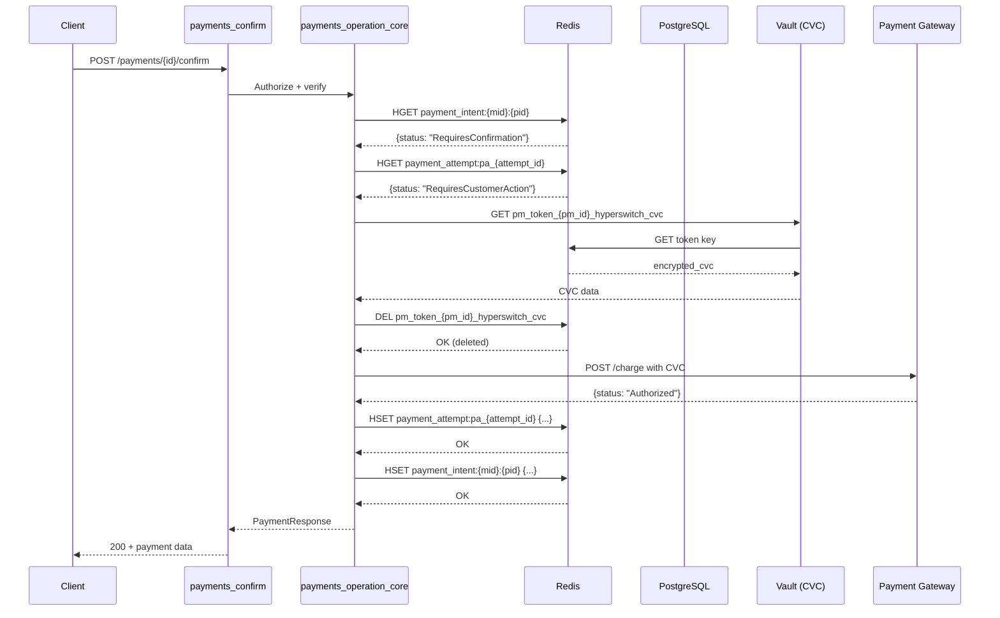
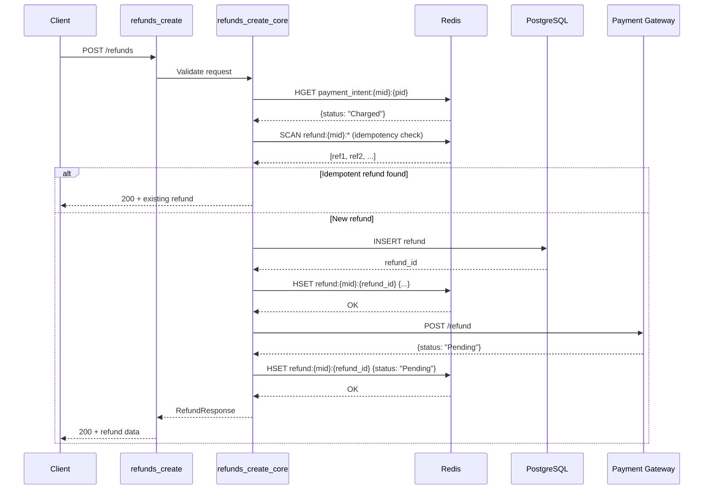
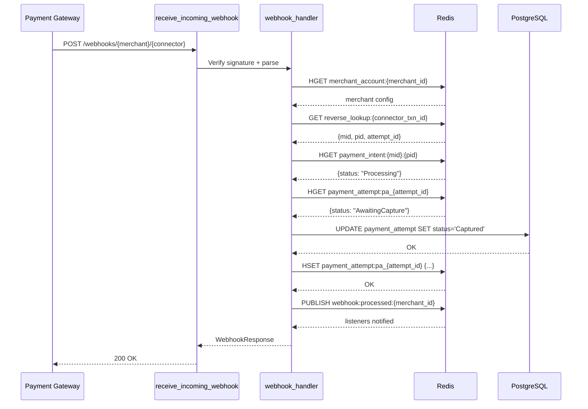

# Hyperswitch Cascade Exercise — Route-Centered Findings

**Date:** 2026-05-08  
**MCP/local rerun:** 2026-05-15; see `08_MCP_RERUN_QUERY_GUIDE.md`  
**Source:** `<repo-root>/vendor/hyperswitch-fresh` (commit `bc39324410031bec3e8c3d0ba924d81841c0c341`)  
**Exercise:** Inbound HTTP → Redis/DB Cascade Ambiguity Analysis

---

## Executive Summary

This analysis traces inbound HTTP routes in Hyperswitch to Redis/database dependency cascades and identifies where Déjà replay becomes ambiguous without state, causal order, occurrence ordinals, or resource versions.

### Key Findings from the MCP/local rerun

| Metric | Value | Source |
|--------|------:|---|
| Total inbound HTTP route rows cataloged | 509 | `raw/route-catalog-normalized.mcp-rerun.tsv` |
| Full per-route cascade matrix rows | 509 | `03_DEPENDENCY_CASCADES_FULL_RUST_BRAIN.md` |
| Routes with Redis/cache possible branch | 503 | Conservative scan of matrix dependency summaries |
| Routes with DB/SQL/OLAP possible branch | 502 | Conservative scan of matrix dependency summaries |
| Routes requiring disambiguation beyond pure signature | 505 | All except 4 health routes marked `signature_only_safe` |
| Routes not even FIFO-maybe-safe | 504 | Excludes health routes and 1 `CARD_BIN_READ` route |

**Verdict:** Signature-only replay (`signature(command) → recorded_response`) is **unsafe for Hyperswitch as a general strategy**. Only the four health routes are classified as signature-only safe in the 509-row matrix. Most routes either read mutable DB/Redis state directly, touch cache/session/token state, or depend on mutable long-lived resource versions.

---

## Route Count by Domain

| Domain | Route rows | Domain | Route rows |
|---|---:|---|---:|
| User | 78 | Payments | 67 |
| Routing | 40 | PaymentMethods | 37 |
| Profiles | 28 | Profile | 20 |
| Customers | 18 | Refunds | 17 |
| Payouts | 17 | Webhooks | 16 |
| MerchantAccount | 15 | Theme | 14 |
| Connectors | 13 | Disputes | 13 |
| Role | 12 | Subscriptions | 11 |
| APIKeys | 10 | Authentication | 9 |
| Organization | 8 | GSM | 8 |
| System | 6 | Auth | 4 |
| EphemeralKeys | 4 | Cards | 4 |
| Verify | 4 | Internal | 4 |
| RevenueRecovery | 4 | Mandates | 3 |
| Files | 3 | ConnectorOnboarding | 3 |
| ProcessTracker | 3 | Tokenization | 2 |
| Forex | 2 | Chat | 2 |
| SampleData | 2 | Embedded | 2 |
| ProfileAcquirer | 2 | ApplePay | 1 |
| 3DS | 1 | FeatureMatrix | 1 |
| SDKConfig | 1 | **TOTAL** | **509** |

### Ambiguity class distribution

| Ambiguity class | Route rows |
|---|---:|
| `needs_db_snapshot_or_transaction_order` | 204 |
| `needs_resource_version_or_state` | 134 |
| `needs_causal_scope_plus_ordinal` | 79 |
| `needs_stateful_redis_emulation` | 57 |
| `needs_causal_scope_plus_ordinal + needs_stateful_redis_emulation` | 28 |
| `signature_only_safe` | 4 |
| `unsafe_without_driver_context` | 2 |
| `per_signature_fifo_maybe_ok` | 1 |

---

## Top 20 Highest-Risk Inbound Routes

The ranking below is representative and route-family oriented. For exact 509-row class counts, use the MCP/local rerun artifacts listed above.

### Critical Risk (Stateful Replay Required)

| Rank | Route | Method | Domain | Risk Pattern | Redis Ops | DB Ops |
|------|-------|--------|--------|--------------|-----------|--------|
| 1 | `/payments/{id}/confirm` | POST | Payments | CVC read-delete + intent status | 4-6 | 0-2 |
| 2 | `/v2/payments/{id}/confirm-intent` | POST | Payments | Same-key read-write | 3-5 | 0-2 |
| 3 | `/payment_methods` | POST | PM | Token storage read-delete | 2-4 | 0-1 |
| 4 | `/payments/{id}/capture` | POST | Payments | Attempt status evolution | 2-4 | 0-2 |
| 5 | `/payments/{id}/cancel` | POST | Payments | Attempt status evolution | 2-4 | 0-2 |

### High Risk (Causal Scope + Ordinal Required)

| Rank | Route | Method | Domain | Risk Pattern | Redis Ops | DB Ops |
|------|-------|--------|--------|--------------|-----------|--------|
| 6 | `/v2/payments/create-intent` | POST | Payments | Same-key intent read-after-write | 2-3 | 0-1 |
| 7 | `/refunds` | POST | Refunds | Idempotency SCAN + intent read | 2-3 | 0-1 |
| 8 | `/refunds/{id}` | GET | Refunds | Status sync update | 1 | 0-1 |
| 9 | `/customers/{id}` | POST | Customers | Same-key update | 1 | 0-1 |
| 10 | `/mandates/{id}` | REVOKE | Mandates | Status update | 1 | 0-1 |
| 11 | `/webhooks/{merchant}/{connector}` | POST | Webhooks | Reverse lookup + status sync | 3-5 | 1-2 |
| 12 | `/disputes/accept/{id}` | POST | Disputes | Status transition | 1 | 1 |

### Medium Risk (Resource Version or Cache-Aware)

| Rank | Route | Method | Domain | Risk Pattern | Redis Ops | DB Ops |
|------|-------|--------|--------|--------------|-----------|--------|
| 13 | `/payments/{id}` | GET | Payments | Cache populate | 1-3 | 0-2 |
| 14 | `/payment_methods/{id}` | GET | PM | Cross-session PM mutation | 1-2 | 0-1 |
| 15 | `/customers/{id}` | GET | Customers | Cross-session customer mutation | 1 | 0-1 |
| 16 | `/mandates/{id}` | GET | Mandates | Cross-session mandate mutation | 1 | 0-1 |
| 17 | `/api_keys/{merchant}/list` | GET | API Keys | List cache populate | 1 | 1 |
| 18 | `/disputes/list` | GET | Disputes | SCAN list variability | 1 SCAN | 1 |
| 19 | `/refunds/list` | GET | Refunds | SCAN list variability | 1 SCAN | 1 |
| 20 | `/payments/list` | GET | Payments | SCAN list variability | 0-1 SCAN | 1 |

---

## Sequence Diagrams for Critical Routes

### Route 1: Payment Confirm (Highest Risk)



**Ambiguity Points:**
1. Intent HGET before/after update → same signature, different responses
2. CVC token GET then DEL → subsequent GET returns NotFound
3. Attempt status evolution → multiple reads with different states

### Route 2: Refund Create (Idempotency SCAN)



**Ambiguity Points:**
1. SCAN result varies based on concurrent refund creation
2. Same refund create called twice → idempotent path diverges
3. Refund status read then update

### Route 3: Webhook Receive (Reverse Lookup)



**Ambiguity Points:**
1. Reverse lookup stable, but target entity mutable
2. Webhook may arrive multiple times → idempotent processing
3. Status transitions depend on current state

---

## Disambiguator Effectiveness by Pattern

| Pattern | Occurs In | Recommended Disambiguator | Effectiveness | Implementation Complexity |
|---------|-----------|--------------------------|---------------|-------------------------|
| Same-key read-after-write | Payment confirm, capture, cancel | `causal_scope_id + ordinal` | HIGH | Medium |
| CVC read-delete | Payment confirm, PM create | `stateful_redis_emulation` | HIGH | High |
| Cache populate | Payment retrieve, API key list | `stateful_redis_emulation` or ignore cache | MEDIUM | Medium |
| Reverse lookup indirection | Webhooks, reference lookups | `resource_version` on target | MEDIUM | Low |
| SCAN/list queries | List endpoints | `result_set_hash` or ordering | MEDIUM | Medium |
| Cross-session mutation | PM retrieve, customer retrieve | `resource_version` | HIGH | Low |
| Status evolution loops | All state machines | `stateful_redis_emulation` | HIGH | High |

---

## Artifact Schema Recommendations for Déjà

### Required Fields per Dependency Event

```yaml
dependency_event:
  # Identity
  global_index: int                    # Monotonic across recording
  connection_id: int                   # Logical connection identifier
  
  # Temporal
  timestamp_ns: int64                  # High-res timestamp
  
  # Signature
  operation_signature: string          # Protocol + normalized command
  resource_key: string                 # Key, query, or table:id
  
  # Disambiguation (NEW - required for safety)
  causal_scope_id: string              # Request/session correlation ID
  local_sequence_in_scope: int         # Ordinal within causal scope
  
  # Resource versioning (optional but recommended)
  resource_version_before: string      # Version/read-timestamp before
  resource_version_after: string       # Version after (for writes)
  
  # Payload
  request_payload: bytes
  response_payload: bytes
  
  # Replay metadata
  classification: enum                 # signature_only_safe | needs_...
  response_variants_seen: int          # For ambiguity detection
```

### Replay Lookup Hierarchy

```
1. EXACT: (causal_scope_id, local_sequence_in_scope, operation_signature)
   ↓ if miss
2. RESOURCE_VERSION: (resource_key, resource_version_before)
   ↓ if miss
3. STATEFUL_EMULATOR: Apply operation to mock Redis state
   ↓ if unavailable
4. PER_SIGNATURE_FIFO: Next response in queue for signature
   ↓ if miss
5. GLOBAL_SEQUENCE: (global_index) - last resort
   ↓ if miss
6. FALLBACK: Return closest match + WARNING
```

---

## Action Items for Déjà Implementation

### Immediate (Critical Path)

1. **Implement causal scope + ordinal tagging**
   - Hook into `DEJA_CORRELATION_ID` at dependency call boundary
   - Maintain per-scope counter in task-local storage
   - Propagate through fred command metadata (channel envelope)

2. **Build Redis stateful emulator**
   - Minimal RESP parser for replay
   - Track HSET/HGET/DEL state per key
   - Handle TTL simulation for SETEX

3. **Add ambiguity detection during recording**
   - Track response variants per signature
   - Flag signatures with >1 distinct response
   - Auto-classify as `needs_*` based on pattern detection

### Near-Term (High Value)

4. **Implement resource version tracking**
   - Parse `modified_at` from entity JSON
   - Add version to lookup key for entities
   - Version extraction for payment_intent, payment_attempt, refund

5. **SCAN query result hashing**
   - Hash sorted result set contents
   - Match by content hash, not just SCAN pattern
   - Handle pagination correctly

### Longer-Term (Nice to Have)

6. **PostgreSQL stateful emulation**
   - For complex transactions with multiple statements
   - Track row versions for deterministic replay

7. **Noise filtering for regression**
   - Timestamps, UUIDs, request_ids as ignorable diffs
   - Configurable noise rules per endpoint

---

## Appendix: Evidence References

### Critical Redis Read Sites

| File | Line | Operation | Entity |
|------|------|-----------|--------|
| storage_impl/src/payments/payment_intent.rs | 510 | HGET | payment_intent |
| storage_impl/src/payments/payment_intent.rs | 694 | HSET | payment_intent |
| storage_impl/src/payments/payment_attempt.rs | 1583 | HGET | payment_attempt |
| storage_impl/src/payments/payment_attempt.rs | 1741 | HSET | payment_attempt |
| core/payment_methods/vault.rs | 2235 | GET | CVC token |
| core/payment_methods/vault.rs | 2320 | SET/DEL | CVC token |
| storage_impl/src/db/refund.rs | 581 | HGET | refund |
| storage_impl/src/db/refund.rs | 1001 | HSET | refund |
| storage_impl/src/db/refund.rs | 810 | SCAN | refund list |
| storage_impl/src/lookup.rs | 104 | GET | reverse_lookup |
| storage_impl/src/db/mandate.rs | 119 | HGET | mandate |
| core/payment_methods.rs | 5208 | GET | payment_method |

### Critical DB Sites

| File | Line | Operation | Entity |
|------|------|-----------|--------|
| storage_impl/src/payments/payment_intent.rs | 448 | INSERT | payment_intent |
| storage_impl/src/payments/payment_attempt.rs | 1262 | INSERT | payment_attempt |
| storage_impl/src/db/refund.rs | 498 | INSERT | refund |
| storage_impl/src/db/api_keys.rs | 1-491 | CRUD | api_keys |

---

*Generated from analysis of Hyperswitch fresh checkout at commit bc39324410031bec3e8c3d0ba924d81841c0c341*
